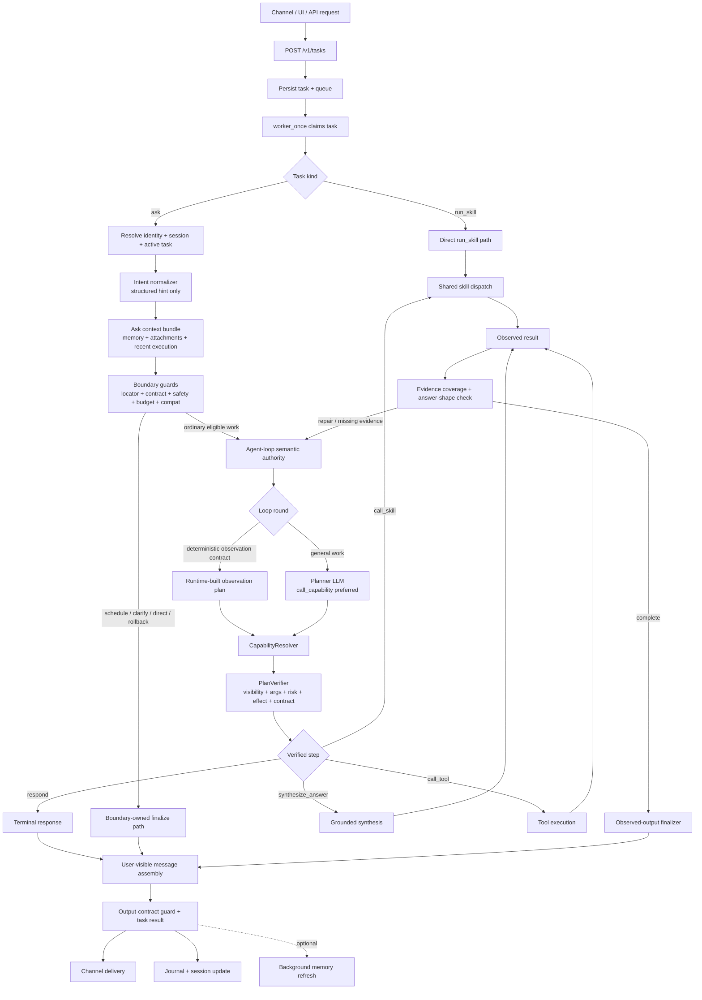
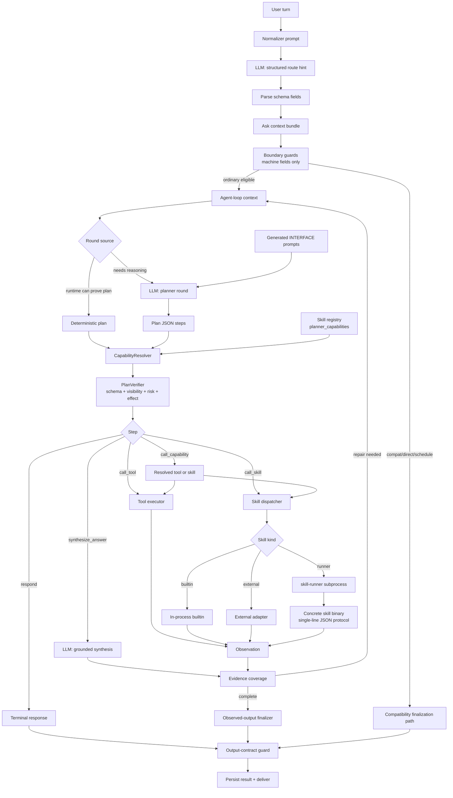
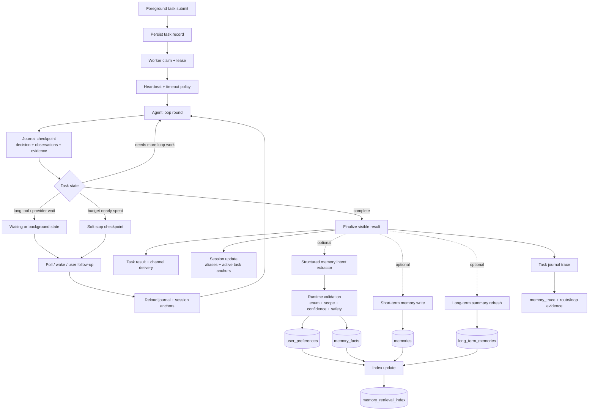

# RustClaw


Chinese version: `README.zh-CN.md`

RustClaw is a local Rust agent runtime centered on `clawd`. It combines multi-channel chat access, task execution, tool and skill routing, memory, scheduling, browser UI, and `user_key` based identity into one deployable stack.

## Overview

RustClaw is built for daily use and administration from messaging apps or a browser instead of a terminal-first workflow.

Current repository highlights:

- multi-channel entry points: Telegram, WeChat, Feishu, Lark, WhatsApp Cloud, WhatsApp Web, browser UI, and optional `webd`
- task runtime and HTTP API in `clawd`
- shared skill dispatch with in-process builtins, external adapters, and runner subprocesses through `skill-runner`
- built-in, external, and runner-based skills for system, files, web, images, audio, crypto, KB, and automation tasks
- local browser UI in `UI/`, including a standalone NNI device-signing page
- Raspberry Pi / small-screen desktop app in `pi_app/`

## Agent Loop Architecture

RustClaw's main natural-language path now uses a Codex / Claude style agent loop by default for eligible ordinary low-risk work. The boundary layer binds the turn to identity and session state, builds structured routing signals, applies locator, contract, safety, confirmation, dry-run, budget, capability, and evidence guards, then gives the agent loop the ordinary semantic decision: respond, call a capability, synthesize from evidence, repair, continue, or stop. Missing required information is handled through boundary/finalizer clarification paths. The intent normalizer is an initial structured hint, not the final semantic authority. Legacy pre-agent routing remains only as a compatibility and emergency rollback path for non-eligible, high-risk, schedule, delivery, and release-gated cases.

### Request And Agent Loop Flow



- `POST /v1/tasks`: channel daemons, the browser UI, and HTTP callers converge on the same persisted task queue.
- `Task kind`: `kind=ask` enters the agent-capable natural-language path; `kind=run_skill` bypasses normalizer and planner and uses the shared skill dispatcher directly.
- `Intent normalizer`: produces structured hints and compatibility trace fields. It is not the final semantic owner for ordinary eligible work.
- `Boundary guards`: bind identity/session state, apply locator, contract, safety, budget, confirmation, dry-run, and compatibility checks from machine fields. This layer should stay small and must not grow per-language phrase logic.
- `Agent-loop semantic authority`: ordinary eligible work enters the loop, where the planner/runtime decides whether to respond, call a capability, execute a tool or skill, synthesize from evidence, repair, or stop.
- `CapabilityResolver / PlanVerifier`: resolves `call_capability` into the current tool or skill implementation, then checks visibility, required arguments, allowed action, risk/effect, confirmation, and output contract before execution.
- `Evidence coverage`: tool, skill, and synthesis outputs become loop observations. Missing evidence or recoverable failures go back into the loop with compact attempted-method history.
- `Observed-output finalizer`: publishes grounded results only after the answer shape and evidence contract are satisfied.
- `Output-contract guard`: normalizes final text, message arrays, file tokens, scalar/strict shapes, and channel delivery consistency before the result is saved.
- `Journal + session update`: task state, observed facts, and active-session anchors are persisted after finalization; background memory work is optional and non-blocking.

### Planner, LLM, And Capability Flow



- `Normalizer prompt`: lets an LLM read the user turn and emit schema-backed fields. Runtime consumes those fields as hints and contracts rather than matching user phrases.
- `Planner prompt`: is built only for loop rounds that need model reasoning. Narrow observation contracts can use runtime-built plans without an extra planner call.
- `call_capability`: is the preferred planner action because it keeps skill/tool choice behind registry metadata and resolver policy.
- `Generated INTERFACE prompts`: come from `crates/skills/*/INTERFACE.md`, `external_skills/*/INTERFACE.md`, and `prompts/layers/generated/skills/*`; new skills should improve these contracts instead of adding `clawd` main-flow branches.
- `PlanVerifier`: blocks unavailable capabilities, missing required fields, unsafe mutations, and disallowed output/evidence shapes before any executor runs.
- `Skill dispatcher`: uses the same dispatch layer for direct `run_skill` and planner skill calls. Builtins run in-process, external skills use adapters, and runner skills launch `skill-runner` plus the concrete binary.
- `Skill process protocol`: runner skills exchange one-line JSON over stdin/stdout and should return stable machine fields in `extra` when runtime needs to make decisions.
- `synthesize_answer`: is scheduled inside the loop when evidence needs natural-language synthesis; it is not a fixed final LLM call after every task.
- `Compatibility finalization`: remains for non-eligible, high-risk, schedule, delivery, and rollback cases, but it is not the ordinary semantic decision path.

## Natural Language Contract Boundary

RustClaw keeps natural-language understanding on the LLM side and deterministic execution on the runtime side. The intent normalizer and planner may read user wording, examples, skill docs, and multilingual prompt guidance, but they must turn that understanding into structured fields before runtime code acts on it.

Runtime code should consume stable contracts such as:

- schema enums, for example `semantic_kind = "package_manager_detection"`
- action names, for example `read_field`, `validate_config`, or `transform_data`
- registry metadata and `planner_capabilities`
- `TaskContract` / `OutputContract` fields, target locators, and explicit `field_path` values
- JSON/TOML/YAML field paths, file extensions, structured tool output, exit codes, error kinds, and risk/effect metadata

Runtime code should not add per-language phrase tables or `prompt.contains(...)` branches to make a single natural-language case pass. If a new user wording needs better handling, update the normalizer/planner schema, registry capability metadata, `INTERFACE.md`, generated skill prompts, or vendor prompt patch so the LLM emits the same structured contract in any language. `python3 scripts/check_no_nl_hardmatch.py` is the local guard for this boundary.

## Memory System

RustClaw memory is split into short-term conversation records, structured user preferences, long-term fact cards, and retrieval indexes. The design goal is to make memory useful without letting old assistant output become a hidden instruction for a new task.

### Core Boundaries

Memory is scoped to the authenticated identity first, then to the current conversation. Channel IDs from Telegram, WeChat, Feishu, browser UI, and other adapters are normalized into the same task identity model, so a bound `user_key` can keep memory consistent across channels while still preserving `user_id` / `chat_id` level conversation state. Recent conversation state stores active-task anchors, alias bindings, and follow-up context separately from durable facts; it is allowed to help resolve “that file” or “the previous result”, but it is not treated as a new user instruction.

The memory layer has three hard boundaries:

- current user input always wins over recalled memory
- memory text is background context unless a structured route or state patch explicitly binds it to the current turn
- runtime code consumes memory through structured fields, source kinds, scores, safety flags, and use-policy decisions rather than per-language phrase branches

This keeps old assistant output, task logs, and knowledge snippets from silently steering execution. If a recalled item conflicts with the current request, the route and planner prompts tell the model to prefer the current request.

### Storage Model

The main persisted memory stores are:

- `memories`: short-term conversation records and task-visible snippets. Rows keep role, memory type, salience, safety state, timestamps, success state, and source metadata.
- `conversation_states`: active per-chat state such as alias bindings, active task anchors, and follow-up state. This is session state, not durable knowledge.
- `user_preferences`: structured user preferences such as response language, response style, response format, and agent display name.
- `memory_facts`: durable fact cards with `fact_key`, `fact_value`, `fact_text`, source refs, confidence, status, expiry, and conflict-group metadata.
- `long_term_memories`: legacy / fallback summary rows used only where the current memory use policy allows summary recall.
- `memory_retrieval_index`: hybrid retrieval index over short-term records, preferences, fact cards, and knowledge snapshots.

`configs/memory.toml` controls budgets, retention, long-term refresh intervals, write filters, preference extraction, retrieval limits, and embedding/index behavior. Defaults are conservative: short acknowledgement messages can be filtered, assistant replies are marked, and LLM-written preferences must pass confidence and runtime validation before they are stored.

### Write Path

After an `ask` task finalizes, RustClaw can persist:

- short-term records in `memories`, scoped by `user_key`, `user_id`, `chat_id`, role, memory type, salience, and safety flag
- user preferences in `user_preferences`, such as `response_language`, `response_style`, `response_format`, and `agent_display_name`
- long-term fact cards in `memory_facts`, with source, confidence, scope, status, conflict group, expiry, and supersede metadata

Preference and fact writes go through a structured memory intent contract. The model is asked to emit `memory_actions` such as `upsert`, `delete`, `expire`, or `noop`; runtime code then validates action enum, kind, scope, confidence, source evidence, TTL, and safety fields before anything is stored. The runtime does not decide durable preference writes by matching a single natural-language phrase.

Long-term summary refresh still exists as a fallback summary path, but durable knowledge is stored as fact cards first. A fact card keeps `fact_key`, `fact_value`, human-readable `fact_text`, `source_ref`, `source_memory_ids_json`, `reason`, `confidence`, `expires_at_ts`, `conflict_group`, and `status`. New active facts in the same conflict group supersede older facts, and expired or deleted facts are removed from retrieval.

Memory writes are intentionally after-answer work. The user-visible response is saved first; then background memory refresh can run when configured. This prevents memory extraction latency from blocking normal replies and makes memory write failures non-fatal to the already completed task.

### Recall And Use Policy

Memory recall is built as a structured context and then filtered by a memory use policy for the current stage:

- route: defaults to a minimal profile with active preferences, relevant facts, and knowledge docs; it omits old assistant results for new tasks
- follow-up route: can include recent events, assistant results, similar triggers, unfinished goals, and snippets when active session state shows that the user is continuing prior work
- planner: can use unfinished goals, preferences, facts, and knowledge docs, but avoids fallback long-term summaries and old assistant results by default
- chat: uses stable preferences and facts; bounded recent context is allowed only when current session state makes it relevant
- skill: `_memory` is cropped by the skill registry `memory_policy`; skills without a policy get a safe default scoped profile

The `photo_organize` skill, for example, declares a memory policy that allows preferences, relevant facts, and knowledge docs while excluding long-term summaries, recent events, assistant results, similar triggers, unfinished goals, and raw recent snippets.

Each use-policy decision records what it included and why. Prompt builders receive already-filtered structured context rather than raw database rows. The common policy is:

- new standalone tasks get stable facts and preferences, not old assistant results
- follow-up turns can use recent observations and active aliases only when session state says the user is continuing the same task
- planner prompts can see enough memory to avoid repeating work, but memory remains background and cannot override the current request
- skill `_memory` payloads are cropped per skill registry policy so specialized skills only receive the memory sources they are expected to use

### Retrieval Index

Hybrid recall uses `memory_retrieval_index` plus optional FTS. Each indexed row records `source_kind`, `source_ref`, memory kind, metadata, salience, success state, and embedding metadata:

- `embedding_model`
- `embedding_dims`
- `embedding_version`

The default provider is `local-hash-v1`, which runs offline. Unsupported or unavailable embedding providers fall back to local hash so the runtime keeps working. Retrieval only uses cosine scoring when the stored embedding metadata matches the current provider spec; mismatched rows fall back to lexical, salience, recency, and success-state scoring. Set `reindex_on_startup = true` in `configs/memory.toml`, or start with an empty index, to rebuild the retrieval index from short-term records, preferences, fact cards, and KB snapshots.

Retrieval combines several signals instead of trusting a single score: exact / lexical matches, vector similarity when compatible, salience, recency, source kind, success state, safety filter, and the current memory use policy. This makes the index useful for multilingual recall while keeping execution grounded in the route and output contracts.

### User Control

The browser console includes a Memory page. It shows counts, preferences, fact cards, and recent records for the current identity. Users can:

- delete a preference, fact, or recent memory item
- mark a fact card as expired
- clear recent records, preferences, facts, or all memory for the current identity
- enable or disable long-term memory through `configs/memory.toml`

The HTTP API behind the page is:

```text
GET    /v1/memory
GET    /v1/memory/recent
GET    /v1/memory/preferences
GET    /v1/memory/facts
DELETE /v1/memory/:id
POST   /v1/memory/:id/expire
POST   /v1/memory/clear
POST   /v1/memory/settings
```

Recent records with safety flags are hidden by default in the UI. Fact-card details such as reason, source, and conflict group are available in a secondary details view instead of being shown as raw JSON first.

### Trace And Troubleshooting

Task journal summaries and traces include `memory_trace`. This records the stage, use policy, recalled source refs, inclusion reason, and character budget without copying raw memory text. It is intended for debugging why a task used memory while reducing the chance of leaking sensitive stored content.

When debugging memory behavior, check these questions in order:

- Was the request a new task or a follow-up bound to an active session?
- Which stage built the memory context: route, planner, chat, schedule, image, or skill?
- Did `memory_trace` include the expected `source_kind` / `source_ref`?
- Did the use policy exclude recent assistant output or long-term summaries by design?
- Was the index stale because embedding metadata changed or `reindex_on_startup` was false?
- Did a fact conflict group supersede the older fact?
- Was the item hidden because it was expired, deleted, low confidence, or safety-risk flagged?

Useful code and config entry points:

- `configs/memory.toml`
- `crates/clawd/src/memory/intent.rs`
- `crates/clawd/src/memory/apply.rs`
- `crates/clawd/src/memory/facts.rs`
- `crates/clawd/src/memory/use_policy.rs`
- `crates/clawd/src/memory/retrieval.rs`
- `crates/clawd/src/memory/indexing.rs`
- `crates/clawd/src/memory/api.rs`

### Background, Resume, And Memory Flow



## Main Components

- `crates/clawd`: core runtime, HTTP API, routing, memory, scheduling, auth, task queue
- `crates/skill-runner`: launches runner skill binaries; `clawd` resolves registry kind / `runner_name` before invoking it
- `crates/clawcli`: terminal CLI for talking to `clawd`
- `crates/webd`: optional reverse proxy and login session bridge for public/browser access
- `crates/telegramd`, `crates/wechatd`, `crates/feishud`, `crates/larkd`, `crates/whatsappd`, `crates/whatsapp_webd`: channel daemons
- `services/wa-web-bridge`: local Node bridge used by the WhatsApp Web channel
- `crates/skills/*`: skill implementations and `INTERFACE.md` specs
- `external_skills/*`: externally submitted skills and their required `INTERFACE.md` specs
- `UI/`: Vite + React local console
- `pi_app/`: small-screen desktop monitor and launcher scripts

## Quick Start

### 1. Prerequisites

```bash
rustup default stable
python3 --version
```

`python3` is required. `npm` is needed when you want to build or deploy the UI.

### 2. Install the launcher

Recommended path:

```bash
# Install launcher only, skip nginx/UI deployment
bash install-rustclaw-cmd.sh --user --no-deploy-ui

# Build from source first, then install
bash install-rustclaw-cmd.sh --build --user --no-deploy-ui

# Build, install launcher, and deploy UI to nginx using script defaults
bash install-rustclaw-cmd.sh --build --user
```

Notes:

- `install-rustclaw-cmd.sh` installs the `rustclaw` launcher
- if `clawcli` was built, it is installed too
- by default the installer deploys `UI/dist` to nginx, writes nginx config, and reloads nginx when needed; pass `--no-deploy-ui` if you only want the launcher
- it also supports `--target <triple>`, `--dir <path>`, `--deploy-ui-nginx [path]`, and `--pi-app`; `--pi-app` only configures the small-screen desktop app on Raspberry Pi and is skipped on regular computers
- without `--build`, the script prefers existing binaries and only asks you to build/sync `release-bin` when they are missing

Verify:

```bash
command -v rustclaw
rustclaw -h
rustclaw -status
```

### 3. Configure runtime and channels

Main runtime config:

- `configs/config.toml`
- `configs/skills_registry.toml`

Split configs commonly edited:

- `configs/image.toml`
- `configs/audio.toml`
- `configs/crypto.toml`
- `configs/memory.toml`

Current channel config files:

- `configs/channels/telegram.toml`
- `configs/channels/wechat.toml`
- `configs/channels/feishu.toml`
- `configs/channels/lark.toml`
- `configs/channels/whatsapp.toml`
- `configs/channels/whatsapp-web.toml`
- `configs/channels/whatsapp-cloud.toml`
- `configs/channels/webd.toml`

### 4. Build from source

```bash
# Full release build: sync skill docs, build the workspace, and run the UI build/deploy script unless skipped
./build-all.sh

# Skip UI build
./build-all.sh no-ui

# Clean then rebuild
./build-all.sh clean

# Set the primary target
./build-all.sh --target aarch64-unknown-linux-gnu

# Raspberry Pi cross-build: defaults to 64-bit Raspberry Pi OS
./cross-build-pi.sh

# 32-bit Raspberry Pi OS
./cross-build-pi.sh --target pi32

# Build multiple targets in one run
./build-all.sh --target host --extra-target aarch64-unknown-linux-gnu
```

Current `build-all.sh` behavior:

- runs `scripts/sync_skill_docs.py` before the build starts
- always builds `release`, auto-discovers workspace binaries, and verifies that the expected outputs exist
- calls `build-ui-nginx.sh` when `UI/` exists and you did not pass `no-ui`, which means the default "build UI + deploy to nginx" path
- writes host outputs to `target/release` and cross-target outputs to `target/<triple>/release`
- `cross-build-pi.sh` prepares the Raspberry Pi linker / `cc` / bindgen environment before calling the existing build flow; it skips UI builds by default unless you pass `--with-ui`

You can still use plain `cargo build --workspace --release` for ad hoc local builds, but it does not include the repo-level sync, UI build, or output verification done by `build-all.sh`.

### 5. Start RustClaw

Examples with the launcher:

```bash
# Smallest startup path: release + channels=all + quick mode
rustclaw start -q

# Start with an explicit vendor/model
rustclaw -start --vendor openai --model gpt-5 --profile release --channels all --quick --skip-setup

# Start and require UI assets
rustclaw -start release all --with-ui
```

Current startup behavior:

- `rustclaw -start ...` ultimately calls `start-all.sh`
- `start-all.sh` starts services based on the `enabled` flags in `configs/channels/*.toml`
- when you pass `telegram | whatsapp_web | both | whatsapp_cloud | all`, the script writes the related Telegram / WhatsApp channel `enabled` values back into config files
- `all` here is a launcher preset, not "force-enable every daemon"; channels such as `webd`, `wechat`, `feishu`, and `lark` still follow their own config files
- `--with-ui` does not launch a frontend dev server; it requires a valid `UI/dist` build and stops with a hint if the assets are missing or stale
- `start-all.sh` no longer runs `sync_skill_docs.py` during startup

Equivalent script-based flow is still available:

```bash
./start-all.sh
./stop-rustclaw.sh
```

Single-service scripts are also available when you want finer control:

```bash
./component_start/start-clawd.sh
./component_start/start-telegramd.sh
./component_start/start-wechatd.sh
./component_start/start-feishud.sh
./component_start/start-larkd.sh
./component_start/start-whatsappd.sh
./component_start/start-whatsapp-webd.sh
./component_start/start-wa-web-bridge.sh
./component_start/start-clawd-ui.sh
```

When starting `clawd` alone:

- `./component_start/start-clawd.sh` checks for both `target/release/clawd` and `target/release/skill-runner`
- on first startup, if `selected_vendor` / `selected_model` are empty in `configs/config.toml`, it prompts for an interactive selection
- if the current vendor `api_key` is empty or still uses a `REPLACE_ME...` placeholder, it asks for the key before launch

### 6. Daily operations

```bash
rustclaw -status
rustclaw -logs clawd 200 --follow
rustclaw -health
rustclaw -stop
rustclaw -key list
```

## Identity And Access

RustClaw uses `user_key` as the main identity across the UI and messaging channels.

- permissions are resolved by `user_key`
- conversations are resolved by `channel + external_chat_id`
- the browser UI sends `X-RustClaw-Key`
- when the auth table is empty, `clawd` can bootstrap the first admin key

Key management:

```bash
rustclaw -key list
rustclaw -key generate user
rustclaw -key generate admin
rustclaw -key add rk-xxxx admin
rustclaw -key disable rk-xxxx
```

## UI, API, And `webd`

The main API still comes from `clawd`, but the current script flow prefers exposing the stack like this:

- `clawd` serves the internal API
- `webd` acts as the browser-facing bridge / reverse-proxy layer
- nginx serves `UI/dist` and proxies `/v1` and `/webd` to `webd`

In the current defaults, `clawd` commonly listens on `0.0.0.0:8787` and `webd` commonly listens on `0.0.0.0:8788`; the deploy scripts derive the nginx upstream from `configs/channels/webd.toml`.

Useful endpoints (send `X-RustClaw-Key` for the current UI/user key):

- `GET /v1/health`
- `POST /v1/tasks`
- `GET /v1/tasks/{task_id}`
- `POST /v1/tasks/cancel`
- `GET /v1/auth/me`
- `POST /v1/auth/channel/bind`
- `GET/POST /v1/auth/crypto-credentials`: reads or overwrites exchange credentials scoped to the current `X-RustClaw-Key`
- `GET /v1/nni/device/status`: reports NNI helper status, supported actions, and whether a device-signing chip is present
- `POST /v1/nni/device/action`: runs one of `pubkey`, `sign_timestamp`, `tng_device_pubkey`, `tng_device_cert`, `tng_signer_cert`, or `tng_root_cert`

Quick example:

```bash
curl http://127.0.0.1:8787/v1/health \
  -H "X-RustClaw-Key: rk-xxxx"

curl -X POST http://127.0.0.1:8787/v1/tasks \
  -H "Content-Type: application/json" \
  -H "X-RustClaw-Key: rk-xxxx" \
  -d '{"user_id":1,"chat_id":1,"user_key":"rk-xxxx","channel":"ui","external_user_id":"local-ui","external_chat_id":"local-ui","kind":"ask","payload":{"text":"hello","agent_mode":true}}'
```

## NL Regression Shortcuts

Use the smallest affected NL set while code is still moving, then widen coverage only at phase or release gates:

1. Focused affected suite: 10-30 hand-picked cases for the code path being changed.
2. Typical aggregate: compressed representative coverage after a phase batch.
3. Canary: 500 client-like cases before changing default authority or deleting old gates.
4. Safe aggregate: full 2100+ coverage, or an explicitly equivalent covered set, before removing rollback/deletion gates.

Focused long-tail closed-loop entries:

- `bash scripts/nl_tests/run_suite.sh ops_closed_loop`
- `bash scripts/nl_tests/run_suite.sh long_tail_flows`
- `bash scripts/nl_tests/run_suite.sh ops_http_repair`

`ops_http_repair` is the focused bilingual retry suite for `ops_http_repair_then_validate_{zh,en}` and writes logs under `scripts/nl_suite_logs/ops_http_repair/<timestamp>/`.

UI notes:

- source lives in `UI/`
- built assets live in `UI/dist`
- `build-ui-nginx.sh` is the main "build UI + copy to nginx + refresh nginx config" path
- `deploy-ui-nginx.sh` is the "deploy existing `UI/dist`" path, with optional `--build`
- `install-rustclaw-cmd.sh` also deploys UI/nginx by default unless you pass `--no-deploy-ui`
- the browser UI has a standalone `NNI` navigation section backed by `/v1/nni/device/*`; devices without a signing chip surface `signature_chip_present=false` and show an explicit missing-chip state
- `webd` can sit in front of `clawd` as a reverse proxy and login/session bridge

## Skills

RustClaw currently ships a broad skill set. Representative groups:

- system and ops: `system_basic`, `process_basic`, `service_control`, `health_check`, `log_analyze`, `task_control`
- files, config, and developer tools: `run_cmd`, `fs_basic`, `config_basic`, `config_edit`, `config_guard`, `archive_basic`, `fs_search`, `git_basic`, `package_manager`, `install_module`, `docker_basic`, `db_basic`
- network and content: `http_basic`, `rss_fetch`, `browser_web`, `doc_parse`, `transform`, `web_search_extract`
- multimodal: `image_generate`, `image_edit`, `image_vision`, `audio_transcribe`, `audio_synthesize`
- workflow and publishing: `schedule`, `extension_manager`, `photo_organize`, `invest_copy`, `x`
- domain and knowledge skills: `crypto`, `stock`, `weather`, `map_merchant`, `kb`

If you need to answer “how is this skill configured / bound / enabled, and what prerequisite is missing”, start with `prompts/references/skill_setup_guide.md`.

Skill discovery and runtime behavior are driven by:

- `configs/skills_registry.toml`
- `[skills]` in `configs/config.toml`
- `crates/skills/*/INTERFACE.md`
- `external_skills/*/INTERFACE.md`
- `prompts/layers/generated/skills/*.md`

Planner skill selection is registry-, capability-, and interface-driven. After a skill is registered, enabled, documented in `INTERFACE.md`, synced with `python3 scripts/sync_skill_docs.py`, and, when planner-facing, given `planner_capabilities` in `configs/skills_registry.toml`, the planner should learn when to use it from registry metadata plus the generated skill prompt. Do not add per-skill selection branches to `clawd` just to make new natural-language examples pass. If selection accuracy is weak, improve the registry capability metadata, skill interface, generated prompt, or model-specific vendor patch; keep Rust code for protocol validation, resolver/verifier boundaries, permission/safety checks, runner dispatch, output-contract enforcement, and deterministic execution compatibility.

Skill integration entry points:

- built-in and standard `runner` skills: `skill_develop/README.md`
- external skill example: `external_skills/example/README.md`
- skill setup and prerequisite reference: `prompts/references/skill_setup_guide.md`

### Local STT With whisper.cpp

`audio_transcribe` can use a local whisper.cpp server through the `custom` OpenAI-compatible provider. Use a dedicated local port such as `8178` so it does not collide with `clawd` or UI ports.

Download a multilingual model into the gitignored local model directory. The script picks `tiny` / `base` / `small` / `medium` from detected device memory, and `large-v3` is available only when explicitly requested with `--model large-v3`.

```bash
MODEL_PATH="$(bash scripts/download-whisper-model.sh --print-path-only)"
data/vendor/whisper.cpp/build/bin/whisper-server -m "$MODEL_PATH" \
  --host 127.0.0.1 --port 8178 \
  --request-path /v1 --inference-path /audio/transcriptions \
  --convert --language auto
```

Use a multilingual Whisper model for Chinese, for example `ggml-small.bin`, `ggml-medium.bin`, or `ggml-large-v3.bin`; avoid English-only `.en` models for Chinese audio.

```toml
[audio_transcribe]
default_vendor = "custom"
adapter_mode = "compat"
allow_compat_adapters = true
default_model = "local-whisper"
custom_models = ["local-whisper", "whisper-1"]

[audio_transcribe.providers.custom]
base_url = "http://127.0.0.1:8178/v1"
api_key = ""
model = "local-whisper"
timeout_seconds = 120
```

The empty `api_key` is accepted only for loopback `custom` providers (`localhost`, `127.0.0.1`, `::1`). Remote custom providers still require a real key.

## Directory Guide

- `configs/`: runtime, channel, model, memory, and skill configuration
- `crates/`: Rust services, daemons, CLI, and skills
- `external_skills/`: externally submitted skills and example scaffolds
- `prompts/`: prompt layers and generated skill prompt files
- `scripts/`: setup, regression, maintenance, and skill-call helpers
- `services/`: non-Rust helper services such as the WhatsApp Web bridge
- `UI/`: browser UI project
- `pi_app/`: desktop small-screen app
- `docker/`: docker-oriented configs and entrypoint files
- `systemd/`: service templates

## Pi App

The small-screen desktop app lives in `pi_app/`.

```bash
cd pi_app && ./run-small-screen.sh
cd pi_app && ./install-desktop.sh
cd pi_app && ./enable-autostart.sh
cd pi_app && ./open-small-screen.sh
```

It reads health status from `clawd`, so start the backend first.

The Pi App also carries the NNI device-signing helper used by the backend and browser UI. `pi_app/signature.py` supports Slot 0 public-key reads, timestamp signing, and TNG device/signer/root certificate reads when supported hardware and `cryptoauthlib` are present; see `pi_app/TNG_SERVER_GUIDE.md`. Devices without that chip are valid deployments and are reported as a missing-signature-chip state.

## Developer Notes

- `build-all.sh` is the most accurate repo-level build entry if you are building from source
- `install-rustclaw-cmd.sh` is the most convenient operator-facing entry because it can handle both launcher installation and optional UI/nginx deployment
- if you only want to refresh the static UI site, use `build-ui-nginx.sh` or `deploy-ui-nginx.sh`
- if you are integrating skills, run `python3 scripts/sync_skill_docs.py` explicitly; startup scripts no longer sync skill docs for you
- many helper and regression scripts live in `scripts/`
- for the local `ops_closed_loop` regression stack, run `bash scripts/regression_ops_closed_loop.sh`

## License

This project uses a non-commercial source-available license.

- English legal text: `LICENSE`
- Chinese reference translation: `LICENSE.zh-CN.md`
