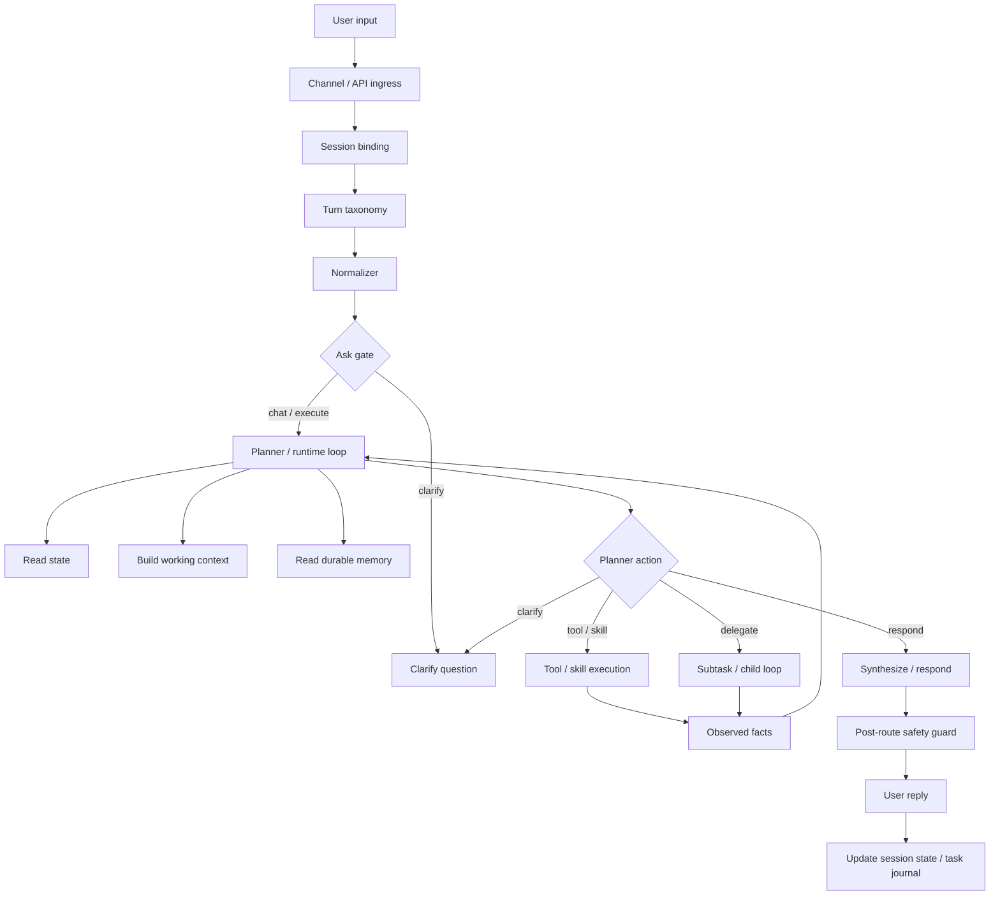
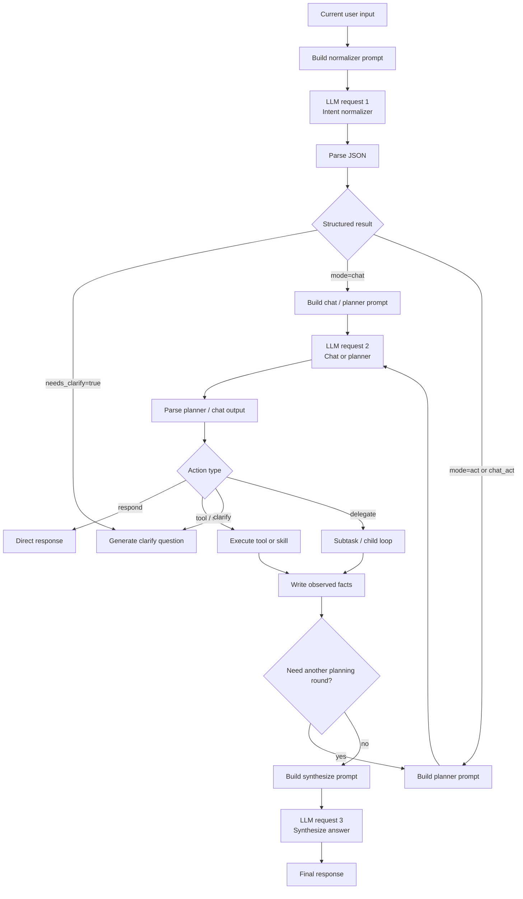

# RustClaw


Chinese version: `README.zh-CN.md`

RustClaw is a local Rust agent runtime centered on `clawd`. It combines multi-channel chat access, task execution, tool and skill routing, memory, scheduling, browser UI, and `user_key` based identity into one deployable stack.

## Overview

RustClaw is built for daily use and administration from messaging apps or a browser instead of a terminal-first workflow.

Current repository highlights:

- multi-channel entry points: Telegram, WeChat, Feishu, Lark, WhatsApp Cloud, WhatsApp Web, browser UI, and optional `webd`
- task runtime and HTTP API in `clawd`
- skill subprocess model through `skill-runner`
- built-in and runner-based skills for system, files, web, images, audio, crypto, KB, and automation tasks
- local browser UI in `UI/`
- Raspberry Pi / small-screen desktop app in `pi_app/`

## Planner-First Architecture

RustClaw's main natural-language path is moving toward a planner-first single-loop design. The goal is to keep one authoritative runtime path for normal requests: normalize the turn, bind it to session state, let the planner/runtime loop decide whether to clarify, execute, delegate, or answer, and only use post-route guards for safety and contract checks.

### Runtime Flow



- `Session binding`: attaches each turn to the active conversation instead of treating every message as a standalone task.
- `Turn taxonomy`: classifies run-control, task updates, corrections, status queries, attachments, and similar turn types without replacing planner reasoning.
- `Normalizer`: extracts structured signals such as `turn_type`, `target_task_policy`, `output_contract`, and execution hints.
- `Ask gate`: keeps only a thin `clarify / chat / execute` split and avoids becoming a semantic fast path.
- `Planner / runtime loop`: the authoritative loop that decides whether to clarify, call tools or skills, delegate, synthesize, or respond.
- `State`, `Working context`, and `Durable memory`: separate run control, current task context, and long-lived preferences so memory cannot override the latest user instruction.
- `Observed facts`: stores tool, skill, and child-loop results as grounded evidence for the next planner step.
- `Post-route safety guard`: validates safety and output contracts without taking over normal semantic routing.

### LLM Request Flow



- `LLM request 1 / Intent normalizer`: performs structured understanding only; it does not produce the final answer.
- `Build chat / planner prompt`: combines mode, session state, working context, and output contract for the second-layer request.
- `LLM request 2`: chat handles direct conversational answers; planner produces native actions such as `respond`, `clarify`, `tool-skill`, or `delegate`.
- `Execute tool or skill`: runs real operations and prevents the model from pretending that work already happened.
- `LLM request 3 / Synthesize answer`: turns grounded observed facts into the final user-facing answer after execution.

## Main Components

- `crates/clawd`: core runtime, HTTP API, routing, memory, scheduling, auth, task queue
- `crates/skill-runner`: launches skill binaries using the registry and runner convention
- `crates/clawcli`: terminal CLI for talking to `clawd`
- `crates/webd`: optional reverse proxy and login session bridge for public/browser access
- `crates/telegramd`, `crates/wechatd`, `crates/feishud`, `crates/larkd`, `crates/whatsappd`, `crates/whatsapp_webd`: channel daemons
- `crates/skills/*`: skill implementations and `INTERFACE.md` specs
- `UI/`: Vite + React local console
- `pi_app/`: small-screen desktop monitor and launcher scripts

## Quick Start

### 1. Prerequisites

```bash
rustup default stable
python3 --version
```

`python3` is required. `npm` is needed when you want to build or deploy the UI.

### 2. Install the launcher

Recommended path:

```bash
# Install launcher only, skip nginx/UI deployment
bash install-rustclaw-cmd.sh --user --no-deploy-ui

# Build from source first, then install
bash install-rustclaw-cmd.sh --build --user --no-deploy-ui

# Build, install launcher, and deploy UI to nginx using script defaults
bash install-rustclaw-cmd.sh --build --user
```

Notes:

- `install-rustclaw-cmd.sh` installs the `rustclaw` launcher
- if `clawcli` was built, it is installed too
- by default the installer deploys `UI/dist` to nginx, writes nginx config, and reloads nginx when needed; pass `--no-deploy-ui` if you only want the launcher
- it also supports `--target <triple>`, `--dir <path>`, `--deploy-ui-nginx [path]`, and `--pi-app`
- without `--build`, the script prefers existing binaries and only asks you to build/sync `release-bin` when they are missing

Verify:

```bash
command -v rustclaw
rustclaw -h
rustclaw -status
```

### 3. Configure runtime and channels

Main runtime config:

- `configs/config.toml`
- `configs/skills_registry.toml`

Split configs commonly edited:

- `configs/image.toml`
- `configs/audio.toml`
- `configs/crypto.toml`
- `configs/memory.toml`

Current channel config files:

- `configs/channels/telegram.toml`
- `configs/channels/wechat.toml`
- `configs/channels/feishu.toml`
- `configs/channels/lark.toml`
- `configs/channels/whatsapp.toml`
- `configs/channels/whatsapp-web.toml`
- `configs/channels/whatsapp-cloud.toml`
- `configs/channels/webd.toml`

### 4. Build from source

```bash
# Full release build: sync skill docs, build the workspace, and run the UI build/deploy script unless skipped
./build-all.sh

# Skip UI build
./build-all.sh no-ui

# Clean then rebuild
./build-all.sh clean

# Set the primary target
./build-all.sh --target aarch64-unknown-linux-gnu

# Build multiple targets in one run
./build-all.sh --target host --extra-target aarch64-unknown-linux-gnu
```

Current `build-all.sh` behavior:

- runs `scripts/sync_skill_docs.py` before the build starts
- always builds `release`, auto-discovers workspace binaries, and verifies that the expected outputs exist
- calls `build-ui-nginx.sh` when `UI/` exists and you did not pass `no-ui`, which means the default "build UI + deploy to nginx" path
- writes host outputs to `target/release` and cross-target outputs to `target/<triple>/release`

You can still use plain `cargo build --workspace --release` for ad hoc local builds, but it does not include the repo-level sync, UI build, or output verification done by `build-all.sh`.

### 5. Start RustClaw

Examples with the launcher:

```bash
# Smallest startup path: release + channels=all + quick mode
rustclaw start -q

# Start with an explicit vendor/model
rustclaw -start --vendor openai --model gpt-5 --profile release --channels all --quick --skip-setup

# Start and require UI assets
rustclaw -start release all --with-ui
```

Current startup behavior:

- `rustclaw -start ...` ultimately calls `start-all.sh`
- `start-all.sh` starts services based on the `enabled` flags in `configs/channels/*.toml`
- when you pass `telegram | whatsapp_web | both | whatsapp_cloud | all`, the script writes the related Telegram / WhatsApp channel `enabled` values back into config files
- `all` here is a launcher preset, not "force-enable every daemon"; channels such as `webd`, `wechat`, `feishu`, and `lark` still follow their own config files
- `--with-ui` does not launch a frontend dev server; it requires a valid `UI/dist` build and stops with a hint if the assets are missing or stale
- `start-all.sh` no longer runs `sync_skill_docs.py` during startup

Equivalent script-based flow is still available:

```bash
./start-all.sh
./stop-rustclaw.sh
```

Single-service scripts are also available when you want finer control:

```bash
./start-clawd.sh
./start-telegramd.sh
./start-wechatd.sh
./start-feishud.sh
./start-larkd.sh
./start-whatsappd.sh
./start-whatsapp-webd.sh
./start-clawd-ui.sh
```

When starting `clawd` alone:

- `./start-clawd.sh` checks for both `target/release/clawd` and `target/release/skill-runner`
- on first startup, if `selected_vendor` / `selected_model` are empty in `configs/config.toml`, it prompts for an interactive selection
- if the current vendor `api_key` is empty or still uses a `REPLACE_ME...` placeholder, it asks for the key before launch

### 6. Daily operations

```bash
rustclaw -status
rustclaw -logs clawd 200 --follow
rustclaw -health
rustclaw -stop
rustclaw -key list
```

## Identity And Access

RustClaw uses `user_key` as the main identity across the UI and messaging channels.

- permissions are resolved by `user_key`
- conversations are resolved by `channel + external_chat_id`
- the browser UI sends `X-RustClaw-Key`
- when the auth table is empty, `clawd` can bootstrap the first admin key

Key management:

```bash
rustclaw -key list
rustclaw -key generate user
rustclaw -key generate admin
rustclaw -key add rk-xxxx admin
rustclaw -key disable rk-xxxx
```

## UI, API, And `webd`

The main API still comes from `clawd`, but the current script flow prefers exposing the stack like this:

- `clawd` serves the internal API
- `webd` acts as the browser-facing bridge / reverse-proxy layer
- nginx serves `UI/dist` and proxies `/v1` and `/webd` to `webd`

In the current defaults, `clawd` commonly listens on `0.0.0.0:8787` and `webd` commonly listens on `0.0.0.0:8788`; the deploy scripts derive the nginx upstream from `configs/channels/webd.toml`.

Useful endpoints:

- `GET /v1/health`
- `POST /v1/tasks`

## NL Regression Shortcuts

Focused long-tail closed-loop entries:

- `bash scripts/nl_tests/run_suite.sh ops_deterministic`
- `bash scripts/nl_tests/run_suite.sh long_tail_flows`
- `bash scripts/nl_tests/run_suite.sh ops_http_repair`

`ops_http_repair` is the focused bilingual retry suite for `ops_http_repair_then_validate_{zh,en}` and writes logs under `scripts/nl_suite_logs/ops_http_repair/<timestamp>/`.
- `GET /v1/tasks/{task_id}`
- `POST /v1/tasks/cancel`
- `GET /v1/auth/me`
- `POST /v1/auth/channel/bind`
- `GET/POST /v1/auth/crypto-credentials`: reads or overwrites exchange credentials scoped to the current `X-RustClaw-Key`

Quick example:

```bash
curl http://127.0.0.1:8787/v1/health

curl -X POST http://127.0.0.1:8787/v1/tasks \
  -H "Content-Type: application/json" \
  -H "X-RustClaw-Key: rk-xxxx" \
  -d '{"user_id":1,"chat_id":1,"user_key":"rk-xxxx","channel":"ui","external_user_id":"local-ui","external_chat_id":"local-ui","kind":"ask","payload":{"text":"hello","agent_mode":true}}'
```

UI notes:

- source lives in `UI/`
- built assets live in `UI/dist`
- `build-ui-nginx.sh` is the main "build UI + copy to nginx + refresh nginx config" path
- `deploy-ui-nginx.sh` is the "deploy existing `UI/dist`" path, with optional `--build`
- `install-rustclaw-cmd.sh` also deploys UI/nginx by default unless you pass `--no-deploy-ui`
- `webd` can sit in front of `clawd` as a reverse proxy and login/session bridge

## Skills

RustClaw currently ships a broad skill set. Representative groups:

- system and ops: `system_basic`, `process_basic`, `service_control`, `health_check`, `log_analyze`, `task_control`
- files and developer tools: `archive_basic`, `fs_search`, `git_basic`, `package_manager`, `install_module`, `docker_basic`, `db_basic`
- network and content: `http_basic`, `rss_fetch`, `browser_web`, `doc_parse`, `transform`, `web_search_extract`
- multimodal: `image_generate`, `image_edit`, `image_vision`, `audio_transcribe`, `audio_synthesize`
- domain skills: `crypto`, `stock`, `weather`, `map_merchant`, `kb`, `chat`, `x`

If you need to answer “how is this skill configured / bound / enabled, and what prerequisite is missing”, start with `prompts/references/skill_setup_guide.md`.

Skill discovery and runtime behavior are driven by:

- `configs/skills_registry.toml`
- `[skills]` in `configs/config.toml`
- `crates/skills/*/INTERFACE.md`
- `prompts/layers/generated/skills/*.md`

Skill integration entry points:

- unified guide: `docs/skill_integration_guide.md`
- standard `runner` skills: `skill_develop/README.md`
- external skill example: `external_skills/example/README.md`

## Directory Guide

- `configs/`: runtime, channel, model, memory, and skill configuration
- `crates/`: Rust services, daemons, CLI, and skills
- `prompts/`: prompt layers and generated skill prompt files
- `scripts/`: setup, regression, maintenance, and skill-call helpers
- `UI/`: browser UI project
- `pi_app/`: desktop small-screen app
- `docker/`: docker-oriented configs and entrypoint files
- `systemd/`: service templates

## Pi App

The small-screen desktop app lives in `pi_app/`.

```bash
cd pi_app && ./run-small-screen.sh
cd pi_app && ./install-desktop.sh
cd pi_app && ./enable-autostart.sh
cd pi_app && ./open-small-screen.sh
```

It reads health status from `clawd`, so start the backend first.

## Developer Notes

- `build-all.sh` is the most accurate repo-level build entry if you are building from source
- `install-rustclaw-cmd.sh` is the most convenient operator-facing entry because it can handle both launcher installation and optional UI/nginx deployment
- if you only want to refresh the static UI site, use `build-ui-nginx.sh` or `deploy-ui-nginx.sh`
- if you are integrating skills, run `python3 scripts/sync_skill_docs.py` explicitly; startup scripts no longer sync skill docs for you
- many helper and regression scripts live in `scripts/`
- for the deterministic local `ops_closed_loop` regression stack, run `bash scripts/regression_ops_closed_loop_deterministic.sh`

## License

This project uses a non-commercial source-available license.

- English legal text: `LICENSE`
- Chinese reference translation: `LICENSE.zh-CN.md`
