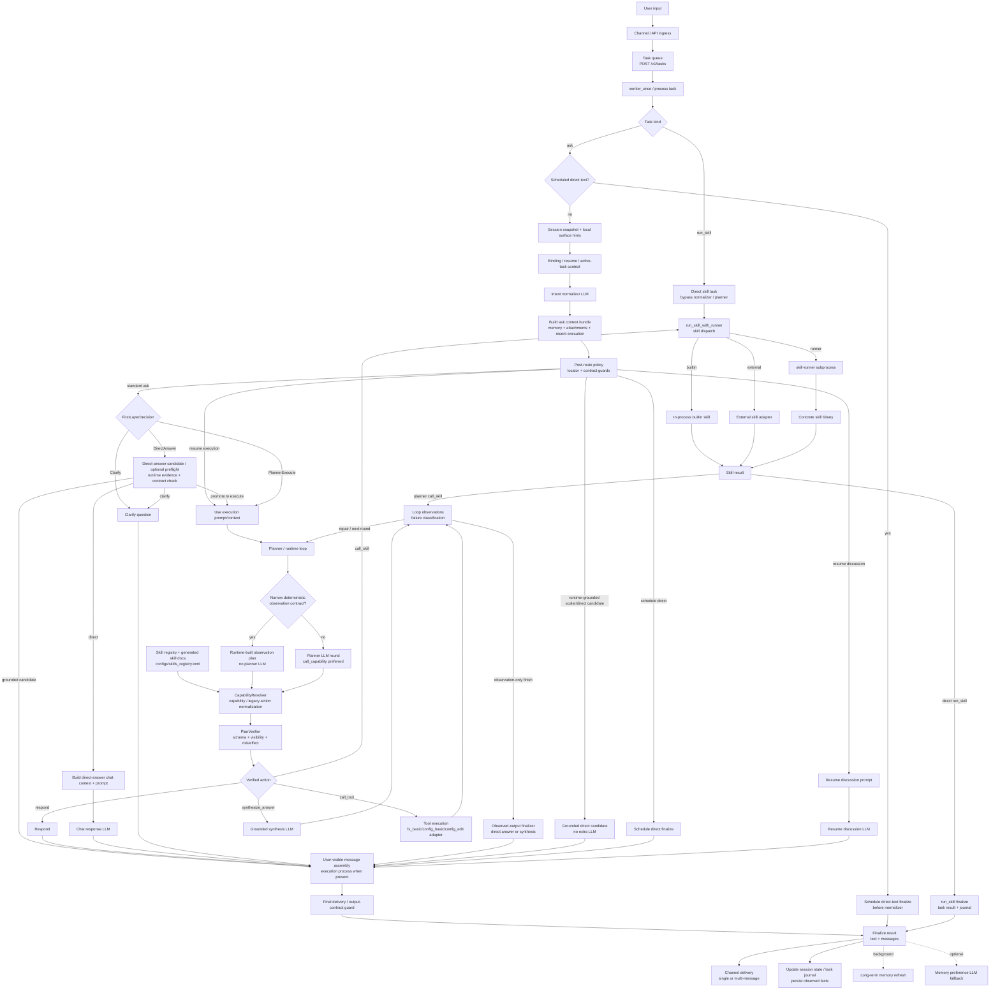
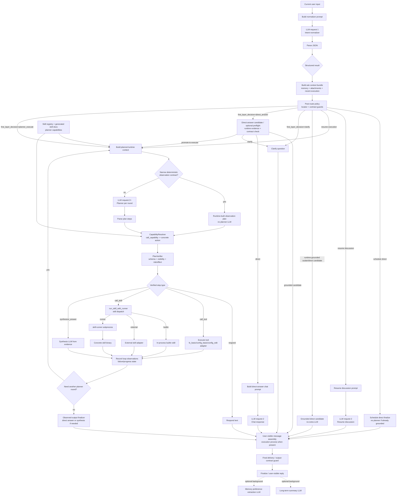

# RustClaw


Chinese version: `README.zh-CN.md`

RustClaw is a local Rust agent runtime centered on `clawd`. It combines multi-channel chat access, task execution, tool and skill routing, memory, scheduling, browser UI, and `user_key` based identity into one deployable stack.

## Overview

RustClaw is built for daily use and administration from messaging apps or a browser instead of a terminal-first workflow.

Current repository highlights:

- multi-channel entry points: Telegram, WeChat, Feishu, Lark, WhatsApp Cloud, WhatsApp Web, browser UI, and optional `webd`
- task runtime and HTTP API in `clawd`
- shared skill dispatch with in-process builtins, external adapters, and runner subprocesses through `skill-runner`
- built-in, external, and runner-based skills for system, files, web, images, audio, crypto, KB, and automation tasks
- local browser UI in `UI/`, including a standalone NNI device-signing page
- Raspberry Pi / small-screen desktop app in `pi_app/`

## Planner-First Architecture

RustClaw's main natural-language path is moving toward a planner-first single-loop design. The goal is to keep one authoritative runtime path for normal requests: bind the turn to session state, run a single intent-normalizer LLM for routing signals and the first-layer decision, then clarify, answer directly once, or enter the planner/runtime loop for tools, skills, optional grounded synthesis, and response. Post-route policy runs before dispatch; final delivery and output-contract guards run before the result is saved.

### Runtime Flow



- `Session snapshot + local surface hints`: attaches each turn to the active conversation and extracts bounded local facts before routing; this is not a separate “taxonomy engine” LLM.
- `Intent normalizer LLM`: one call that emits `first_layer_decision`, `needs_clarify`, `output_contract`, and optional `turn_type` / `target_task_policy` style fields. Runtime then derives `ask_mode` and a log-only route label. **Clarify vs DirectAnswer vs PlannerExecute is decided here**, not via a `clarify` action inside the planner JSON.
- `Task queue`: HTTP callers submit `POST /v1/tasks`; channel daemons also hand work to the same queued worker path.
- `Task kind`: `kind=ask` enters the normalizer / post-route / ask dispatch flow; `kind=run_skill` bypasses LLM routing and runs the named skill directly through the shared skill dispatch path.
- `Ask context bundle`: built once after normalization and before ask dispatch; it supplies chat context, execution prompt context, attachments, durable memory, and recent execution context used by post-route locator policy.
- `Post-route policy`: applies locator resolution, missing-locator clarification, and contract guards after the ask context bundle is available and before dispatch. It can refine the gate from structured state, but it is not a separate semantic router.
- `Schedule / resume branches`: scheduler-triggered direct-text tasks can finalize before the normalizer; normal schedule-direct requests can finalize after routing but before the planner; resume-discussion uses a recovery prompt; resume-execution returns to the normal execution runtime.
- `FirstLayerDecision`: keeps the runtime gate to `Clarify / DirectAnswer / PlannerExecute`. `AskMode` is the code-facing dispatch type; route labels such as `AskClarify`, `Chat`, `Act`, and `ChatAct` are derived only for logs and journals, not stored as a second routing state.
- `Direct-answer candidate / optional preflight`: before a normal chat answer is sent, the runtime can reuse a grounded scalar/direct candidate when it matches current runtime facts; otherwise it can run a lightweight contract/advice-only check. It keeps pure chat in `DirectAnswer`, but can promote tool-backed requests to `PlannerExecute` or ask one clarification when the normalizer was too weak.
- `Chat response LLM`: handles confirmed `DirectAnswer` replies; pure chat requests do not enter the execution planner loop.
- `Planner / runtime loop`: for `PlannerExecute`, runs multiple rounds. Most rounds call the planner LLM; narrow structured observation contracts can produce a runtime-built deterministic observation plan for that round, but still use the same loop, observations, guards, and finalization path. Planner steps are `think`, `call_capability`, `call_tool`, `call_skill`, `synthesize_answer`, and `respond` (there is **no** `delegate` step type today—execution steps are traced as subtasks in logs, not a nested child loop). `call_capability` is the preferred capability-level planner action; `call_tool` / `call_skill` remain legacy-compatible direct actions.
- `Execution prompt/context`: reuses the ask context bundle and resolved prompt for `PlannerExecute`, so memory cannot override the latest user instruction.
- `Skill registry + generated skill docs`: planner-visible skills and capability metadata come from runtime skill views and generated interface docs, primarily `configs/skills_registry.toml`, `crates/skills/*/INTERFACE.md`, and `prompts/layers/generated/skills/*`. New planner-facing skills should declare `planner_capabilities` instead of adding language-specific planner branches.
- `CapabilityResolver / PlanVerifier`: capability-level actions are resolved to concrete tools or skills before execution. The verifier then checks visibility, required arguments, risk/effect boundaries, confirmation requirements, and mutation validation before any real action runs.
- `call_skill` / direct `run_skill`: both go through `run_skill_with_runner`, which applies policy and skill switches, then dispatches by registry kind: builtins run in-process, external skills run through their external adapter, and runner skills launch `skill-runner` plus the concrete skill binary.
- `Loop observations` and `Observed-output finalizer`: tool, skill, and synthesis outputs remain grounded evidence inside the loop; recoverable failures publish progress and re-enter the planner with compact attempted-method history, while terminal failures finish with a grounded result; observation-only plans can still finish through runtime-owned structured answers, with observed-answer synthesis only when runtime cannot safely format the answer.
- `User-visible message assembly`: pure chat can remain a single answer. Execution, clarification, retry, and skill paths can attach sanitized `messages` separate from the final deliverable body, so execution stays visible without exposing raw prompts, stack traces, or secrets.
- `Final delivery / output-contract guard`: normalizes file tokens, `messages`, exact scalar/strict output shapes, and delivery consistency before the result is saved.
- `Finalize result`: can emit one `text` field and a `messages` array; channel adapters send each publishable message separately when present.

### LLM Request Flow



- `LLM request 1 / Intent normalizer`: performs structured understanding only; it does not produce the final answer.
- This diagram covers the normal `kind=ask` LLM path. `kind=run_skill` and scheduler-triggered direct-text asks have no normalizer / planner LLM request and are finalized by their direct task paths.
- `Build chat prompt / planner runtime context`: combines mode, session state, working context, and output contract for follow-on requests. The full planner prompt is only needed when the current loop round actually calls the planner LLM.
- `Skill registry + generated skill docs`: planner prompts and resolver mappings are built from enabled skill views, generated interface documents, and `planner_capabilities`, so skill capability growth should be data/contract driven.
- `DirectAnswer candidate / preflight`: **DirectAnswer** may reuse a runtime-grounded direct candidate or run a lightweight preflight LLM before the chat reply is sent. If the request is confirmed as direct answer, chat response runs and finalizes; if it detects missing required information, the request becomes clarification; if it detects real tool/workspace/system evidence is needed, it is promoted into `PlannerExecute`.
- `PlannerExecute`: usually uses one-or-more **planner** calls per loop round; narrow deterministic observation contracts can skip the planner LLM for that round and emit runtime-built observation steps instead. Planner JSON steps are `{think, call_capability, call_tool, call_skill, synthesize_answer, respond}` only (no `clarify` or `delegate` step types). Prefer `call_capability`; `call_tool` and `call_skill` remain compatible direct actions. `AskMode` finalization style controls whether the execution result is returned plainly or chat-wrapped.
- `CapabilityResolver / PlanVerifier`: `call_capability` is normalized into the current tool/skill implementation before execution. The verifier blocks unavailable capabilities, missing required fields, risk-budget violations, and unsafe mutation plans before the executor sees them.
- `Execute tool or skill`: runs real operations and prevents the model from pretending that work already happened. Skill execution uses the shared dispatch layer; only runner skills spawn `skill-runner`.
- `synthesize_answer`: an extra LLM call **scheduled inside the planner loop** when the plan includes that step—**not** always a single fixed “LLM 3 after all planning is done”; rounds can interleave execution, synthesis, and further planning.
- `Observed-output finalizer`: if a plan ends after observation steps without a terminal `respond`, runtime can still publish a grounded direct answer or run the observed-answer synthesis path. Recoverable failures are fed back to later planner rounds as attempted-method evidence instead of being hidden inside shell fallbacks.
- `User-visible message assembly`: pure chat replies can pass through without an execution-process block. Clarifications and execution paths can include sanitized progress/process messages before final delivery.
- `Final delivery / output-contract guard`: applies delivery normalization and output-contract verification before final task persistence.
- `Finalize`: may also start background memory work after the user-visible result is saved, including long-term summary refresh and optional preference extraction controlled by `configs/memory.toml`.

## Main Components

- `crates/clawd`: core runtime, HTTP API, routing, memory, scheduling, auth, task queue
- `crates/skill-runner`: launches runner skill binaries; `clawd` resolves registry kind / `runner_name` before invoking it
- `crates/clawcli`: terminal CLI for talking to `clawd`
- `crates/webd`: optional reverse proxy and login session bridge for public/browser access
- `crates/telegramd`, `crates/wechatd`, `crates/feishud`, `crates/larkd`, `crates/whatsappd`, `crates/whatsapp_webd`: channel daemons
- `services/wa-web-bridge`: local Node bridge used by the WhatsApp Web channel
- `crates/skills/*`: skill implementations and `INTERFACE.md` specs
- `UI/`: Vite + React local console
- `pi_app/`: small-screen desktop monitor and launcher scripts

## Quick Start

### 1. Prerequisites

```bash
rustup default stable
python3 --version
```

`python3` is required. `npm` is needed when you want to build or deploy the UI.

### 2. Install the launcher

Recommended path:

```bash
# Install launcher only, skip nginx/UI deployment
bash install-rustclaw-cmd.sh --user --no-deploy-ui

# Build from source first, then install
bash install-rustclaw-cmd.sh --build --user --no-deploy-ui

# Build, install launcher, and deploy UI to nginx using script defaults
bash install-rustclaw-cmd.sh --build --user
```

Notes:

- `install-rustclaw-cmd.sh` installs the `rustclaw` launcher
- if `clawcli` was built, it is installed too
- by default the installer deploys `UI/dist` to nginx, writes nginx config, and reloads nginx when needed; pass `--no-deploy-ui` if you only want the launcher
- it also supports `--target <triple>`, `--dir <path>`, `--deploy-ui-nginx [path]`, and `--pi-app`; `--pi-app` only configures the small-screen desktop app on Raspberry Pi and is skipped on regular computers
- without `--build`, the script prefers existing binaries and only asks you to build/sync `release-bin` when they are missing

Verify:

```bash
command -v rustclaw
rustclaw -h
rustclaw -status
```

### 3. Configure runtime and channels

Main runtime config:

- `configs/config.toml`
- `configs/skills_registry.toml`

Split configs commonly edited:

- `configs/image.toml`
- `configs/audio.toml`
- `configs/crypto.toml`
- `configs/memory.toml`

Current channel config files:

- `configs/channels/telegram.toml`
- `configs/channels/wechat.toml`
- `configs/channels/feishu.toml`
- `configs/channels/lark.toml`
- `configs/channels/whatsapp.toml`
- `configs/channels/whatsapp-web.toml`
- `configs/channels/whatsapp-cloud.toml`
- `configs/channels/webd.toml`

### 4. Build from source

```bash
# Full release build: sync skill docs, build the workspace, and run the UI build/deploy script unless skipped
./build-all.sh

# Skip UI build
./build-all.sh no-ui

# Clean then rebuild
./build-all.sh clean

# Set the primary target
./build-all.sh --target aarch64-unknown-linux-gnu

# Raspberry Pi cross-build: defaults to 64-bit Raspberry Pi OS
./cross-build-pi.sh

# 32-bit Raspberry Pi OS
./cross-build-pi.sh --target pi32

# Build multiple targets in one run
./build-all.sh --target host --extra-target aarch64-unknown-linux-gnu
```

Current `build-all.sh` behavior:

- runs `scripts/sync_skill_docs.py` before the build starts
- always builds `release`, auto-discovers workspace binaries, and verifies that the expected outputs exist
- calls `build-ui-nginx.sh` when `UI/` exists and you did not pass `no-ui`, which means the default "build UI + deploy to nginx" path
- writes host outputs to `target/release` and cross-target outputs to `target/<triple>/release`
- `cross-build-pi.sh` prepares the Raspberry Pi linker / `cc` / bindgen environment before calling the existing build flow; it skips UI builds by default unless you pass `--with-ui`

You can still use plain `cargo build --workspace --release` for ad hoc local builds, but it does not include the repo-level sync, UI build, or output verification done by `build-all.sh`.

### 5. Start RustClaw

Examples with the launcher:

```bash
# Smallest startup path: release + channels=all + quick mode
rustclaw start -q

# Start with an explicit vendor/model
rustclaw -start --vendor openai --model gpt-5 --profile release --channels all --quick --skip-setup

# Start and require UI assets
rustclaw -start release all --with-ui
```

Current startup behavior:

- `rustclaw -start ...` ultimately calls `start-all.sh`
- `start-all.sh` starts services based on the `enabled` flags in `configs/channels/*.toml`
- when you pass `telegram | whatsapp_web | both | whatsapp_cloud | all`, the script writes the related Telegram / WhatsApp channel `enabled` values back into config files
- `all` here is a launcher preset, not "force-enable every daemon"; channels such as `webd`, `wechat`, `feishu`, and `lark` still follow their own config files
- `--with-ui` does not launch a frontend dev server; it requires a valid `UI/dist` build and stops with a hint if the assets are missing or stale
- `start-all.sh` no longer runs `sync_skill_docs.py` during startup

Equivalent script-based flow is still available:

```bash
./start-all.sh
./stop-rustclaw.sh
```

Single-service scripts are also available when you want finer control:

```bash
./component_start/start-clawd.sh
./component_start/start-telegramd.sh
./component_start/start-wechatd.sh
./component_start/start-feishud.sh
./component_start/start-larkd.sh
./component_start/start-whatsappd.sh
./component_start/start-whatsapp-webd.sh
./component_start/start-wa-web-bridge.sh
./component_start/start-clawd-ui.sh
```

When starting `clawd` alone:

- `./component_start/start-clawd.sh` checks for both `target/release/clawd` and `target/release/skill-runner`
- on first startup, if `selected_vendor` / `selected_model` are empty in `configs/config.toml`, it prompts for an interactive selection
- if the current vendor `api_key` is empty or still uses a `REPLACE_ME...` placeholder, it asks for the key before launch

### 6. Daily operations

```bash
rustclaw -status
rustclaw -logs clawd 200 --follow
rustclaw -health
rustclaw -stop
rustclaw -key list
```

## Identity And Access

RustClaw uses `user_key` as the main identity across the UI and messaging channels.

- permissions are resolved by `user_key`
- conversations are resolved by `channel + external_chat_id`
- the browser UI sends `X-RustClaw-Key`
- when the auth table is empty, `clawd` can bootstrap the first admin key

Key management:

```bash
rustclaw -key list
rustclaw -key generate user
rustclaw -key generate admin
rustclaw -key add rk-xxxx admin
rustclaw -key disable rk-xxxx
```

## UI, API, And `webd`

The main API still comes from `clawd`, but the current script flow prefers exposing the stack like this:

- `clawd` serves the internal API
- `webd` acts as the browser-facing bridge / reverse-proxy layer
- nginx serves `UI/dist` and proxies `/v1` and `/webd` to `webd`

In the current defaults, `clawd` commonly listens on `0.0.0.0:8787` and `webd` commonly listens on `0.0.0.0:8788`; the deploy scripts derive the nginx upstream from `configs/channels/webd.toml`.

Useful endpoints (send `X-RustClaw-Key` for the current UI/user key):

- `GET /v1/health`
- `POST /v1/tasks`
- `GET /v1/tasks/{task_id}`
- `POST /v1/tasks/cancel`
- `GET /v1/auth/me`
- `POST /v1/auth/channel/bind`
- `GET/POST /v1/auth/crypto-credentials`: reads or overwrites exchange credentials scoped to the current `X-RustClaw-Key`
- `GET /v1/nni/device/status`: reports NNI helper status, supported actions, and whether a device-signing chip is present
- `POST /v1/nni/device/action`: runs one of `pubkey`, `sign_timestamp`, `tng_device_pubkey`, `tng_device_cert`, `tng_signer_cert`, or `tng_root_cert`

Quick example:

```bash
curl http://127.0.0.1:8787/v1/health \
  -H "X-RustClaw-Key: rk-xxxx"

curl -X POST http://127.0.0.1:8787/v1/tasks \
  -H "Content-Type: application/json" \
  -H "X-RustClaw-Key: rk-xxxx" \
  -d '{"user_id":1,"chat_id":1,"user_key":"rk-xxxx","channel":"ui","external_user_id":"local-ui","external_chat_id":"local-ui","kind":"ask","payload":{"text":"hello","agent_mode":true}}'
```

## NL Regression Shortcuts

Focused long-tail closed-loop entries:

- `bash scripts/nl_tests/run_suite.sh ops_closed_loop`
- `bash scripts/nl_tests/run_suite.sh long_tail_flows`
- `bash scripts/nl_tests/run_suite.sh ops_http_repair`

`ops_http_repair` is the focused bilingual retry suite for `ops_http_repair_then_validate_{zh,en}` and writes logs under `scripts/nl_suite_logs/ops_http_repair/<timestamp>/`.

UI notes:

- source lives in `UI/`
- built assets live in `UI/dist`
- `build-ui-nginx.sh` is the main "build UI + copy to nginx + refresh nginx config" path
- `deploy-ui-nginx.sh` is the "deploy existing `UI/dist`" path, with optional `--build`
- `install-rustclaw-cmd.sh` also deploys UI/nginx by default unless you pass `--no-deploy-ui`
- the browser UI has a standalone `NNI` navigation section backed by `/v1/nni/device/*`; devices without a signing chip surface `signature_chip_present=false` and show an explicit missing-chip state
- `webd` can sit in front of `clawd` as a reverse proxy and login/session bridge

## Skills

RustClaw currently ships a broad skill set. Representative groups:

- system and ops: `system_basic`, `process_basic`, `service_control`, `health_check`, `log_analyze`, `task_control`
- files, config, and developer tools: `fs_basic`, `config_basic`, `config_edit`, `archive_basic`, `fs_search`, `git_basic`, `package_manager`, `install_module`, `docker_basic`, `db_basic`
- network and content: `http_basic`, `rss_fetch`, `browser_web`, `doc_parse`, `transform`, `web_search_extract`
- multimodal: `image_generate`, `image_edit`, `image_vision`, `audio_transcribe`, `audio_synthesize`
- domain skills: `crypto`, `stock`, `weather`, `map_merchant`, `kb`, `x`

If you need to answer “how is this skill configured / bound / enabled, and what prerequisite is missing”, start with `prompts/references/skill_setup_guide.md`.

Skill discovery and runtime behavior are driven by:

- `configs/skills_registry.toml`
- `[skills]` in `configs/config.toml`
- `crates/skills/*/INTERFACE.md`
- `prompts/layers/generated/skills/*.md`

Planner skill selection is registry-, capability-, and interface-driven. After a skill is registered, enabled, documented in `INTERFACE.md`, synced with `python3 scripts/sync_skill_docs.py`, and, when planner-facing, given `planner_capabilities` in `configs/skills_registry.toml`, the planner should learn when to use it from registry metadata plus the generated skill prompt. Do not add per-skill selection branches to `clawd` just to make new natural-language examples pass. If selection accuracy is weak, improve the registry capability metadata, skill interface, generated prompt, or model-specific vendor patch; keep Rust code for protocol validation, resolver/verifier boundaries, permission/safety checks, runner dispatch, output-contract enforcement, and deterministic execution compatibility.

Skill integration entry points:

- built-in and standard `runner` skills: `skill_develop/README.md`
- external skill example: `external_skills/example/README.md`
- skill setup and prerequisite reference: `prompts/references/skill_setup_guide.md`

### Local STT With whisper.cpp

`audio_transcribe` can use a local whisper.cpp server through the `custom` OpenAI-compatible provider. Use a dedicated local port such as `8178` so it does not collide with `clawd` or UI ports.

Download a multilingual model into the gitignored local model directory. The script picks `tiny` / `base` / `small` / `medium` from detected device memory, and `large-v3` is available only when explicitly requested with `--model large-v3`.

```bash
MODEL_PATH="$(bash scripts/download-whisper-model.sh --print-path-only)"
data/vendor/whisper.cpp/build/bin/whisper-server -m "$MODEL_PATH" \
  --host 127.0.0.1 --port 8178 \
  --request-path /v1 --inference-path /audio/transcriptions \
  --convert --language auto
```

Use a multilingual Whisper model for Chinese, for example `ggml-small.bin`, `ggml-medium.bin`, or `ggml-large-v3.bin`; avoid English-only `.en` models for Chinese audio.

```toml
[audio_transcribe]
default_vendor = "custom"
adapter_mode = "compat"
allow_compat_adapters = true
default_model = "local-whisper"
custom_models = ["local-whisper", "whisper-1"]

[audio_transcribe.providers.custom]
base_url = "http://127.0.0.1:8178/v1"
api_key = ""
model = "local-whisper"
timeout_seconds = 120
```

The empty `api_key` is accepted only for loopback `custom` providers (`localhost`, `127.0.0.1`, `::1`). Remote custom providers still require a real key.

## Directory Guide

- `configs/`: runtime, channel, model, memory, and skill configuration
- `crates/`: Rust services, daemons, CLI, and skills
- `prompts/`: prompt layers and generated skill prompt files
- `scripts/`: setup, regression, maintenance, and skill-call helpers
- `services/`: non-Rust helper services such as the WhatsApp Web bridge
- `UI/`: browser UI project
- `pi_app/`: desktop small-screen app
- `docker/`: docker-oriented configs and entrypoint files
- `systemd/`: service templates

## Pi App

The small-screen desktop app lives in `pi_app/`.

```bash
cd pi_app && ./run-small-screen.sh
cd pi_app && ./install-desktop.sh
cd pi_app && ./enable-autostart.sh
cd pi_app && ./open-small-screen.sh
```

It reads health status from `clawd`, so start the backend first.

The Pi App also carries the NNI device-signing helper used by the backend and browser UI. `pi_app/signature.py` supports Slot 0 public-key reads, timestamp signing, and TNG device/signer/root certificate reads when supported hardware and `cryptoauthlib` are present; see `pi_app/TNG_SERVER_GUIDE.md`. Devices without that chip are valid deployments and are reported as a missing-signature-chip state.

## Developer Notes

- `build-all.sh` is the most accurate repo-level build entry if you are building from source
- `install-rustclaw-cmd.sh` is the most convenient operator-facing entry because it can handle both launcher installation and optional UI/nginx deployment
- if you only want to refresh the static UI site, use `build-ui-nginx.sh` or `deploy-ui-nginx.sh`
- if you are integrating skills, run `python3 scripts/sync_skill_docs.py` explicitly; startup scripts no longer sync skill docs for you
- many helper and regression scripts live in `scripts/`
- for the local `ops_closed_loop` regression stack, run `bash scripts/regression_ops_closed_loop.sh`

## License

This project uses a non-commercial source-available license.

- English legal text: `LICENSE`
- Chinese reference translation: `LICENSE.zh-CN.md`
