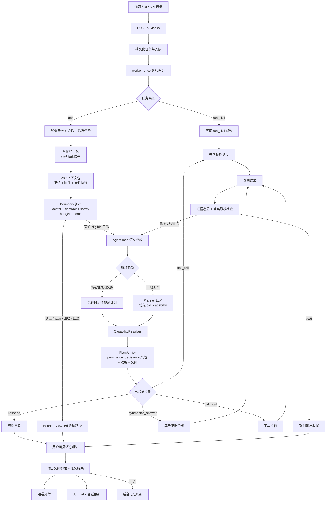
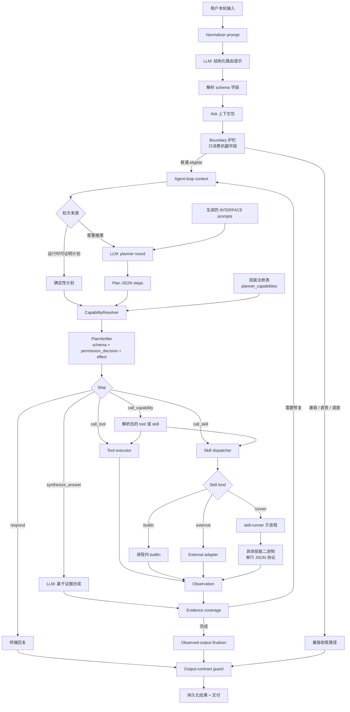
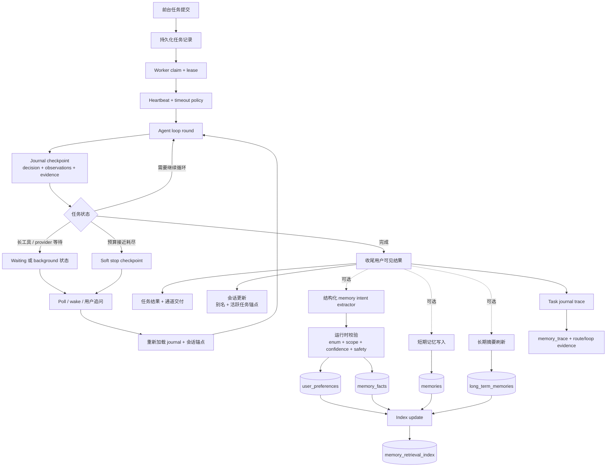

# RustClaw


英文版：`README.md`

RustClaw 是一个以 `clawd` 为核心的本地 Rust Agent Runtime。它把多通道接入、任务执行、技能路由、记忆、调度、浏览器 UI，以及基于 `user_key` 的身份体系整合到一套可部署系统里。

## 项目概览

RustClaw 面向“消息端或浏览器里就能完成日常使用和管理”的场景，而不是只给命令行使用者。

当前仓库的主要能力包括：

- 多通道接入：Telegram、微信、飞书、Lark、WhatsApp Cloud、WhatsApp Web、浏览器 UI，以及可选的 `webd`
- 由 `clawd` 提供任务运行时、HTTP API、路由、记忆和调度
- 共享技能调度层，支持进程内 builtin、external adapter，以及通过 `skill-runner` 拉起的 runner 子进程
- 覆盖系统、文件、网络、图片、语音、视频、音乐、加密货币、知识库、自动化等场景的 builtin、external 与 runner 技能
- 本地浏览器控制台位于 `UI/`，其中包含独立的 NNI 设备签名页面
- 树莓派/小屏桌面程序位于 `pi_app/`

## Agent Loop 架构

RustClaw 主自然语言路径现在默认对 eligible 的普通低风险工作使用接近 Codex / Claude 的 agent loop。Boundary layer 负责把本轮绑定到身份与会话状态，构建结构化路由信号，并应用 locator、契约、安全、确认、dry-run、预算、能力和证据护栏；之后把普通语义决策交给 agent loop：回复、调用能力、按证据合成、修复、继续或停止。缺少必要信息时，由 boundary/finalizer 澄清路径处理。意图归一化器只是初始结构化提示，不是最终语义权威。旧 pre-agent 路由仅保留为 non-eligible、高风险、调度、交付和 release-gated case 的兼容与紧急回滚路径。

### 请求与 Agent Loop 流程



- `POST /v1/tasks`：通道守护进程、浏览器 UI 和 HTTP 调用者都收敛到同一套持久化任务队列。
- `Task kind`：`kind=ask` 进入可使用 agent 的自然语言路径；`kind=run_skill` 绕过 intent normalizer、planner loop、capability resolver 和 plan verifier，只把显式提供的 `payload.skill_name` 交给共享 skill dispatcher / 协议执行。两种 task kind 都会把结果写回原始 `task_id`，调用方仍可通过 task 查询 API 查看最终状态。
- `Intent normalizer`：产出结构化提示和兼容 trace 字段；对普通 eligible 工作，它不是最终语义权威。
- `Boundary guards`：绑定身份/会话状态，并基于机器字段应用 locator、contract、safety、budget、confirmation、dry-run 和兼容检查。该层应保持轻量，不能继续增加按语言维护的短语逻辑。
- `Agent-loop 语义权威`：普通 eligible 工作进入循环，由 planner/runtime 决定回复、调用能力、执行工具或技能、按证据合成、修复或停止。
- `CapabilityResolver / PlanVerifier`：把 `call_capability` 解析到当前 tool 或 skill 实现，再检查可见性、必填参数、allowed action、risk/effect、confirmation 和输出契约。
- `permission_decision`：verifier 和 preflight blocker 输出 `allowed`、`needs_confirmation`、`denied_by_policy`、`dry_run_required`、`external_provider_blocked`、`risk_level`、`action_effect`、registry dedup/idempotency 等机器字段。UI、API、finalizer 和 i18n 应消费这些字段渲染说明，而不是解析 runtime prose。
- `Evidence coverage`：工具、技能和合成输出都会成为循环内观测；缺证据或可恢复失败会带着压缩的已尝试方法历史回到循环。
- `Observed-output finalizer`：只有答案形状与证据契约满足后，才发布有观测依据的结果。
- `Output-contract guard`：保存结果前规范最终文本、`messages` 数组、文件 token、标量/严格输出形状和通道交付一致性。
- `Journal + session update`：任务状态、观测事实和活跃会话锚点在收尾后持久化；后台记忆任务是可选、非阻塞的。

### Planner、LLM 与 Capability 流程



- `Normalizer prompt`：让 LLM 阅读本轮用户输入并输出 schema 字段。运行时把这些字段当作提示和契约消费，而不是匹配用户短语。
- `Planner prompt`：只在循环轮次需要模型推理时构建；窄范围观测契约可直接使用运行时构建的计划。
- `call_capability`：推荐的 planner action，把 tool/skill 选择放到 registry metadata 与 resolver policy 后面。
- `Generated INTERFACE prompts`：来自 `crates/skills/*/INTERFACE.md`、`external_skills/*/INTERFACE.md` 和 `prompts/layers/generated/skills/*`；新增技能应改这些契约，不改 `clawd` 主流程分支。
- `PlanVerifier`：执行前阻断不可用能力、缺必填字段、不安全 mutation，以及不符合输出/证据形状的计划。拒绝路径应携带稳定机器字段，不写固定用户可见回复模板。
- `Skill dispatcher`：直接 `run_skill` 和 planner skill call 复用同一调度层。直接 `run_skill` 不让 normalizer / planner 选择技能，只派发显式的 `payload.skill_name`。Builtin 在进程内运行，external 走 adapter，runner 才启动 `skill-runner` 和具体二进制。
- `Skill process protocol`：runner 技能通过 stdin/stdout 交换单行 JSON；运行时需要判断时，技能应在 `extra` 返回稳定机器字段。
- `synthesize_answer`：在循环内需要自然语言合成时调度，不是每个任务固定最后再调用一次 LLM。
- `Compatibility finalization`：保留给 non-eligible、高风险、调度、交付和回滚 case，不是普通语义决策路径。

### 权限平面与命令策略

权限平面是结构化执行边界，不是第二套语义路由器。来自 `configs/skills_registry.toml` 的 registry metadata、contract matrix policy 和 verifier 状态会投影到 `permission_decision`，让 UI/API/finalizer 能解释发生了什么，而不需要 runtime 写死自然语言回复。

- `risk_level`、`requires_confirmation`、`once_per_task`、`idempotent`、`dedup_scope` 优先来自 registry 与 planner capability metadata。
- `action_effect` 从结构化 skill/action 参数和 contract metadata 派生，不从用户语言短语里判断。
- `run_cmd` 会在 `command_policy` 下输出 `policy_authority`、`literal_command_token`、`command_arg_present`、`unresolved_runtime_template_present` 和命令 effect 标记。
- 显式用户命令用 `_clawd_literal_command` 表达；否则 `run_cmd` 作为 planner 结构化命令参数处理，继续受 contract 与媒体产物 blocker 约束。

## 自然语言契约边界

RustClaw 的原则是：自然语言理解交给 LLM，运行时只消费结构化契约。意图归一化器和规划器可以阅读用户表达、示例、技能文档和多语言提示词，但进入 Rust 运行时前，语义必须已经落到稳定字段里。

运行时允许依赖的确定性输入包括：

- schema enum，例如 `semantic_kind = "package_manager_detection"`
- action name，例如 `read_field`、`validate_config`、`transform_data`
- registry metadata 与 `planner_capabilities`
- `TaskContract` / `OutputContract`、结构化 locator、明确的 `field_path`
- JSON/TOML/YAML 字段路径、文件扩展名、工具结构化输出、exit code、error kind、risk/effect metadata
- `permission_decision` 与 `command_policy` 机器字段

运行时不要为了某个中文、英文或其他语言样例通过而新增短语表、固定问法分支或 `prompt.contains(...)`。如果新的自然语言表达没有被理解，应优先改 normalizer/planner schema、registry capability metadata、`INTERFACE.md`、生成技能提示词或必要的 vendor prompt patch，让 LLM 在不同语言下输出同一套结构化契约。本地门禁是：

```bash
python3 scripts/check_no_nl_hardmatch.py
```

## 记忆系统

RustClaw 记忆分为短期对话记录、结构化用户偏好、长期事实卡和检索索引。目标是让记忆能帮助当前任务，同时避免旧助手输出变成新的隐藏指令。

### 写入路径

`ask` 任务收尾后，RustClaw 可以持久化：

- `memories` 短期记录：按 `user_key`、`user_id`、`chat_id`、角色、类型、显著性和安全标记分组
- `user_preferences` 用户偏好：例如 `response_language`、`response_style`、`response_format`、`agent_display_name`
- `memory_facts` 长期事实卡：包含来源、置信度、作用域、状态、冲突组、过期和 supersede 信息

偏好和事实写入走结构化 memory intent contract。LLM 输出 `memory_actions`，例如 `upsert`、`delete`、`expire`、`noop`；运行时再校验 action enum、kind、scope、confidence、source evidence、TTL 和 safety 字段后才写入数据库。运行时不会通过匹配某一句自然语言来决定 durable preference。

长期摘要刷新仍作为兜底摘要路径存在，但优先把可复用知识写成事实卡。事实卡保留 `fact_key`、`fact_value`、`fact_text`、`source_ref`、`source_memory_ids_json`、`reason`、`confidence`、`expires_at_ts`、`conflict_group` 和 `status`。同一冲突组的新 active fact 会 supersede 旧 fact；过期或删除的 fact 不再进入召回。

### 召回与使用策略

记忆召回会先构造成结构化上下文，再按当前阶段套用 memory use policy：

- route：默认只给最小上下文，包括 active preferences、相关 facts 和 knowledge docs；不把旧助手结果塞进新任务
- follow-up route：当会话状态显示用户正在延续之前任务时，可以加入 recent events、assistant results、similar triggers、unfinished goals 和 snippets
- planner：可使用 unfinished goals、preferences、facts 和 knowledge docs，默认避开 fallback long-term summaries 和旧助手结果
- chat：使用稳定 preferences 与 facts；只有当前会话状态相关时才带有限 recent context
- skill：`_memory` 会按技能 registry 的 `memory_policy` 裁剪；没有显式策略的技能使用安全默认配置

例如 `photo_organize` 技能声明了自己的 memory policy：允许 preferences、relevant facts 和 knowledge docs，但排除 long-term summaries、recent events、assistant results、similar triggers、unfinished goals 和 raw recent snippets。

### 检索索引

混合召回使用 `memory_retrieval_index` 和可选 FTS。索引行会记录 `source_kind`、`source_ref`、memory kind、metadata、salience、success state 和 embedding metadata：

- `embedding_model`
- `embedding_dims`
- `embedding_version`

默认 provider 是离线可用的 `local-hash-v1`。如果配置了不可用或不支持的 embedding provider，运行时会回退到 local hash。只有索引行的 embedding metadata 与当前 provider spec 匹配时才使用 cosine scoring；不匹配时会回退到词法、显著性、时间和成功状态评分。可以在 `configs/memory.toml` 设置 `reindex_on_startup = true`，或从空索引启动，来重建短期记录、偏好、事实卡和知识库快照的检索索引。

### 用户控制

浏览器控制台包含 Memory 页面。它会展示当前身份下的数量、偏好、事实卡和最近记录。用户可以：

- 删除某条偏好、事实或最近记忆
- 把事实卡标记为过期
- 清空当前身份下的最近记录、偏好、事实或全部记忆
- 通过 `configs/memory.toml` 开启或关闭长期记忆

对应 HTTP API：

```text
GET    /v1/memory
GET    /v1/memory/recent
GET    /v1/memory/preferences
GET    /v1/memory/facts
DELETE /v1/memory/:id
POST   /v1/memory/:id/expire
POST   /v1/memory/clear
POST   /v1/memory/settings
```

带 safety 标记的 recent records 默认不会在 UI 中展示。事实卡的 reason、source、conflict group 等细节放在二级详情视图，而不是默认暴露原始 JSON。

### 追踪与排障

Task journal summary 和 trace 会记录 `memory_trace`。它包含 stage、use policy、召回 source refs、纳入原因和字符预算，但不复制原始记忆文本，便于排查“为什么这次任务用了记忆”，同时降低敏感内容泄露风险。

常用代码和配置入口：

- `configs/memory.toml`
- `crates/clawd/src/memory/intent.rs`
- `crates/clawd/src/memory/apply.rs`
- `crates/clawd/src/memory/facts.rs`
- `crates/clawd/src/memory/use_policy.rs`
- `crates/clawd/src/memory/retrieval.rs`
- `crates/clawd/src/memory/indexing.rs`
- `crates/clawd/src/memory/api.rs`

### 后台、恢复与记忆流程



## 主要组件

- `crates/clawd`：核心运行时、HTTP API、任务队列、路由、记忆、鉴权、调度
- `crates/skill-runner`：启动 runner 技能二进制；`clawd` 会先解析 registry kind / `runner_name` 再调用它
- `crates/clawcli`：面向 `clawd` 的终端 CLI
- `crates/webd`：可选的反向代理和登录会话桥接层
- `crates/telegramd`、`crates/wechatd`、`crates/feishud`、`crates/larkd`、`crates/whatsappd`、`crates/whatsapp_webd`：通道守护进程
- `services/wa-web-bridge`：WhatsApp Web 通道使用的本地 Node bridge
- `crates/skills/*`：技能实现及其 `INTERFACE.md`
- `external_skills/*`：外部提交技能及其必须提供的 `INTERFACE.md`
- `UI/`：基于 Vite + React 的本地控制台
- `pi_app/`：小屏桌面程序和启动脚本

## 快速开始

### 1. 前置条件

```bash
rustup default stable
python3 --version
```

必须有 `python3`。如果你要构建或部署前端 UI，还需要 `npm`。

### 2. 安装启动命令

推荐方式：

```bash
# 仅安装启动器，不部署 nginx/UI
bash install-rustclaw-cmd.sh --user --no-deploy-ui

# 从源码构建后再安装
bash install-rustclaw-cmd.sh --build --user --no-deploy-ui

# 安装启动器，并按脚本默认行为把 UI 部署到 nginx
bash install-rustclaw-cmd.sh --build --user
```

说明：

- `install-rustclaw-cmd.sh` 会安装 `rustclaw` 启动器
- 如果仓库里已经构建出 `clawcli`，安装脚本也会一并安装它
- 默认情况下，安装脚本会部署 `UI/dist` 到 nginx、写入 nginx 配置并尝试重载 nginx；如果只想装命令，不想碰 UI/nginx，请显式传 `--no-deploy-ui`
- 支持 `--target <triple>`、`--dir <path>`、`--deploy-ui-nginx [path]`、`--pi-app`；其中 `--pi-app` 只会在树莓派上配置小屏桌面程序和登录自启动，普通电脑会自动跳过
- 如果未传 `--build`，脚本会优先复用现有二进制；找不到时才提示你构建或同步 `release-bin`

安装后检查：

```bash
command -v rustclaw
rustclaw -h
rustclaw -status
```

### 3. 配置运行时和通道

主配置：

- `configs/config.toml`
- `configs/skills_registry.toml`

常见拆分配置：

- `configs/image.toml`
- `configs/audio.toml`
- `configs/crypto.toml`
- `configs/memory.toml`

当前实际存在的通道配置文件：

- `configs/channels/telegram.toml`
- `configs/channels/wechat.toml`
- `configs/channels/feishu.toml`
- `configs/channels/lark.toml`
- `configs/channels/whatsapp.toml`
- `configs/channels/whatsapp-web.toml`
- `configs/channels/whatsapp-cloud.toml`
- `configs/channels/webd.toml`

### 4. 从源码构建

```bash
# 完整 release 构建：先同步技能文档，再构建工作区，并在未跳过时执行 UI 构建/部署脚本
./build-all.sh

# 跳过 UI 构建
./build-all.sh no-ui

# 清理后重建
./build-all.sh clean

# 指定主 target
./build-all.sh --target aarch64-unknown-linux-gnu

# 树莓派交叉编译：默认 64 位 Raspberry Pi OS
./cross-build-pi.sh

# 32 位 Raspberry Pi OS
./cross-build-pi.sh --target pi32

# 一次构建多个 target
./build-all.sh --target host --extra-target aarch64-unknown-linux-gnu
```

`build-all.sh` 的当前行为：

- 开始前先执行 `scripts/sync_skill_docs.py`
- 默认构建 `release`，并自动发现工作区里的二进制目标后校验产物是否齐全
- 若存在 `UI/` 且未传 `no-ui`，会调用 `build-ui-nginx.sh`，也就是走“构建 UI + 部署到 nginx”的默认流程
- `--target host` 输出到 `target/release`，交叉编译输出到 `target/<triple>/release`
- `cross-build-pi.sh` 会先准备 Raspberry Pi 目标的 linker / `cc` / bindgen 参数，再调用现有构建流程；默认跳过 UI 构建，避免交叉编译时被前端构建阻塞

如果你只想临时本地编译某个 Rust 目标，仍然可以直接用 `cargo build --workspace --release`，但它不会覆盖 `build-all.sh` 里的同步、UI 构建和产物校验逻辑。

### 5. 启动 RustClaw

使用启动器的示例：

```bash
# 最简启动：等价于 release + channels=all + quick 模式
rustclaw start -q

# 指定厂商/模型启动
rustclaw -start --vendor openai --model gpt-5 --profile release --channels all --quick --skip-setup

# 启动时要求检查并带上 UI
rustclaw -start release all --with-ui
```

当前启动链路与脚本语义：

- `rustclaw -start ...` 最终调用的是 `start-all.sh`
- `start-all.sh` 当前按 `configs/channels/*.toml` 里的 `enabled` 开关决定启动哪些服务
- 如果传了 `telegram | whatsapp_web | both | whatsapp_cloud | all`，脚本会把 Telegram / WhatsApp 相关通道的 `enabled` 值写回配置文件
- 这里的 `all` 是启动器里的快捷通道组合，不等于强制打开 `webd`、`wechat`、`feishu`、`lark` 等所有通道；这些仍以各自配置文件里的 `enabled` 为准
- `--with-ui` 不会自动帮你开发模式起前端，而是要求 `UI/dist` 已存在且没有过期；缺失时会提示你先执行 `cd UI && npm install && npm run build`
- `start-all.sh` 不再在启动阶段自动执行 `sync_skill_docs.py`

脚本方式依然可用：

```bash
./start-all.sh
./stop-rustclaw.sh
```

如果你想按服务精细控制，也可以直接用单服务脚本：

```bash
./component_start/start-clawd.sh
./component_start/start-telegramd.sh
./component_start/start-wechatd.sh
./component_start/start-feishud.sh
./component_start/start-larkd.sh
./component_start/start-whatsappd.sh
./component_start/start-whatsapp-webd.sh
./component_start/start-wa-web-bridge.sh
./component_start/start-clawd-ui.sh
```

单独启动 `clawd` 时：

- `./component_start/start-clawd.sh` 会检查 `target/release/clawd` 和 `target/release/skill-runner`
- 如果 `configs/config.toml` 里还没有 `selected_vendor` / `selected_model`，会在首次启动时要求交互选择
- 若当前厂商的 `api_key` 为空或还是 `REPLACE_ME...`，也会要求在终端里补齐后再启动

### 6. 日常运维命令

```bash
rustclaw -status
rustclaw -logs clawd 200 --follow
rustclaw -health
rustclaw -stop
rustclaw -key list
```

## 身份与访问控制

RustClaw 使用 `user_key` 作为跨 UI 和消息通道的主身份标识。

- 权限按 `user_key` 解析
- 会话按 `channel + external_chat_id` 解析
- 浏览器 UI 通过 `X-RustClaw-Key` 传递身份
- 当鉴权表为空时，`clawd` 可以引导生成首个管理员 key

常用 key 管理命令：

```bash
rustclaw -key list
rustclaw -key generate user
rustclaw -key generate admin
rustclaw -key add rk-xxxx admin
rustclaw -key disable rk-xxxx
```

## UI、API 与 `webd`

主 API 仍由 `clawd` 提供；而脚本当前默认更推荐的对外方式是：

- `clawd` 提供内部 API
- `webd` 作为浏览器访问层/反向代理桥接
- nginx 托管 `UI/dist`，并把 `/v1`、`/webd` 反代到 `webd`

在默认配置里，`configs/config.toml` 中的 `clawd` 监听通常是 `0.0.0.0:8787`，`webd` 默认监听常见为 `0.0.0.0:8788`；部署脚本会从 `configs/channels/webd.toml` 推导反代上游地址。

常用接口（请求时带上当前 UI/user key 的 `X-RustClaw-Key`）：

- `GET /v1/health`
- `POST /v1/tasks`
- `GET /v1/tasks/{task_id}`
- `POST /v1/tasks/cancel`
- `GET /v1/auth/me`
- `POST /v1/auth/channel/bind`
- `GET/POST /v1/auth/crypto-credentials`：按当前 `X-RustClaw-Key` 作用域读取或覆盖当前 key 自己的交易所凭据
- `GET /v1/nni/device/status`：返回 NNI helper 状态、支持的操作，以及是否检测到设备签名芯片
- `POST /v1/nni/device/action`：执行 `pubkey`、`sign_timestamp`、`tng_device_pubkey`、`tng_device_cert`、`tng_signer_cert` 或 `tng_root_cert`

快速示例：

```bash
curl http://127.0.0.1:8787/v1/health \
  -H "X-RustClaw-Key: rk-xxxx"

curl -X POST http://127.0.0.1:8787/v1/tasks \
  -H "Content-Type: application/json" \
  -H "X-RustClaw-Key: rk-xxxx" \
  -d '{"user_id":1,"chat_id":1,"user_key":"rk-xxxx","channel":"ui","external_user_id":"local-ui","external_chat_id":"local-ui","kind":"ask","payload":{"text":"hello","agent_mode":true}}'
```

## NL 回归快捷入口

面向长尾闭环链路的常用入口：

- `bash scripts/nl_tests/run_suite.sh ops_closed_loop`
- `bash scripts/nl_tests/run_suite.sh long_tail_flows`
- `bash scripts/nl_tests/run_suite.sh ops_http_repair`

其中 `ops_http_repair` 是专门盯 `ops_http_repair_then_validate_{zh,en}` 的双语回归入口，日志写到 `scripts/nl_suite_logs/ops_http_repair/<timestamp>/`。

UI 相关说明：

- 源码位于 `UI/`
- 构建产物位于 `UI/dist`
- `build-ui-nginx.sh` 默认会执行“构建 UI + 复制到 nginx + 校验/写入 nginx 配置”
- `deploy-ui-nginx.sh` 更偏向“部署已有 `UI/dist`”，可选 `--build`
- `install-rustclaw-cmd.sh` 默认也会执行 UI/nginx 部署，除非传 `--no-deploy-ui`
- 浏览器 UI 里有独立的 `NNI` 导航分类，对应后端 `/v1/nni/device/*`；没有签名芯片的设备会返回 `signature_chip_present=false`，并在 UI 上显示明确的缺失签名芯片状态
- `webd` 可以作为 `clawd` 前面的反向代理和登录会话桥接层

## 技能体系

RustClaw 当前内置的技能已经比较完整，按类别可大致分为：

- 系统与运维：`system_basic`、`process_basic`、`service_control`、`health_check`、`log_analyze`、`task_control`
- 文件与开发工具：`run_cmd`、`fs_basic`、`config_basic`、`config_edit`、`config_guard`、`archive_basic`、`fs_search`、`git_basic`、`package_manager`、`install_module`、`docker_basic`、`db_basic`
- 网络与内容处理：`http_basic`、`rss_fetch`、`browser_web`、`doc_parse`、`transform`、`web_search_extract`
- 多模态与媒体生成：`image_generate`、`image_edit`、`image_vision`、`audio_transcribe`、`audio_synthesize`、`video_generate`、`music_generate`
- 工作流与发布类：`schedule`、`extension_manager`、`photo_organize`、`invest_copy`、`x`
- 业务与知识类：`crypto`、`stock`、`weather`、`map_merchant`、`kb`

如果要回答“某个 skill 怎么配置、怎么绑定、缺什么前置条件”，优先看：`prompts/references/skill_setup_guide.zh-CN.md`。

技能发现与运行主要由这些位置驱动：

- `configs/skills_registry.toml`
- `configs/config.toml` 里的 `[skills]`
- `crates/skills/*/INTERFACE.md`
- `external_skills/*/INTERFACE.md`
- `prompts/layers/generated/skills/*.md`

Planner 的技能选择必须由 registry、capability metadata 与 interface/prompt 驱动。一个技能完成注册、开启、补齐 `INTERFACE.md`、执行 `python3 scripts/sync_skill_docs.py`，并在需要给 planner 使用时在 `configs/skills_registry.toml` 声明 `planner_capabilities` 后，planner 应该通过 registry metadata 与生成的 skill prompt 学会何时使用它。不要为了让某个新自然语言样例通过，就在 `clawd` 里新增按技能名分支的选择逻辑。若选择准确率不够，优先改 registry capability metadata、`INTERFACE.md`、生成提示词或必要的 vendor patch；Rust 代码只保留协议校验、resolver/verifier 边界、权限/安全边界、runner 派发、输出合同校验和确定性的跨平台执行兼容。

技能接入入口：

- 内置和普通 `runner` 技能：`skill_develop/README.md`
- 外部技能示例：`external_skills/example/README.md`
- 技能配置和前置条件参考：`prompts/references/skill_setup_guide.zh-CN.md`

### 本地 STT：whisper.cpp

`audio_transcribe` 可以通过 `custom` OpenAI-compatible provider 接本地 whisper.cpp 服务。建议使用专用本地端口，例如 `8178`，避免和 `clawd`、UI 或其他组件端口冲突。

先把多语言模型下载到被 git 忽略的本地模型目录。脚本会按设备内存自动选择 `tiny` / `base` / `small` / `medium`，只有显式传 `--model large-v3` 时才会下载大模型。

```bash
MODEL_PATH="$(bash scripts/download-whisper-model.sh --print-path-only)"
data/vendor/whisper.cpp/build/bin/whisper-server -m "$MODEL_PATH" \
  --host 127.0.0.1 --port 8178 \
  --request-path /v1 --inference-path /audio/transcriptions \
  --convert --language auto
```

中文语音要选多语言 Whisper 模型，例如 `ggml-small.bin`、`ggml-medium.bin` 或 `ggml-large-v3.bin`；不要用 `.en` 结尾的英文专用模型。

```toml
[audio_transcribe]
default_vendor = "custom"
adapter_mode = "compat"
allow_compat_adapters = true
default_model = "local-whisper"
custom_models = ["local-whisper", "whisper-1"]

[audio_transcribe.providers.custom]
base_url = "http://127.0.0.1:8178/v1"
api_key = ""
model = "local-whisper"
timeout_seconds = 120
```

空 `api_key` 只允许本机 `custom` provider（`localhost`、`127.0.0.1`、`::1`）。如果是远端 custom provider，仍然必须配置真实 key。

## 目录说明

- `configs/`：运行时、通道、模型、记忆、技能配置
- `crates/`：Rust 服务、守护进程、CLI 和技能实现
- `external_skills/`：外部提交技能与示例脚手架
- `prompts/`：提示词分层和自动生成的技能提示词
- `scripts/`：安装、回归、维护、技能调用辅助脚本
- `services/`：非 Rust 辅助服务，例如 WhatsApp Web bridge
- `UI/`：浏览器控制台项目
- `pi_app/`：桌面小屏程序
- `docker/`：Docker 相关配置和入口
- `systemd/`：服务模板

## Pi App 小屏程序

小屏桌面程序位于 `pi_app/`。

```bash
cd pi_app && ./run-small-screen.sh
cd pi_app && ./install-desktop.sh
cd pi_app && ./enable-autostart.sh
cd pi_app && ./open-small-screen.sh
```

它会读取 `clawd` 的健康状态，所以需要先启动后端。

Pi App 也包含后端和浏览器 UI 使用的 NNI 设备签名 helper。`pi_app/signature.py` 在硬件和 `cryptoauthlib` 可用时支持读取 Slot 0 公钥、时间戳签名，以及读取 TNG 设备 / signer / root 证书；详细说明见 `pi_app/TNG_SERVER_GUIDE.md`。没有这类芯片的设备也是有效部署，会被显示为“缺失签名芯片”状态。

## 开发说明

- 如果你是源码开发者，`build-all.sh` 是最贴近当前仓库脚本行为的统一构建入口
- 如果你是部署或体验使用者，`install-rustclaw-cmd.sh` 是更直接的入口，因为它会同时处理启动器安装和可选的 UI/nginx 部署
- 如果你只想更新 UI 静态站点，优先看 `build-ui-nginx.sh` 和 `deploy-ui-nginx.sh`
- 如果你在做技能接入，记得显式执行 `python3 scripts/sync_skill_docs.py`，不要依赖启动脚本帮你同步
- 各类回归和辅助脚本主要集中在 `scripts/`
- 如果要跑本地 `ops_closed_loop` 闭环回归，执行 `bash scripts/regression_ops_closed_loop.sh`

## 许可证

本项目使用非商用、源码可见许可。

- 英文法律文本：`LICENSE`
- 中文参考翻译：`LICENSE.zh-CN.md`
