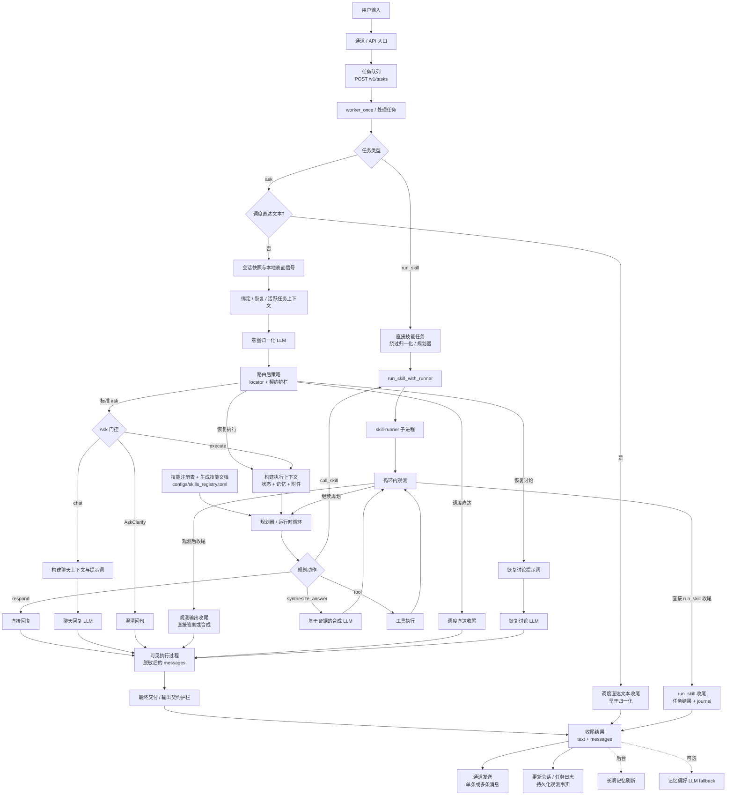
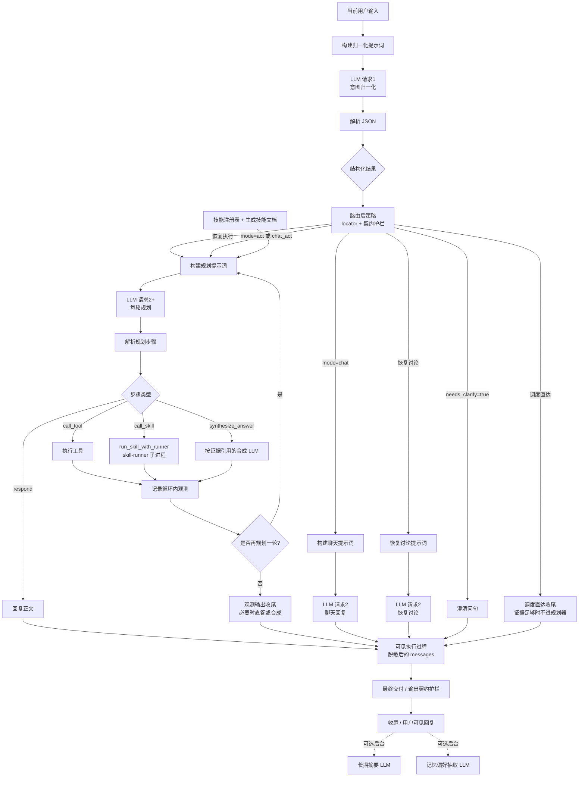

# RustClaw


英文版：`README.md`

RustClaw 是一个以 `clawd` 为核心的本地 Rust Agent Runtime。它把多通道接入、任务执行、技能路由、记忆、调度、浏览器 UI，以及基于 `user_key` 的身份体系整合到一套可部署系统里。

## 项目概览

RustClaw 面向“消息端或浏览器里就能完成日常使用和管理”的场景，而不是只给命令行使用者。

当前仓库的主要能力包括：

- 多通道接入：Telegram、微信、飞书、Lark、WhatsApp Cloud、WhatsApp Web、浏览器 UI，以及可选的 `webd`
- 由 `clawd` 提供任务运行时、HTTP API、路由、记忆和调度
- 通过 `skill-runner` 拉起技能子进程
- 覆盖系统、文件、网络、图片、语音、加密货币、知识库、自动化等场景的技能
- 本地浏览器控制台位于 `UI/`
- 树莓派/小屏桌面程序位于 `pi_app/`

## 规划优先架构

RustClaw 主自然语言路径正转向「规划优先、单循环」设计。目标是对常规请求只保留一条权威路径：先把本轮绑定到会话状态，再用**单次**意图归一化 LLM 产出路由信号（含是否澄清），之后在「只聊天一次」或「规划/运行时循环」里调用工具与技能、按需做基于证据的合成并回复。路由后策略在分发前处理 locator 与契约护栏；最终发送前再做交付与输出契约校验。

### 运行时流程



- **会话快照与本地表面信号**：把每一轮话绑定到当前对话，并在路由前抽取有限的本地事实；**不是**单独的「轮次分类」LLM 阶段。
- **意图归一化 LLM**：一次调用产出 `routed_mode`、`needs_clarify`、`output_contract` 以及可选的 `turn_type` / `target_task_policy` 等字段——**澄清 / 聊天 / 执行**在此处分流，**不是**规划器 JSON 里的 `clarify` 动作。
- **任务队列**：HTTP 调用通过 `POST /v1/tasks` 入队；各通道守护进程也复用同一 worker 任务路径。
- **任务类型**：`kind=ask` 进入归一化 / 路由后策略 / ask 分发流程；`kind=run_skill` 不跑 LLM 路由，直接通过共享 runner 路径执行指定技能。
- **路由后策略**：归一化之后、分发之前处理 locator 解析、缺 locator 澄清和契约护栏；它可以细化门控，但不是语义快路径。
- **调度 / 恢复支路**：调度器触发的直达文本任务可在归一化前收尾；普通调度直达请求可在路由后、进入规划器前完成收尾；恢复讨论走恢复提示词；恢复执行回到正常执行运行时。
- **Ask 门控**：只保留 `AskClarify / chat / execute` 的薄分流。代码分发走 `AskMode`（`ClarifyOrChat` 与 `Act`），`RoutedMode`（`AskClarify`、`Chat`、`Act`、`ChatAct`）仍是面向 normalizer 的兼容形状。
- **聊天回复 LLM**：`mode=chat` 直接走聊天回复，不进入执行规划器循环。
- **规划器 / 运行时循环**：在 act / chat_act 下多轮执行；规划步骤类型为 `think`、`call_tool`、`call_skill`、`synthesize_answer`、`respond`（当前**没有** `delegate` 类型；子任务前缀多用于日志与追踪，而非独立的子循环委派）。
- **执行上下文**：整合运行态、当前任务上下文、附件、最近执行记录与持久记忆，避免记忆压过最新用户指令。
- **技能注册表 + 生成技能文档**：规划器可见技能来自运行时 skill views 与生成接口文档，主要由 `configs/skills_registry.toml`、`crates/skills/*/INTERFACE.md`、`prompts/layers/generated/skills/*` 提供。新增技能应扩展这些契约，而不是新增特定语言的规划分支。
- **call_skill / 直接 run_skill**：都经过 `run_skill_with_runner` 拉起 `skill-runner`，再启动具体技能二进制。
- **循环内观测与观测输出收尾**：工具、技能与合成步骤输出作为循环内证据；如果计划只完成观测，也可以通过结构化直答或运行时合成完成交付。
- **可见执行过程**：用户可见的过程块作为脱敏后的 `messages` 组装，并与最终交付正文分离；这样既能外露执行过程，也不会暴露原始 prompt、堆栈或密钥。
- **最终交付 / 输出契约护栏**：在保存结果前规范文件 token、`messages`、精确标量/严格输出形状与交付一致性。
- **收尾结果**：可同时包含 `text` 和 `messages` 数组；通道适配器在有多条可发布消息时会分别发送。

### LLM 请求流程



- **LLM 请求1 / 意图归一化**：只做结构化理解，不产出最终答案。
- 本图只覆盖常规 `kind=ask` 的 LLM 路径。`kind=run_skill` 和调度器触发的直达文本 ask 不发生归一化 / 规划器 LLM 请求，会走各自的直接任务路径收尾。
- **构建聊天 / 规划提示词**：把模式、会话态、工作上下文与输出约定拼进后续请求。
- **技能注册表 + 生成技能文档**：规划提示词从已启用技能视图与生成接口文档构建，技能能力增长应由数据/契约驱动。
- **LLM 请求2**：**Chat** 模式通常只需**一次**聊天补全后进入收尾。**Act / chat_act** 则按循环进行**一轮或多轮**规划 LLM；规划 JSON 只包含 `{think, call_tool, call_skill, synthesize_answer, respond}`（**没有** `clarify`、`delegate` 步骤类型）。
- **执行工具或技能**：跑真实能力，避免模型假装已执行。
- **synthesize_answer**：当规划里包含该步骤时会**额外**触发合成 LLM；可与执行交错，**不一定**是「全部规划结束后的固定第三次 LLM」。
- **观测输出收尾**：如果计划在观测步骤后没有终端 `respond`，运行时仍可发布结构化直答，或走观测答案合成路径。
- **可见执行过程**：普通回复、澄清和执行结果都会在最终交付前经过脱敏的可见过程消息层。
- **最终交付 / 输出契约护栏**：在最终任务持久化前执行交付规范化与输出契约验证。
- **收尾**：保存用户可见结果后，还可能启动后台记忆任务，包括长期摘要刷新，以及受 `configs/memory.toml` 控制的可选偏好抽取。

## 主要组件

- `crates/clawd`：核心运行时、HTTP API、任务队列、路由、记忆、鉴权、调度
- `crates/skill-runner`：根据注册表和约定启动技能二进制
- `crates/clawcli`：面向 `clawd` 的终端 CLI
- `crates/webd`：可选的反向代理和登录会话桥接层
- `crates/telegramd`、`crates/wechatd`、`crates/feishud`、`crates/larkd`、`crates/whatsappd`、`crates/whatsapp_webd`：通道守护进程
- `crates/skills/*`：技能实现及其 `INTERFACE.md`
- `UI/`：基于 Vite + React 的本地控制台
- `pi_app/`：小屏桌面程序和启动脚本

## 快速开始

### 1. 前置条件

```bash
rustup default stable
python3 --version
```

必须有 `python3`。如果你要构建或部署前端 UI，还需要 `npm`。

### 2. 安装启动命令

推荐方式：

```bash
# 仅安装启动器，不部署 nginx/UI
bash install-rustclaw-cmd.sh --user --no-deploy-ui

# 从源码构建后再安装
bash install-rustclaw-cmd.sh --build --user --no-deploy-ui

# 安装启动器，并按脚本默认行为把 UI 部署到 nginx
bash install-rustclaw-cmd.sh --build --user
```

说明：

- `install-rustclaw-cmd.sh` 会安装 `rustclaw` 启动器
- 如果仓库里已经构建出 `clawcli`，安装脚本也会一并安装它
- 默认情况下，安装脚本会部署 `UI/dist` 到 nginx、写入 nginx 配置并尝试重载 nginx；如果只想装命令，不想碰 UI/nginx，请显式传 `--no-deploy-ui`
- 支持 `--target <triple>`、`--dir <path>`、`--deploy-ui-nginx [path]`、`--pi-app`；其中 `--pi-app` 只会在树莓派上配置小屏桌面程序和登录自启动，普通电脑会自动跳过
- 如果未传 `--build`，脚本会优先复用现有二进制；找不到时才提示你构建或同步 `release-bin`

安装后检查：

```bash
command -v rustclaw
rustclaw -h
rustclaw -status
```

### 3. 配置运行时和通道

主配置：

- `configs/config.toml`
- `configs/skills_registry.toml`

常见拆分配置：

- `configs/image.toml`
- `configs/audio.toml`
- `configs/crypto.toml`
- `configs/memory.toml`

当前实际存在的通道配置文件：

- `configs/channels/telegram.toml`
- `configs/channels/wechat.toml`
- `configs/channels/feishu.toml`
- `configs/channels/lark.toml`
- `configs/channels/whatsapp.toml`
- `configs/channels/whatsapp-web.toml`
- `configs/channels/whatsapp-cloud.toml`
- `configs/channels/webd.toml`

### 4. 从源码构建

```bash
# 完整 release 构建：先同步技能文档，再构建工作区，并在未跳过时执行 UI 构建/部署脚本
./build-all.sh

# 跳过 UI 构建
./build-all.sh no-ui

# 清理后重建
./build-all.sh clean

# 指定主 target
./build-all.sh --target aarch64-unknown-linux-gnu

# 树莓派交叉编译：默认 64 位 Raspberry Pi OS
./cross-build-pi.sh

# 32 位 Raspberry Pi OS
./cross-build-pi.sh --target pi32

# 一次构建多个 target
./build-all.sh --target host --extra-target aarch64-unknown-linux-gnu
```

`build-all.sh` 的当前行为：

- 开始前先执行 `scripts/sync_skill_docs.py`
- 默认构建 `release`，并自动发现工作区里的二进制目标后校验产物是否齐全
- 若存在 `UI/` 且未传 `no-ui`，会调用 `build-ui-nginx.sh`，也就是走“构建 UI + 部署到 nginx”的默认流程
- `--target host` 输出到 `target/release`，交叉编译输出到 `target/<triple>/release`
- `cross-build-pi.sh` 会先准备 Raspberry Pi 目标的 linker / `cc` / bindgen 参数，再调用现有构建流程；默认跳过 UI 构建，避免交叉编译时被前端构建阻塞

如果你只想临时本地编译某个 Rust 目标，仍然可以直接用 `cargo build --workspace --release`，但它不会覆盖 `build-all.sh` 里的同步、UI 构建和产物校验逻辑。

### 5. 启动 RustClaw

使用启动器的示例：

```bash
# 最简启动：等价于 release + channels=all + quick 模式
rustclaw start -q

# 指定厂商/模型启动
rustclaw -start --vendor openai --model gpt-5 --profile release --channels all --quick --skip-setup

# 启动时要求检查并带上 UI
rustclaw -start release all --with-ui
```

当前启动链路与脚本语义：

- `rustclaw -start ...` 最终调用的是 `start-all.sh`
- `start-all.sh` 当前按 `configs/channels/*.toml` 里的 `enabled` 开关决定启动哪些服务
- 如果传了 `telegram | whatsapp_web | both | whatsapp_cloud | all`，脚本会把 Telegram / WhatsApp 相关通道的 `enabled` 值写回配置文件
- 这里的 `all` 是启动器里的快捷通道组合，不等于强制打开 `webd`、`wechat`、`feishu`、`lark` 等所有通道；这些仍以各自配置文件里的 `enabled` 为准
- `--with-ui` 不会自动帮你开发模式起前端，而是要求 `UI/dist` 已存在且没有过期；缺失时会提示你先执行 `cd UI && npm install && npm run build`
- `start-all.sh` 不再在启动阶段自动执行 `sync_skill_docs.py`

脚本方式依然可用：

```bash
./start-all.sh
./stop-rustclaw.sh
```

如果你想按服务精细控制，也可以直接用单服务脚本：

```bash
./component_start/start-clawd.sh
./component_start/start-telegramd.sh
./component_start/start-wechatd.sh
./component_start/start-feishud.sh
./component_start/start-larkd.sh
./component_start/start-whatsappd.sh
./component_start/start-whatsapp-webd.sh
./component_start/start-clawd-ui.sh
```

单独启动 `clawd` 时：

- `./component_start/start-clawd.sh` 会检查 `target/release/clawd` 和 `target/release/skill-runner`
- 如果 `configs/config.toml` 里还没有 `selected_vendor` / `selected_model`，会在首次启动时要求交互选择
- 若当前厂商的 `api_key` 为空或还是 `REPLACE_ME...`，也会要求在终端里补齐后再启动

### 6. 日常运维命令

```bash
rustclaw -status
rustclaw -logs clawd 200 --follow
rustclaw -health
rustclaw -stop
rustclaw -key list
```

## 身份与访问控制

RustClaw 使用 `user_key` 作为跨 UI 和消息通道的主身份标识。

- 权限按 `user_key` 解析
- 会话按 `channel + external_chat_id` 解析
- 浏览器 UI 通过 `X-RustClaw-Key` 传递身份
- 当鉴权表为空时，`clawd` 可以引导生成首个管理员 key

常用 key 管理命令：

```bash
rustclaw -key list
rustclaw -key generate user
rustclaw -key generate admin
rustclaw -key add rk-xxxx admin
rustclaw -key disable rk-xxxx
```

## UI、API 与 `webd`

主 API 仍由 `clawd` 提供；而脚本当前默认更推荐的对外方式是：

- `clawd` 提供内部 API
- `webd` 作为浏览器访问层/反向代理桥接
- nginx 托管 `UI/dist`，并把 `/v1`、`/webd` 反代到 `webd`

在默认配置里，`configs/config.toml` 中的 `clawd` 监听通常是 `0.0.0.0:8787`，`webd` 默认监听常见为 `0.0.0.0:8788`；部署脚本会从 `configs/channels/webd.toml` 推导反代上游地址。

常用接口：

- `GET /v1/health`
- `POST /v1/tasks`

## NL 回归快捷入口

面向长尾闭环链路的常用入口：

- `bash scripts/nl_tests/run_suite.sh ops_closed_loop`
- `bash scripts/nl_tests/run_suite.sh long_tail_flows`
- `bash scripts/nl_tests/run_suite.sh ops_http_repair`

其中 `ops_http_repair` 是专门盯 `ops_http_repair_then_validate_{zh,en}` 的双语回归入口，日志写到 `scripts/nl_suite_logs/ops_http_repair/<timestamp>/`。
- `GET /v1/tasks/{task_id}`
- `POST /v1/tasks/cancel`
- `GET /v1/auth/me`
- `POST /v1/auth/channel/bind`
- `GET/POST /v1/auth/crypto-credentials`：按当前 `X-RustClaw-Key` 作用域读取或覆盖当前 key 自己的交易所凭据

快速示例：

```bash
curl http://127.0.0.1:8787/v1/health

curl -X POST http://127.0.0.1:8787/v1/tasks \
  -H "Content-Type: application/json" \
  -H "X-RustClaw-Key: rk-xxxx" \
  -d '{"user_id":1,"chat_id":1,"user_key":"rk-xxxx","channel":"ui","external_user_id":"local-ui","external_chat_id":"local-ui","kind":"ask","payload":{"text":"hello","agent_mode":true}}'
```

UI 相关说明：

- 源码位于 `UI/`
- 构建产物位于 `UI/dist`
- `build-ui-nginx.sh` 默认会执行“构建 UI + 复制到 nginx + 校验/写入 nginx 配置”
- `deploy-ui-nginx.sh` 更偏向“部署已有 `UI/dist`”，可选 `--build`
- `install-rustclaw-cmd.sh` 默认也会执行 UI/nginx 部署，除非传 `--no-deploy-ui`
- `webd` 可以作为 `clawd` 前面的反向代理和登录会话桥接层

## 技能体系

RustClaw 当前内置的技能已经比较完整，按类别可大致分为：

- 系统与运维：`system_basic`、`process_basic`、`service_control`、`health_check`、`log_analyze`、`task_control`
- 文件与开发工具：`archive_basic`、`fs_search`、`git_basic`、`package_manager`、`install_module`、`docker_basic`、`db_basic`
- 网络与内容处理：`http_basic`、`rss_fetch`、`browser_web`、`doc_parse`、`transform`、`web_search_extract`
- 多模态：`image_generate`、`image_edit`、`image_vision`、`audio_transcribe`、`audio_synthesize`
- 业务类：`crypto`、`stock`、`weather`、`map_merchant`、`kb`、`x`

如果要回答“某个 skill 怎么配置、怎么绑定、缺什么前置条件”，优先看：`prompts/references/skill_setup_guide.zh-CN.md`。

技能发现与运行主要由这些位置驱动：

- `configs/skills_registry.toml`
- `configs/config.toml` 里的 `[skills]`
- `crates/skills/*/INTERFACE.md`
- `prompts/layers/generated/skills/*.md`

Planner 的技能选择必须由 registry 与 interface/prompt 驱动。一个技能完成注册、开启、补齐 `INTERFACE.md` 并执行 `python3 scripts/sync_skill_docs.py` 后，planner 应该通过生成的 skill prompt 学会何时使用它。不要为了让某个新自然语言样例通过，就在 `clawd` 里新增按技能名分支的选择逻辑。若选择准确率不够，优先改 `INTERFACE.md`、生成提示词或必要的 vendor patch；Rust 代码只保留协议校验、权限/安全边界、runner 派发、输出合同校验和确定性的跨平台执行兼容。

技能接入入口：

- 统一说明：`docs/skill_integration_guide.md`
- 普通 `runner` 技能：`skill_develop/README.md`
- 外部技能示例：`external_skills/example/README.md`

### 本地 STT：whisper.cpp

`audio_transcribe` 可以通过 `custom` OpenAI-compatible provider 接本地 whisper.cpp 服务。建议使用专用本地端口，例如 `8178`，避免和 `clawd`、UI 或其他组件端口冲突。

```bash
./build/bin/whisper-server -m models/ggml-small.bin \
  --host 127.0.0.1 --port 8178 \
  --request-path /v1 --inference-path /audio/transcriptions \
  --convert --language auto
```

中文语音要选多语言 Whisper 模型，例如 `ggml-small.bin`、`ggml-medium.bin` 或 `ggml-large-v3*.bin`；不要用 `.en` 结尾的英文专用模型。

```toml
[audio_transcribe]
default_vendor = "custom"
adapter_mode = "compat"
allow_compat_adapters = true
default_model = "local-whisper"
custom_models = ["local-whisper", "whisper-1"]

[audio_transcribe.providers.custom]
base_url = "http://127.0.0.1:8178/v1"
api_key = ""
model = "local-whisper"
timeout_seconds = 120
```

空 `api_key` 只允许本机 `custom` provider（`localhost`、`127.0.0.1`、`::1`）。如果是远端 custom provider，仍然必须配置真实 key。

## 目录说明

- `configs/`：运行时、通道、模型、记忆、技能配置
- `crates/`：Rust 服务、守护进程、CLI 和技能实现
- `prompts/`：提示词分层和自动生成的技能提示词
- `scripts/`：安装、回归、维护、技能调用辅助脚本
- `UI/`：浏览器控制台项目
- `pi_app/`：桌面小屏程序
- `docker/`：Docker 相关配置和入口
- `systemd/`：服务模板

## Pi App 小屏程序

小屏桌面程序位于 `pi_app/`。

```bash
cd pi_app && ./run-small-screen.sh
cd pi_app && ./install-desktop.sh
cd pi_app && ./enable-autostart.sh
cd pi_app && ./open-small-screen.sh
```

它会读取 `clawd` 的健康状态，所以需要先启动后端。

## 开发说明

- 如果你是源码开发者，`build-all.sh` 是最贴近当前仓库脚本行为的统一构建入口
- 如果你是部署或体验使用者，`install-rustclaw-cmd.sh` 是更直接的入口，因为它会同时处理启动器安装和可选的 UI/nginx 部署
- 如果你只想更新 UI 静态站点，优先看 `build-ui-nginx.sh` 和 `deploy-ui-nginx.sh`
- 如果你在做技能接入，记得显式执行 `python3 scripts/sync_skill_docs.py`，不要依赖启动脚本帮你同步
- 各类回归和辅助脚本主要集中在 `scripts/`
- 如果要跑本地 `ops_closed_loop` 闭环回归，执行 `bash scripts/regression_ops_closed_loop.sh`

## 许可证

本项目使用非商用、源码可见许可。

- 英文法律文本：`LICENSE`
- 中文参考翻译：`LICENSE.zh-CN.md`
