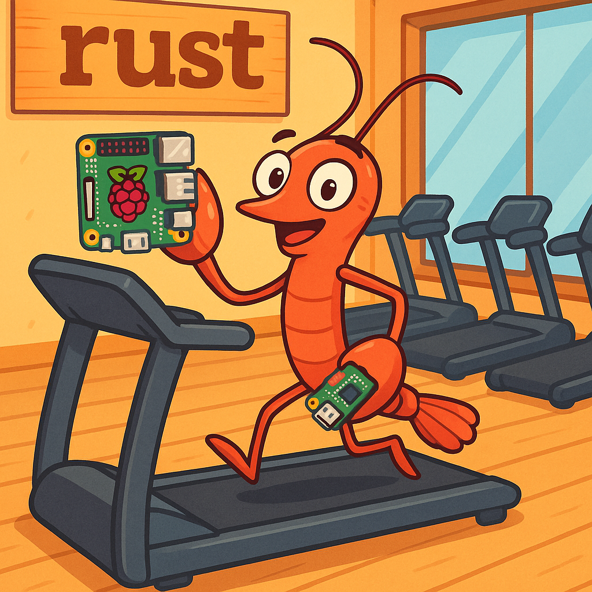

# RustClaw



英文版：`README.md`

RustClaw 是一个基于 Rust 的本地 Agent 运行时栈。核心由 `clawd` 提供任务网关与执行编排，并通过 Telegram / WhatsApp / UI 多通道接入，支持技能调用、调度、记忆、多模态能力，以及基于 `user_key` 的身份体系。

## 核心架构

- `crates/clawd`：HTTP API、任务队列、路由、调度、记忆、执行适配层
- `crates/claw-core`：共享配置、类型定义、错误模型
- `crates/skill-runner`：技能进程宿主，负责拉起和调用各个 skill
- 通信适配器：
  - `crates/telegramd`
  - `crates/whatsappd`（Cloud API）
  - `crates/whatsapp_webd` + `services/wa-web-bridge`（WhatsApp Web）
- 技能实现：`crates/skills/*`
- 配置：`configs/`
- 数据与迁移：`data/`、`migrations/`

## 身份与通道绑定

- 系统以 `user_key` 作为主身份标识，Telegram / WhatsApp / UI 都绑定到这个身份上，而不是各自维持永久用户 ID。
- 会话范围与身份分离：
  - 执行上下文、记忆、任务归属按 `channel + external_chat_id` 解析
  - 权限与敏感凭证按 `user_key` 解析
- UI 现在是正式一等 channel（`ui`），与 Telegram / WhatsApp 使用同一套鉴权模型。
- 当鉴权表为空时，`clawd` 可以自动生成首个 admin key。
- 本地 key 管理：
  - `rustclaw -key list`
  - `rustclaw -key generate admin`
  - `rustclaw -key generate user`
  - `scripts/auth-key.sh list`

## 多步骤任务行为

- Agent 的 `act` 请求会先被拆成可执行子步骤，再开始执行。
- 一旦拆成多步，系统会先把编号任务列表发给用户，再按顺序执行。
- 如果执行中途失败，任务结果里可能带 `resume_context`，后续诸如“继续”“为什么失败了”“不用了”这类回复会被分流成 `resume / defer / abandon`。
- `resume` 只会继续未完成步骤，不会重复已完成步骤。

## 技能说明

- `archive_basic`：压缩、解压、列归档内容
- `audio_synthesize`：文本转语音
- `audio_transcribe`：语音转文本
- `chat`：轻量聊天生成，适合笑话、小型闲聊、简短文本生成
- `config_guard`：安全配置修改
- `crypto`：行情、指标、新闻、持仓、预览下单、确认下单、查单、撤单
- `db_basic`：本地数据库查询/受控修改
- `docker_basic`：容器诊断与生命周期操作
- `fs_search`：文件系统搜索
- `git_basic`：Git 辅助操作
- `health_check`：健康检查
- `http_basic`：HTTP/API 调试
- `image_edit` / `image_generate` / `image_vision`：图片编辑、生成、视觉分析
- `install_module`：模块安装辅助
- `log_analyze`：日志诊断
- `package_manager`：包管理
- `process_basic`：进程管理
- `rss_fetch`：RSS/新闻抓取
- `service_control`：服务控制
- `system_basic`：系统信息与基础诊断
- `x`：X/Twitter 相关流程

## API 与本地 UI

监听地址在 `configs/config.toml` 中配置，例如 `0.0.0.0:8787`。多数受保护 API 需要 `X-RustClaw-Key`。

- `GET /v1/health`：服务健康、队列、进程状态
- `POST /v1/tasks`：提交任务（`ask` / `run_skill`）
- `GET /v1/tasks/{task_id}`：查询任务结果
- `POST /v1/tasks/cancel`：按会话范围取消任务
- `POST /v1/auth/ui-key/verify`：验证 UI key
- `GET /v1/auth/me`：通过 key 解析当前身份
- `POST /v1/auth/channel/resolve`：解析通道绑定
- `POST /v1/auth/channel/bind`：绑定 Telegram / WhatsApp / UI 到某个 key
- `GET/POST /v1/auth/crypto-credentials`：读取/写入某个用户自己的交易所 API 凭证

示例：

```bash
curl http://127.0.0.1:8787/v1/health \
  -H "X-RustClaw-Key: rk-xxxx"

curl -X POST http://127.0.0.1:8787/v1/tasks \
  -H "Content-Type: application/json" \
  -d '{"user_id":1,"chat_id":1,"user_key":"rk-xxxx","channel":"ui","external_user_id":"local-ui","external_chat_id":"local-ui","kind":"ask","payload":{"text":"hello","agent_mode":true}}'
```

本地监控 UI：

- 地址：`http://127.0.0.1:8787/`
- 默认静态目录：`UI/dist`
- 可通过环境变量 `RUSTCLAW_UI_DIST` 覆盖
- 浏览器端会本地保存 `user_key`，并通过 `X-RustClaw-Key` 发给后端

桌面小程序 / 小屏监控：

- 目录：`pi_app/`
- Python 桌面小程序前台启动：`cd pi_app && ./run-small-screen.sh`
- 安装桌面快捷方式：`cd pi_app && ./install-desktop.sh`
- 启用登录后自启动：`cd pi_app && ./enable-autostart.sh`
- 浏览器全屏打开网页版小屏：`cd pi_app && ./open-small-screen.sh`
- 桌面小程序读取 `GET /v1/health`，因此需要先启动 `clawd`
- 首次启动时，Python 小程序会自动生成一把本机专用 `user` key，并保存到 `pi_app/.rustclaw_small_screen_key`

## 启动与日常操作

安装统一命令：

```bash
bash install-rustclaw-cmd.sh
bash install-rustclaw-cmd.sh --user
```

安装后检查：

```bash
command -v rustclaw
rustclaw -h
rustclaw -status
```

Key 管理：

```bash
rustclaw -key list
rustclaw -key generate user
rustclaw -key generate admin
```

启动：

```bash
rustclaw -start --vendor openai --model gpt-4.1 --profile release --channels all --with-ui --quick
rustclaw -start release all
```

日常：

```bash
rustclaw -status
rustclaw -logs clawd 200 --follow
rustclaw -health
rustclaw -stop
```

旧脚本方式仍可用：

```bash
./start-all.sh
./stop-rustclaw.sh
```

## 行为与配置补充

- 图像/音频兼容适配开关默认在拆分配置里，默认值为 `false`
- 配置拆分：
  - `configs/config.toml`：基础配置
  - `configs/image.toml`：图片相关 skill
  - `configs/audio.toml`：音频相关 skill
- 原生适配模型路由：
  - `configs/image.toml` / `configs/audio.toml` 中的 `native_models` 用来控制哪些 Qwen 模型在 `auto` 模式下优先走原生适配。
  - 如果模型不在 `native_models` 中，且允许 compat，则 RustClaw 会优先走 compat 适配。
- `chat-skill` 的默认 system prompt 现在已独立到 prompt 文件，并支持运行时读取：
  - `prompts/chat_skill_system_prompt.md`
  - `prompts/chat_skill_joke_system_prompt.md`
- 若调用方显式传入 `system_prompt`，则优先使用调用方传入值，而不是默认 prompt 文件
- 交易所 API 凭证不再作为全局共享配置使用，而是按 `user_key` 存入 `exchange_api_credentials`
- 模型优先级与通道路由分离：模型选择仍按 `request.model > default_model > <vendor>_models[0] > models[0] > llm.<vendor>.model`，原生/兼容通道则由 `native_models` 和 `adapter_mode` 决定

## 主要脚本

- `rustclaw`：统一运行命令
- `install-rustclaw-cmd.sh`：安装 `rustclaw`
- `cross-build-upload.sh`：远端交叉编译并回传产物
- `build-all.sh`：构建工作区二进制
- `start-all.sh` / `stop-rustclaw.sh`：一键启动 / 停止
- `start-clawd.sh` / `start-clawd-ui.sh`
- `start-telegramd.sh`
- `start-whatsappd.sh`
- `start-whatsapp-webd.sh`
- `start-wa-web-bridge.sh`
- `scripts/auth-key.sh`：低层 key 管理
- `scripts/import-crypto-credentials.sh`：导入旧版交易所凭证到数据库
- `pi_app/run-small-screen.sh`：前台启动 Python 桌面小程序，适合调试
- `pi_app/run-small-screen-launcher.sh`：桌面图标/自启动使用的启动器，会补全图形环境变量
- `pi_app/install-desktop.sh`：创建 `~/Desktop/RustClaw.desktop`
- `pi_app/enable-autostart.sh`：启用桌面小程序开机自启动
- `pi_app/disable-autostart.sh`：取消桌面小程序开机自启动
- `pi_app/open-small-screen.sh`：全屏打开网页版小屏

## 目录参考

- `configs/config.toml`：主配置
- `configs/image.toml`：图片技能配置
- `configs/audio.toml`：音频技能配置
- `configs/hard_rules/main_flow.toml`：主流程硬规则/恢复/总结等标记
- `configs/channels/*.toml`：通道配置
- `configs/command_intent/*.toml`：意图路由规则
- `configs/i18n/*.toml`：国际化文本
- `prompts/`：所有 prompt 模板
- `prompts/chat_skill_system_prompt.md`：`chat-skill` 普通聊天默认 system prompt
- `prompts/chat_skill_joke_system_prompt.md`：`chat-skill` 笑话模式默认 system prompt
- `migrations/`：数据库迁移
- `pi_app/`：桌面小程序 / 树莓派小屏监控
- `systemd/`：服务部署模板
- `USAGE.md`：团队使用补充说明

## 说明

- 生产部署前请检查并清理配置中的敏感内容。
- 如需 systemd 部署，请以 `systemd/` 下模板为基础调整。

## 许可证

本项目使用非商用、源码可见许可：

- 英文法律文本：`LICENSE`
- 中文参考翻译：`LICENSE.zh-CN.md`
