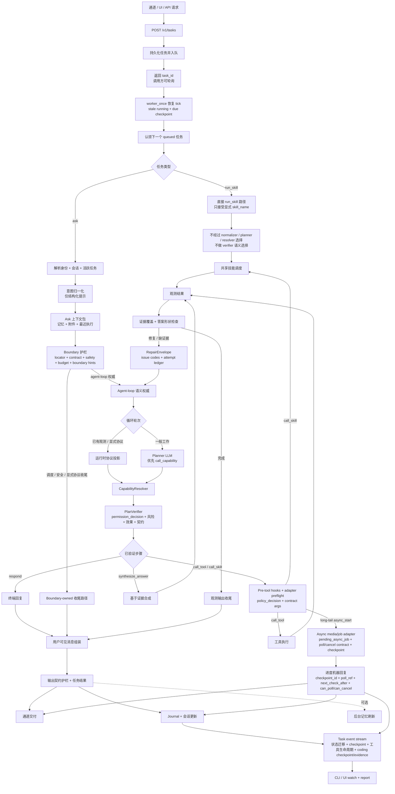
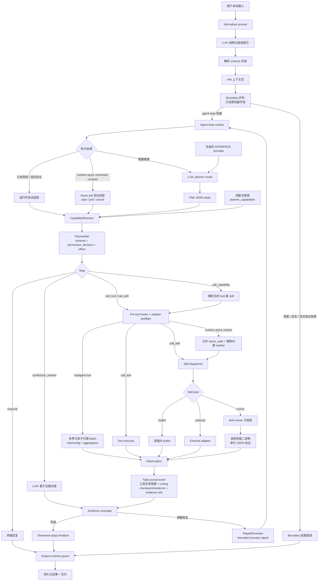
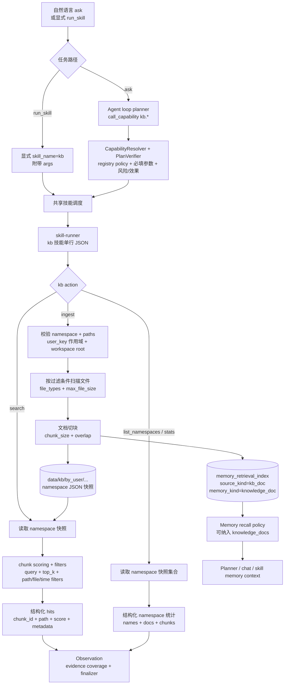
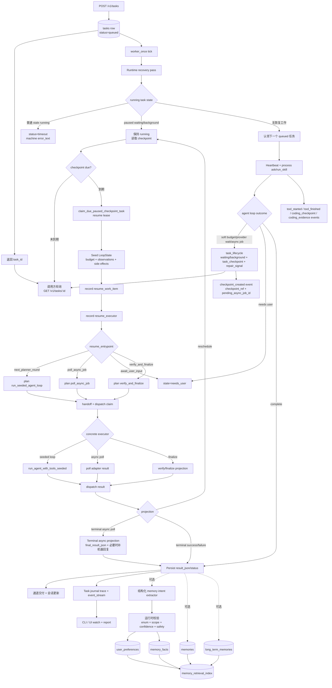
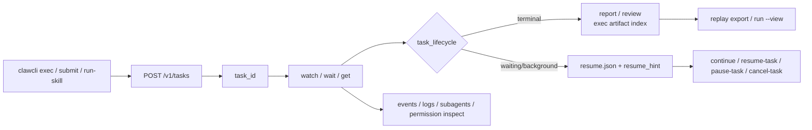
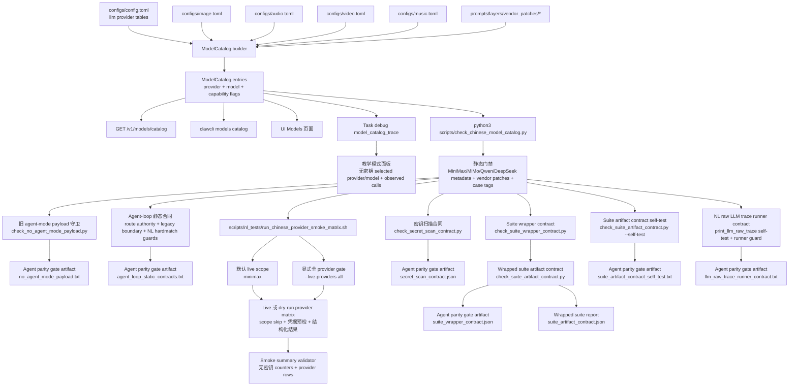

# RustClaw


英文版：`README.md`

RustClaw 是一个以 `clawd` 为核心的本地 Rust Agent Runtime。它把多通道接入、任务执行、技能路由、记忆、调度、浏览器 UI，以及基于 `user_key` 的身份体系整合到一套可部署系统里。

## 项目概览

RustClaw 面向“消息端或浏览器里就能完成日常使用和管理”的场景，而不是只给命令行使用者。

当前仓库的主要能力包括：

- 多通道接入：Telegram、微信、飞书、Lark、WhatsApp Cloud、WhatsApp Web、浏览器 UI，以及可选的 `webd`
- 由 `clawd` 提供任务运行时、HTTP API、路由、记忆和调度
- 共享技能调度层，支持进程内 builtin、external adapter，以及通过 `skill-runner` 拉起的 runner 子进程
- 覆盖系统、文件、网络、图片、语音、视频、音乐、加密货币、知识库、自动化等场景的 builtin、external 与 runner 技能
- 本地浏览器控制台位于 `UI/`，其中包含独立的 NNI 设备签名页面
- 树莓派/小屏桌面程序位于 `pi_app/`

## Agent Loop 架构

RustClaw 主自然语言路径默认使用接近 Codex / Claude 的 agent loop。Boundary layer 负责把本轮绑定到身份与会话状态，构建结构化边界提示，并应用 locator、契约、安全、确认、dry-run、预算、能力和证据护栏；之后把普通语义决策交给 agent loop：回复、调用能力、按证据合成、修复、继续或停止。普通缺槽判断保持 loop-owned；boundary 收尾只限显式调度、安全、协议或已有观测完成路径。意图归一化器只是初始结构化提示，不是最终语义权威。旧 pre-agent 语义路由开关已经从运行时配置中移除；普通 ask/chat fallback 由 agent loop 处理。

### 请求与 Agent Loop 流程



- `POST /v1/tasks`：通道守护进程、浏览器 UI 和 HTTP 调用者都收敛到同一套持久化任务队列。
- `task_id polling`：API/通道请求的等待超时只影响调用方等多久；后台任务仍可通过 `GET /v1/tasks/{task_id}` 查询，除非 worker 生命周期逻辑已经把它标记为终态。
- `worker_once recovery tick`：worker 认领新 queued 任务前，会先检查 stale running、受保护 paused checkpoint、到期恢复任务、async poll 结果和结果投影。
- `Task kind`：`kind=ask` 进入可使用 agent 的自然语言路径；`kind=run_skill` 绕过 intent normalizer、planner loop、capability resolver 和 plan verifier，只把显式提供的 `payload.skill_name` 交给共享 skill dispatcher / 协议执行。两种 task kind 都会把结果写回原始 `task_id`，调用方仍可通过 task 查询 API 查看最终状态。

### Ask 与 Run Skill 边界

这里需要明确区分，因为 `run_skill` 是 API 层任务类型，不是自然语言路由捷径。

直接技能任务的关键点：

- `kind=run_skill` 不运行 intent normalizer，也不进入 planner / agent loop；调用方已经提供了 `payload.skill_name` 和参数。
- `kind=run_skill` 接受显式技能名后，仍使用共享 skill dispatcher 和技能协议。
- `kind=run_skill` 仍创建和更新普通 task row，因此最终状态和结果仍可通过 `task_id` 查询。

| 问题 | `kind=ask` | `kind=run_skill` |
| --- | --- | --- |
| 是否运行 intent normalizer？ | 是，作为结构化提示和兼容输入。 | 否。调用方已经提供目标技能。 |
| 是否进入 planner / agent loop？ | 普通自然语言工作默认进入；显式调度、安全、协议和已有观测完成路径可不要求 planner 重新选择能力而收尾。 | 否。不会让 planner 选择技能或 action。 |
| 是否把 `CapabilityResolver` / `PlanVerifier` 当作语义选择器？ | 否。普通语义选择由 planner 负责；resolver/verifier 只解析和校验 planner step，再允许执行。 | 否。直接技能任务绕过语义选择；显式 skill call 仍走调度和协议校验。 |
| 是否使用共享 skill dispatcher？ | 是，planner 选择 `call_skill` 或 capability 解析到 skill 时使用。 | 是。把 `payload.skill_name` 派发到同一套 builtin / external / runner 技能协议。 |
| 结果是否能用 `task_id` 查询？ | 是。 | 是。直接技能结果保存到原始 task row，可通过 `GET /v1/tasks/{task_id}` 或 `clawcli get` 读取。 |

操作上：用户给自然语言请求时使用 `kind=ask`，让 RustClaw 自己判断回答、澄清、规划或执行。API 调用方已经知道明确技能和参数时使用 `kind=run_skill`，只把 RustClaw 当作任务队列、鉴权、生命周期和结果投影层来运行该技能。

- `Intent normalizer`：产出结构化提示和兼容 trace 字段；对普通 eligible 工作，它不是最终语义权威。
- `Boundary guards`：绑定身份/会话状态，并基于机器字段应用 locator、contract、safety、budget、confirmation、dry-run 和兼容检查。该层应保持轻量，不能继续增加按语言维护的短语逻辑。
- `Agent-loop 语义权威`：普通自然语言工作默认进入循环，由 planner/runtime 决定回复、调用能力、执行工具或技能、按证据合成、修复或停止。
- `CapabilityResolver / PlanVerifier`：把 `call_capability` 解析到当前 tool 或 skill 实现，再检查可见性、必填参数、allowed action、risk/effect、confirmation 和输出契约。
- `permission_decision`：verifier 和 preflight blocker 输出 `allowed`、`needs_confirmation`、`denied_by_policy`、`dry_run_required`、`external_provider_blocked`、`risk_level`、`action_effect`、registry dedup/idempotency 等机器字段。UI、API、finalizer 和 i18n 应消费这些字段渲染说明，而不是解析 runtime prose。
- `Async job start`：长尾工具可以先发布包含 `checkpoint_id`、`poll_ref`、`next_check_after`、`can_poll`、`can_cancel` 的机器回复，同时任务仍可通过 checkpoint 轮询恢复。媒体技能通过 registry capability 暴露这类形状，例如 `image.generate` / `image.poll` / `image.cancel`、`audio.synthesize` / `audio.poll` / `audio.cancel`、`video.generate` / `video.poll` / `video.cancel` 和 `music.generate` / `music.poll` / `music.cancel`。
- `Evidence coverage`：工具、技能和合成输出都会成为循环内观测；缺证据或可恢复失败会带着压缩的已尝试方法历史回到循环。
- `RepairEnvelope`：repair 是有边界的循环内恢复。运行时提供 `repair_source`、`issue_codes`、`missing_evidence`、`permission_decision`、`provider_status`、`attempt_fingerprint`、`side_effect_fingerprint`、`checkpoint_id`、`next_recovery_kind` 等机器字段；planner/finalizer 可以据此重新规划、澄清、转后台等待或结构化失败，而不是解析本地化 prose。
- `Observed-output finalizer`：只有答案形状与证据契约满足后，才发布有观测依据的结果。
- `Output-contract guard`：保存结果前规范最终文本、`messages` 数组、文件 token、标量/严格输出形状和通道交付一致性。
- `Journal + session update`：任务状态、观测事实和活跃会话锚点在收尾后持久化；后台记忆任务是可选、非阻塞的。
- `Task event stream`：journal trace 事件暴露机器可读进度，例如 `task_transition`、`checkpoint_created`、`tool_started`、`tool_step`、`tool_finished`、`coding_checkpoint`、`coding_evidence`、`provider_call`、`agent_hook`、`subagent` 和 `task_final`。CLI 与 UI 直接渲染这些字段，包括 `evidence_ref`、`checkpoint_ref`、`checkpoint_kind`、`pending_async_job_id`、coding 计数、验证命令计数/token、验证状态/失败类别 token、未验证风险 token 和 step 时间字段，不读取原始日志或本地化文本来判断状态。

### Planner、LLM 与 Capability 流程



- `Normalizer prompt`：让 LLM 阅读本轮用户输入并输出 schema 字段。运行时把这些字段当作提示和契约消费，而不是匹配用户短语。
- `Planner prompt`：只在循环轮次需要模型推理时构建。只有显式协议或状态投影，例如 async job 轮询、安全/状态收尾，才可以不要求 planner 重新选择能力而完成；普通语义能力选择仍由 planner 负责。
- `call_capability`：推荐的 planner action，把 tool/skill 选择放到 registry metadata 与 resolver policy 后面。
- `Generated INTERFACE prompts`：来自 `crates/skills/*/INTERFACE.md`、`external_skills/*/INTERFACE.md` 和 `prompts/layers/generated/skills/*`；新增技能应改这些契约，不改 `clawd` 主流程分支。
- `Command payload contract repair`：声明了 command payload 的任务会按需要归一到 `RawCommandOutput` 或 `CommandOutputSummary` 机器契约，包括上游提示误标成 service-status 的情况。
- `PlanVerifier`：执行前阻断不可用能力、缺必填字段、不安全 mutation，以及不符合输出/证据形状的计划。拒绝路径应携带稳定机器字段，不写固定用户可见回复模板。
- `Pre-tool hooks + adapter preflight`：循环执行和有边界的恢复重试都必须经过同一套 hook、contract-argument、command-policy 与结构化错误检查，之后才允许真正执行有副作用的 adapter。
- `Task journal event`：executor observation 会投影为稳定的 `tool_started`、`tool_step`、`tool_finished`，以及可选 `coding_checkpoint` / `coding_evidence` 事件，带 step refs、evidence refs、artifact 计数、coding 计数、checkpoint kind、验证命令计数/token、验证状态/失败类别 token、验证风险 token、时间字段和 failure attribution，供 CLI/UI 进度视图使用。
- `subagent tool`：planner 授权的子代理必须显式、只读。单个 child run 或有界 `children` batch 都通过 role/config 校验、timeout/cancellation policy 字段、optional/required failure 隔离，以及只包含机器字段的聚合（`child_results`、`finding_refs`、`evidence_refs`）记录；不会授予写入或外部发布权限。
- `Skill dispatcher`：直接 `run_skill` 和 planner skill call 复用同一调度层。直接 `run_skill` 不让 normalizer / planner 选择技能，只派发显式的 `payload.skill_name`。Builtin 在进程内运行，external 走 adapter，runner 才启动 `skill-runner` 和具体二进制。
- `Skill process protocol`：runner 技能通过 stdin/stdout 交换单行 JSON；运行时需要判断时，技能应在 `extra` 返回稳定机器字段。
- `synthesize_answer`：在循环内需要自然语言合成时调度，不是每个任务固定最后再调用一次 LLM。
- `RepairEnvelope`：verifier、executor、permission、provider 和 checkpoint recovery 路径会把结构化 repair context 暴露给下一轮循环；用户可见 fallback prose 应来自 i18n、finalizer、UI 或模型，不应来自 runtime 模板。
- `Boundary finalization`：保留给显式调度、安全、协议、状态和已有观测完成路径。它不是普通语义路由器，也不应重新引入 route-authority rollback 开关。

### 权限平面与命令策略

权限平面是结构化执行边界，不是第二套语义路由器。来自 `configs/skills_registry.toml` 的 registry metadata、面向非能力输出形态的 bundled evidence policy，以及 verifier 状态会投影到 `permission_decision`，让 UI/API/finalizer 能解释发生了什么，而不需要 runtime 写死自然语言回复。普通 registry capability family 由 planner `call_capability` 和 resolver metadata 选择，不再由旧 `semantic_kind` 或兼容 contract-marker 值选择。

- `risk_level`、`requires_confirmation`、`once_per_task`、`idempotent`、`dedup_scope` 优先来自 registry 与 planner capability metadata。
- `action_effect` 从结构化 skill/action 参数和 contract metadata 派生，不从用户语言短语里判断。
- `run_cmd` 会在 `command_policy` 下输出 `policy_authority`、`literal_command_token`、`command_arg_present`、`unresolved_runtime_template_present` 和命令 effect 标记。
- 显式用户命令用 `_clawd_literal_command` 表达；否则 `run_cmd` 作为 planner 结构化命令参数处理，继续受 contract 与媒体产物 blocker 约束。
- 有风险的本地代码或文件变更能力应在 registry metadata 中声明 isolation profile。`local_temp_workspace` 用于一次性预览、dry-run 和可通过 artifact refs 清理的生成产物；`local_worktree` 用于明确写入当前工作区的开发任务，必须通过 task evidence、changed-file refs 和 verification commands 展示。UI 和 CLI 渲染 `permission_decision.steps[].sandbox`、`workspace_scope` 与 `registry_policy` 机器字段，不从本地化文本里推断权限状态。

## 自然语言契约边界

RustClaw 的原则是：自然语言理解交给 LLM，运行时只消费结构化契约。意图归一化器和规划器可以阅读用户表达、示例、技能文档和多语言提示词，但进入 Rust 运行时前，语义必须已经落到稳定字段里。

运行时允许依赖的确定性输入包括：

- evidence-policy 答案形状字段，例如 `final_answer_shape = "content_excerpt_summary"` 和 `final_answer_shape_class = "grounded_summary"`
- 面向非能力输出形态的 schema 兼容 enum，例如 `semantic_kind` / `contract_marker`，但只能在它们作为 normalizer、历史 trace 或输出契约兼容边界的机器字段出现时消费
- planner 或边界上下文输出的 capability ref，例如 `capability_ref = "package.detect_manager"` 或 `call_capability("package.detect_manager")`
- action name，例如 `read_field`、`validate_config`、`transform_data`
- registry metadata 与 `planner_capabilities`
- `EvidencePolicyContext` / `OutputContract`、结构化 locator、明确的 `field_path`
- JSON/TOML/YAML 字段路径、文件扩展名、工具结构化输出、exit code、error kind、risk/effect metadata
- `permission_decision` 与 `command_policy` 机器字段

运行时不要为了某个中文、英文或其他语言样例通过而新增短语表、固定问法分支或 `prompt.contains(...)`。如果新的自然语言表达没有被理解，应优先改 normalizer/planner schema、registry capability metadata、`INTERFACE.md`、生成技能提示词或必要的 vendor prompt patch，让 LLM 在不同语言下输出同一套结构化契约。天气、网页、图片、照片、发布、包管理、Docker、RSS、行情等普通技能必须走 registry capability metadata；过时的 registry-bridge `semantic_kind` 或 contract-marker 值会落到通用 contract policy，不能再选择这些能力族。当前 planner、verifier、finalizer 和 journal 诊断应暴露 `final_answer_shape`，不要继续把旧 marker 名称作为输出身份；例外只允许出现在隔离的 normalizer/schema 兼容和历史 trace 读取边界。本地门禁是：

```bash
python3 scripts/check_no_nl_hardmatch.py
```

## 记忆系统

RustClaw 记忆分为短期对话记录、结构化用户偏好、长期事实卡和检索索引。目标是让记忆能帮助当前任务，同时避免旧助手输出变成新的隐藏指令。

### 写入路径

`ask` 任务收尾后，RustClaw 可以持久化：

- `memories` 短期记录：按 `user_key`、`user_id`、`chat_id`、角色、类型、显著性和安全标记分组
- `user_preferences` 用户偏好：例如 `response_language`、`response_style`、`response_format`、`agent_display_name`
- `memory_facts` 长期事实卡：包含来源、置信度、作用域、状态、冲突组、过期和 supersede 信息

偏好和事实写入走结构化 memory intent contract。LLM 输出 `memory_actions`，例如 `upsert`、`delete`、`expire`、`noop`；运行时再校验 action enum、kind、scope、confidence、source evidence、TTL 和 safety 字段后才写入数据库。运行时不会通过匹配某一句自然语言来决定 durable preference。

长期摘要刷新仍作为兜底摘要路径存在，但优先把可复用知识写成事实卡。事实卡保留 `fact_key`、`fact_value`、`fact_text`、`source_ref`、`source_memory_ids_json`、`reason`、`confidence`、`expires_at_ts`、`conflict_group` 和 `status`。同一冲突组的新 active fact 会 supersede 旧 fact；过期或删除的 fact 不再进入召回。

### 召回与使用策略

记忆召回会先构造成结构化上下文，再按当前阶段套用 memory use policy：

- route：默认只给最小上下文，包括 active preferences、相关 facts 和 knowledge docs；不把旧助手结果塞进新任务
- follow-up route：当会话状态显示用户正在延续之前任务时，可以加入 recent events、assistant results、similar triggers、unfinished goals 和 snippets
- planner：可使用 unfinished goals、preferences、facts 和 knowledge docs，默认避开 fallback long-term summaries 和旧助手结果
- chat：使用稳定 preferences 与 facts；只有当前会话状态相关时才带有限 recent context
- skill：`_memory` 会按技能 registry 的 `memory_policy` 裁剪；没有显式策略的技能使用安全默认配置

例如 `photo_organize` 技能声明了自己的 memory policy：允许 preferences、relevant facts 和 knowledge docs，但排除 long-term summaries、recent events、assistant results、similar triggers、unfinished goals 和 raw recent snippets。

### 检索索引

混合召回使用 `memory_retrieval_index` 和可选 FTS。索引行会记录 `source_kind`、`source_ref`、memory kind、metadata、salience、success state 和 embedding metadata：

- `embedding_model`
- `embedding_dims`
- `embedding_version`

默认 provider 是离线可用的 `local-hash-v1`。如果配置了不可用或不支持的 embedding provider，运行时会回退到 local hash。只有索引行的 embedding metadata 与当前 provider spec 匹配时才使用 cosine scoring；不匹配时会回退到词法、显著性、时间和成功状态评分。可以在 `configs/memory.toml` 设置 `reindex_on_startup = true`，或从空索引启动，来重建短期记录、偏好、事实卡和知识库快照的检索索引。

### 知识库设计流程

`kb` 技能是用户管理文档知识库的路径。它和其他普通能力一样接入：`ask` 任务由 agent loop 规划 `call_capability("kb.*")`，直接 API 调用可以用 `kind=run_skill` 加 `skill_name=kb`。运行时不会在 planner 前按用户自然语言特殊判断知识库意图；它只解析和校验 registry capability metadata，然后通过同一套 runner skill 协议派发。



关键边界：

- `kb.ingest` 是本地知识库写入能力；registry policy 把它标成 medium risk、once per task，并通过 local process adapter 走 async-preferred。
- `kb.search`、`kb.list_namespaces`、`kb.stats` 是 observe-mode 能力，返回 `namespace`、`hits`、`names`、`document_count`、`chunk_count` 等结构化机器字段。
- `data/kb/by_user/...` 下的 namespace 快照保留兼容文档索引；ingest 还会把 chunks 同步到统一 `memory_retrieval_index`，以 `kb_doc` / `knowledge_doc` 形式参与后续召回，启动重建索引时也可以从快照恢复这些行。
- KB 行按 `user_key` 和 workspace 文件作用域管理，不绑定单个 chat thread。后续只有 memory use policy 允许时才进入 planner/chat/skill 上下文，且当前用户输入始终优先。

### 用户控制

浏览器控制台包含 Memory 页面。它会展示当前身份下的数量、偏好、事实卡和最近记录。用户可以：

- 删除某条偏好、事实或最近记忆
- 把事实卡标记为过期
- 清空当前身份下的最近记录、偏好、事实或全部记忆
- 通过 `configs/memory.toml` 开启或关闭长期记忆

对应 HTTP API：

```text
GET    /v1/memory
GET    /v1/memory/recent
GET    /v1/memory/preferences
GET    /v1/memory/facts
DELETE /v1/memory/:id
POST   /v1/memory/:id/expire
POST   /v1/memory/clear
POST   /v1/memory/settings
```

带 safety 标记的 recent records 默认不会在 UI 中展示。事实卡的 reason、source、conflict group 等细节放在二级详情视图，而不是默认暴露原始 JSON。

### 追踪与排障

Task journal summary 和 trace 会记录 `memory_trace`。它包含 stage、use policy、召回 source refs、纳入原因和字符预算，但不复制原始记忆文本，便于排查“为什么这次任务用了记忆”，同时降低敏感内容泄露风险。浏览器教学模式的 trace 面板和 `/v1/debug/tasks/{task_id}` 还会在编号 LLM 调用上方展示紧凑的 `flow_summary`，包含 stage、module、retry、verifier、finalizer、provider-error 等机器计数，并把结构化 memory/KB 策略、`model_catalog_trace` 和 `resume_trace` 放在原始请求/响应细节旁边。教学模式里，当前选中的对话轮次会展示 task id、状态、LLM 调用次数、stage 数、verifier/finalizer 次数、目标/上下文/team/coding/checkpoint 事件时间线、模型/厂商能力决策、后台续跑/checkpoint 决策，并基于 `flow_stage`、`flow_node`、`code_module`、`code_entrypoint` 和调用编号生成 agent 过程时间线。

常用代码和配置入口：

- `configs/memory.toml`
- `crates/clawd/src/memory/intent.rs`
- `crates/clawd/src/memory/apply.rs`
- `crates/clawd/src/memory/facts.rs`
- `crates/clawd/src/memory/use_policy.rs`
- `crates/clawd/src/memory/retrieval.rs`
- `crates/clawd/src/memory/indexing.rs`
- `crates/clawd/src/memory/api.rs`

### 后台、恢复与记忆流程



关键生命周期细节：

- 前台 HTTP/通道等待时间默认较短。调用方停止等待后应继续轮询同一个 `task_id`，不要重新创建重复任务，也不要把后台任务误判为失败。
- `task_lifecycle` 是机器可读的状态投影。查询 API 暴露 `state`、`db_status`、`can_poll`、`can_cancel`、`checkpoint_id`、`resume_due`、`resume_wait_seconds` 和 heartbeat 字段，供 UI 渲染。
- 状态来源：`crates/clawd/src/task_lifecycle.rs` 负责生命周期投影，`repo::get_task_query_record()` 会把该投影挂到 `GET /v1/tasks/{task_id}`。UI、CLI 和通道应渲染这些结构化字段，不从 `text` 或 `error_text` 推断状态。
- `clawcli get` 和 `clawcli watch` 渲染 lifecycle 机器字段；`clawcli cancel-task <task_id>` 使用直接 task-id 取消 API，`clawcli cancel-index` 只保留给 active-list index 兼容。
- `clawcli resume-task <task_id>` 会把已有 checkpoint 标记为到期恢复；`clawcli pause-task <task_id> --pause-seconds N` 只延迟已有 waiting/background checkpoint，不会重启没有 checkpoint 的任务。
- `clawcli submit --detach` 快速返回 `task_id`；`clawcli submit --wait` 轮询到终态；`--json` 保持 submit/watch 输出适合脚本消费。
- `clawcli exec` 是面向 CI/脚本的执行入口：提交或恢复 ask 任务，默认等待，返回稳定 exit class/code，支持 `--profile quick|coding|release-gate|long-tail`，可在后台 checkpoint 停下，非 JSON 输出会用 `exec_compact_*` 机器行展示预算、代码变更、验证、resume 与残余风险；artifact 目录会写 `summary.json`、`task.json`、`events.jsonl`、`verification.json`、`diff_summary.json`、`llm_summary.json`、`resume.json` 和 `index.json`。`clawcli code` 是 `exec --profile coding` 的简写。
- `clawcli active` 默认打印紧凑任务表，也支持 `--json`；`clawcli events <task_id>` 支持 `--jsonl` 和 `--event-type`、`--checkpoint-id`、`--policy-decision`、`--subagent-id`、`--async-job-id` 等机器过滤器。
- task event stream 包含状态迁移、checkpoint、工具生命周期、coding checkpoint/evidence、provider、hook、subagent 和 final 事件。`clawcli events/watch`、`clawcli report`、`clawcli review`、`clawcli subagents`、`clawcli permission inspect` 与浏览器任务详情会渲染 `evidence_ref`、`checkpoint_ref`、`checkpoint_kind`、`pending_async_job_id`、`step_ref`、`changed_file_count`、`test_count`、`verification_command_count`、`verification_command`、`verification_commands`、`verification_status`、`verification_failure_kinds`、`unverified_risk`、`llm_budget_status`、`child_run_id`、`tool_permission_profile`、`read_only_enforced`、`write_isolation_status`、`isolation_profile`、`sandbox_source`、`started_at`、`finished_at` 等机器字段；原始 event JSON 放在二级详情。
- `clawcli run-skill <skill_name> --args-json '{...}'` 提交显式 `kind=run_skill` 任务，不走自然语言路由；加 `--wait` 可轮询同一个 `task_id`。
- `clawcli skills` 读取 registry-backed 技能元数据；`clawcli capabilities` 读取扁平化 `/v1/capabilities` 机器端点。脚本消费时请加 `--json`。
- `clawcli replay export/run/diff` 使用脱敏的 recorded-only bundle 调试和 CI 对比，不调用 live 模型或工具；`replay run --coverage` 查看记录覆盖，`replay run --view llm|tools|checkpoints|summary` 只看指定类型证据，`replay diff` 输出 `route_changed`、`plan_changed`、`permission_changed`、`final_status_changed` 等分类 token。
- 普通 stale `running` 任务会变成 `timeout`；处于 `waiting` 或 `background` 的 paused checkpoint 仍保留 `running`，以便恢复逻辑按 checkpoint id 认领。
- async 长尾工具应启动外部 job、写入 `pending_async_job`、建立 checkpoint，并先发布包含 `checkpoint_id`、`poll_ref`、`next_check_after` 的 accepted 机器回复；当 provider 或 dry-run adapter 支持时，poll 和 cancel 也应作为结构化 capability 暴露。后续由 worker recovery 通过 `poll_async_job` 继续轮询。
- terminal async poll projection 会保留已有 ask 可见回复；如果 ask 任务只有机器 executor 输出，则补一个包含 `checkpoint_id`、`poll_ref`、`task_id` 和 `final_result_json` 的机器 JSON 回复。
- seeded resume 会恢复 checkpoint 中的预算计数、observations、artifact refs、repair budget 字段和已完成 side-effect fingerprints，再重新进入 agent loop。
- runtime recovery 和 projection 只移动 `status_code`、`message_key`、`executor_state`、`resume_directive`、`job_id`、artifact refs 等机器字段。用户可见 prose 由 finalizer、i18n、UI 或模型渲染。
- Lease/heartbeat 模型见 `docs/task_lifecycle_lease_model.md`；当前 runtime 使用 `tasks.updated_at` 与 checkpoint `resume_executor` 机器字段，新的数据库 lease columns 会等到 multi-worker claim 真正需要时再加入。

CLI 任务操作流程：



## 主要组件

- `crates/clawd`：核心运行时、HTTP API、任务队列、路由、记忆、鉴权、调度
- `crates/skill-runner`：启动 runner 技能二进制；`clawd` 会先解析 registry kind / `runner_name` 再调用它
- `crates/clawcli`：面向 `clawd` 的终端 CLI
- `crates/webd`：可选的反向代理和登录会话桥接层
- `crates/telegramd`、`crates/wechatd`、`crates/feishud`、`crates/larkd`、`crates/whatsappd`、`crates/whatsapp_webd`：通道守护进程
- `services/wa-web-bridge`：WhatsApp Web 通道使用的本地 Node bridge
- `crates/skills/*`：技能实现及其 `INTERFACE.md`
- `external_skills/*`：外部提交技能及其必须提供的 `INTERFACE.md`
- `UI/`：基于 Vite + React 的本地控制台
- `pi_app/`：小屏桌面程序和启动脚本

## 快速开始

### 1. 前置条件

```bash
rustup default stable
python3 --version
```

必须有 `python3`。如果你要构建或部署前端 UI，还需要 `npm`。

### 2. 安装启动命令

推荐方式：

```bash
# 仅安装启动器，不部署 nginx/UI
bash install-rustclaw-cmd.sh --user --no-deploy-ui

# 从源码构建后再安装
bash install-rustclaw-cmd.sh --build --user --no-deploy-ui

# 安装启动器，并按脚本默认行为把 UI 部署到 nginx
bash install-rustclaw-cmd.sh --build --user
```

说明：

- `install-rustclaw-cmd.sh` 会安装 `rustclaw` 启动器
- 如果仓库里已经构建出 `clawcli`，安装脚本也会一并安装它
- 默认情况下，安装脚本会部署 `UI/dist` 到 nginx、写入 nginx 配置并尝试重载 nginx；如果只想装命令，不想碰 UI/nginx，请显式传 `--no-deploy-ui`
- 支持 `--target <triple>`、`--dir <path>`、`--deploy-ui-nginx [path]`、`--pi-app`；其中 `--pi-app` 只会在树莓派上配置小屏桌面程序和登录自启动，普通电脑会自动跳过
- 如果未传 `--build`，脚本会优先复用现有二进制；找不到时才提示你构建或同步 `release-bin`

安装后检查：

```bash
command -v rustclaw
rustclaw -h
rustclaw -status
```

### 3. 配置运行时和通道

主配置：

- `configs/config.toml`
- `configs/skills_registry.toml`

常见拆分配置：

- `configs/image.toml`
- `configs/audio.toml`
- `configs/crypto.toml`
- `configs/memory.toml`

当前实际存在的通道配置文件：

- `configs/channels/telegram.toml`
- `configs/channels/wechat.toml`
- `configs/channels/feishu.toml`
- `configs/channels/lark.toml`
- `configs/channels/whatsapp.toml`
- `configs/channels/whatsapp-web.toml`
- `configs/channels/whatsapp-cloud.toml`
- `configs/channels/webd.toml`

### 4. 从源码构建

```bash
# 完整 release 构建：先同步技能文档，再构建工作区，并在未跳过时执行 UI 构建/部署脚本
./build-all.sh

# 跳过 UI 构建
./build-all.sh no-ui

# 清理后重建
./build-all.sh clean

# 指定主 target
./build-all.sh --target aarch64-unknown-linux-gnu

# 树莓派交叉编译：默认 64 位 Raspberry Pi OS
./cross-build-pi.sh

# 32 位 Raspberry Pi OS
./cross-build-pi.sh --target pi32

# 一次构建多个 target
./build-all.sh --target host --extra-target aarch64-unknown-linux-gnu
```

`build-all.sh` 的当前行为：

- 开始前先执行 `scripts/sync_skill_docs.py`
- 默认构建 `release`，并自动发现工作区里的二进制目标后校验产物是否齐全
- 若存在 `UI/` 且未传 `no-ui`，会调用 `build-ui-nginx.sh`，也就是走“构建 UI + 部署到 nginx”的默认流程
- `--target host` 输出到 `target/release`，交叉编译输出到 `target/<triple>/release`
- `cross-build-pi.sh` 会先准备 Raspberry Pi 目标的 linker / `cc` / bindgen 参数，再调用现有构建流程；默认跳过 UI 构建，避免交叉编译时被前端构建阻塞

如果你只想临时本地编译某个 Rust 目标，仍然可以直接用 `cargo build --workspace --release`，但它不会覆盖 `build-all.sh` 里的同步、UI 构建和产物校验逻辑。

### 5. 启动 RustClaw

使用启动器的示例：

```bash
# 最简启动：等价于 release + channels=all + quick 模式
rustclaw start -q

# 指定厂商/模型启动
rustclaw -start --vendor openai --model gpt-5 --profile release --channels all --quick --skip-setup

# 启动时要求检查并带上 UI
rustclaw -start release all --with-ui
```

当前启动链路与脚本语义：

- `rustclaw -start ...` 最终调用的是 `start-all.sh`
- `start-all.sh` 当前按 `configs/channels/*.toml` 里的 `enabled` 开关决定启动哪些服务
- 如果传了 `telegram | whatsapp_web | both | whatsapp_cloud | all`，脚本会把 Telegram / WhatsApp 相关通道的 `enabled` 值写回配置文件
- 这里的 `all` 是启动器里的快捷通道组合，不等于强制打开 `webd`、`wechat`、`feishu`、`lark` 等所有通道；这些仍以各自配置文件里的 `enabled` 为准
- `--with-ui` 不会自动帮你开发模式起前端，而是要求 `UI/dist` 已存在且没有过期；缺失时会提示你先执行 `cd UI && npm install && npm run build`
- `start-all.sh` 不再在启动阶段自动执行 `sync_skill_docs.py`

脚本方式依然可用：

```bash
./start-all.sh
./stop-rustclaw.sh
```

如果你想按服务精细控制，也可以直接用单服务脚本：

```bash
./component_start/start-clawd.sh
./component_start/start-telegramd.sh
./component_start/start-wechatd.sh
./component_start/start-feishud.sh
./component_start/start-larkd.sh
./component_start/start-whatsappd.sh
./component_start/start-whatsapp-webd.sh
./component_start/start-wa-web-bridge.sh
./component_start/start-clawd-ui.sh
```

单独启动 `clawd` 时：

- `./component_start/start-clawd.sh` 会检查 `target/release/clawd` 和 `target/release/skill-runner`
- 如果 `configs/config.toml` 里还没有 `selected_vendor` / `selected_model`，会在首次启动时要求交互选择
- 若当前厂商的 `api_key` 为空或还是 `REPLACE_ME...`，也会要求在终端里补齐后再启动

### 6. 日常运维命令

```bash
rustclaw -status
rustclaw -logs clawd 200 --follow
rustclaw -health
rustclaw -stop
rustclaw -key list
```

## 身份与访问控制

RustClaw 使用 `user_key` 作为跨 UI 和消息通道的主身份标识。

- 权限按 `user_key` 解析
- 会话按 `channel + external_chat_id` 解析
- 浏览器 UI 通过 `X-RustClaw-Key` 传递身份
- 当鉴权表为空时，`clawd` 可以引导生成首个管理员 key

常用 key 管理命令：

```bash
rustclaw -key list
rustclaw -key generate user
rustclaw -key generate admin
rustclaw -key add rk-xxxx admin
rustclaw -key disable rk-xxxx
```

## UI、API 与 `webd`

主 API 仍由 `clawd` 提供；而脚本当前默认更推荐的对外方式是：

- `clawd` 提供内部 API
- `webd` 作为浏览器访问层/反向代理桥接
- nginx 托管 `UI/dist`，并把 `/v1`、`/webd` 反代到 `webd`

在默认配置里，`configs/config.toml` 中的 `clawd` 监听通常是 `0.0.0.0:8787`，`webd` 默认监听常见为 `0.0.0.0:8788`；部署脚本会从 `configs/channels/webd.toml` 推导反代上游地址。

常用接口（请求时带上当前 UI/user key 的 `X-RustClaw-Key`）：

- `GET /v1/health`
- `POST /v1/tasks`
- `GET /v1/tasks/{task_id}`
- `POST /v1/tasks/cancel`
- `POST /v1/tasks/cancel-by-task-id`
- `POST /v1/tasks/cancel-one`：按 active-list index 取消的兼容接口
- `POST /v1/services/{service}/{action}`：浏览器控制台服务启动/停止/重启；失败时返回 `error_code`、`status_code`、`message_key`、`service`、`action` 等机器字段
- `GET /v1/auth/me`
- `POST /v1/auth/channel/bind`
- `GET/POST /v1/auth/crypto-credentials`：按当前 `X-RustClaw-Key` 作用域读取或覆盖当前 key 自己的交易所凭据
- `GET /v1/models/catalog`：返回不含密钥的模型/厂商能力目录，供 UI Models 页面和教学模式 `model_catalog_trace` 使用
- `GET /v1/nni/device/status`：返回 NNI helper 状态、支持的操作，以及是否检测到设备签名芯片
- `POST /v1/nni/device/action`：执行 `pubkey`、`sign_timestamp`、`tng_device_pubkey`、`tng_device_cert`、`tng_signer_cert` 或 `tng_root_cert`

快速示例：

```bash
curl http://127.0.0.1:8787/v1/health \
  -H "X-RustClaw-Key: rk-xxxx"

curl -X POST http://127.0.0.1:8787/v1/tasks \
  -H "Content-Type: application/json" \
  -H "X-RustClaw-Key: rk-xxxx" \
  -d '{"user_id":1,"chat_id":1,"user_key":"rk-xxxx","channel":"ui","external_user_id":"local-ui","external_chat_id":"local-ui","kind":"ask","payload":{"text":"hello"}}'
```

## 模型能力目录与中文 Provider 验证

模型能力目录是配置派生的机器事实，不是运行时临时猜测。它从 `configs/config.toml` 的 LLM provider 表，以及 `configs/image.toml`、`configs/audio.toml`、`configs/video.toml`、`configs/music.toml` 的多模态模型配置生成，输出不含密钥的能力字段：文本、图片/视频/音频输入、图片/语音/视频/音乐生成、是否需要 async、是否支持 dry-run、timeout、context window、`credential_state`、当前激活文本 provider 和配置来源。`credential_state` 是机器 token（`configured_inline`、`configured_env` 或 `missing`），不会包含密钥值。



MiniMax M3/M2.7、MiMo、Qwen 和 DeepSeek 的中文 provider 元数据由 `scripts/check_chinese_model_catalog.py` 守住；它的 `--self-test` 会覆盖 TOML 和 env-file 缺失、读取失败、坏 UTF-8、语法错误等结构化 finding，并在 agent parity gate 中写入 `chinese_model_catalog_self_test.txt`，之后 gate 才信任配置派生的元数据。`scripts/nl_tests/run_chinese_provider_smoke_matrix.sh --dry-run` 可只验证 case 与凭据状态，不调用 provider。需要 live 验证时，必须确保当前运行中的 `clawd` 已按对应 provider/config 启动，runner 的 `RUSTCLAW_PROVIDER_OVERRIDE` 只用于元数据和同环境启动 wrapper，不会重写已经运行的进程。如果当前账号只购买/启用了一部分 provider，用 `--live-providers minimax` 或其他机器 token CSV 明确当前验收范围，范围外 provider 会记录为 `provider_not_in_live_scope`，不再被当成代码未完成；默认 live scope 是 MiniMax，只有明确需要完整账号验收时才使用 `--live-providers all`。

Agent parity gate 会传递 `CHINESE_PROVIDER_ENV_FILE` 或默认的 `../runtime_env_filled.sh` 给中文 provider catalog 与 smoke preflight，并且只记录 env-file 状态/来源和无密钥凭据元数据，不记录 env-file 路径或密钥值。中文 provider smoke metadata 只记录可搬移路径引用，例如 repo-relative 路径、`out_dir/...` 或 `external_path`；validator 会拒绝 `case_file`、`output_file`、`run_dir` 中的本机绝对路径。它会运行 `scripts/check_no_agent_mode_payload.py` 并写入 `no_agent_mode_payload.txt`，防止旧 channel/UI agent-mode 布尔开关重新成为关闭默认 agent loop 的隐形入口。它还会运行 route-authority legacy-key guard、legacy route boundary guard、pre-planner removal guard、NL hard-match scanner 和 historical hardcoded-language scanner，并写入 `agent_loop_static_contracts.txt`，确保旧 pre-route 语义路由和固定自然语言捷径不会回到生产路径。

Agent parity gate 还会运行 `scripts/nl_tests/check_secret_scan_contract.py` 并写入 `secret_scan_contract.json`，把禁用密钥字段、非 object JSON artifact 和疑似密钥值的检查固定成机器合同，而不是靠人工约定；同时运行 `scripts/nl_tests/check_suite_wrapper_contract.py` 并写入 `suite_wrapper_contract.json`，保证长任务回放和教学追踪依赖的 wrapped-suite 恢复产物保持稳定。它还会运行 `scripts/nl_tests/check_suite_artifact_contract.py --self-test` 并写入 `suite_artifact_contract_self_test.txt`，证明 checker 会拒绝 report 缺失、不可读取、JSON 损坏、顶层不是 object、基础 report 字段错误、未完成自证、summary 不一致、嵌套 agent parity contract 不一致、中文 live provider scope 非法、env-file state/source 非法、中文 provider smoke path ref 不安全或意外带入嵌套 agent parity contract 的 report，之后才把它作为 release artifact 信任。当通过 `scripts/nl_tests/run_suite.sh agent_parity_gate` 启动时，`suite_artifact_contract.json` 还会验证嵌套的 `agent_parity_gate/` artifacts，并记录 `agent_parity_gate_contract.checked=true`，证明 agent-loop static、no-agent-mode、secret、wrapper、suite-artifact self-test 和 raw LLM trace 合同都参与了该 wrapped run；如果嵌套 gate summary 缺失，checker 会返回结构化 `agent_parity_gate_summary_missing` finding，而不是 traceback。最终 report 写入会使用 `--validate-contract-report-content` 和 `--require-contract-report-content-checked`，要求既有 report 为 `ok=true`、无 findings、与当前 summary 和嵌套合同计数一致，并且已经标记 `contract_report_content_checked=true`。`gate_summary.env` 必须包含 `live_metrics=0|1`，`chinese_provider_live_providers` 必须是 `all` 或已知中文 provider 机器 token 的 CSV，env-file state/source 也必须保持在允许的机器 token 集合内；`metrics=1` 只表示 metrics gate 没有被禁用，`live_metrics=1` 才表示提供了 run directory 且 `run_metrics.*` 已生成并通过内容校验，checker 不会从 `metrics` 推断 live metrics。它也会运行 `scripts/nl_tests/print_llm_raw_trace.py --self-test` 与 `scripts/nl_tests/check_llm_raw_trace_runner_contract.py`，写入 `llm_raw_trace_runner_contract.txt`，确保 NL/live NL runner 保留 `logs/model_io.log` offset、`task_id`、`PRINT_LLM_TRACE` 和 `LLM#1..N` 原始字段回放合同。

## NL 回归快捷入口

代码还在快速推进时，优先跑最小受影响 NL 集；阶段收口或 release gate 时再扩大覆盖：

1. 静态 compact 覆盖：`python3 scripts/nl_tests/check_compact_coverage.py --report`，只检查源控 case 覆盖基础技能、route/lifecycle 分类和媒体 dry-run，不调用 provider。
2. 受影响小集合：针对本次修改路径挑 10-30 条。
3. 典型聚合集：一个阶段完成后跑压缩代表性覆盖。
4. Canary：改变默认 authority 或删除旧 gate 前跑 500 条 client-like。
5. Safe aggregate：先跑 compact 等价覆盖；只有高风险删除 gate 或发布硬化才跑完整 2100+。

当前不再用固定七天等待作为普通开发删除门槛。删除兼容路径前，应使用受影响 compact live NL、release-gate 等价覆盖、loop-boundary/replay 无 unexplained mismatch，以及静态门禁。Contract repair 清理必须通过 `python3 scripts/check_contract_repair_loop_observation_boundary.py`；route/output-contract 清理应通过 `python3 scripts/check_route_reason_marker_facade.py` 和 `python3 scripts/check_output_semantic_kind_write_boundary.py`；repair 清理应通过 `python3 scripts/check_repair_boundary_inventory_coverage.py` 和 `python3 scripts/check_repair_no_user_text_fields.py`。

面向长尾闭环链路的常用入口：

- `bash scripts/nl_tests/run_suite.sh ops_closed_loop`
- `bash scripts/nl_tests/run_suite.sh long_tail_flows`
- `bash scripts/nl_tests/run_suite.sh ops_http_repair`

其中 `ops_http_repair` 是专门盯 `ops_http_repair_then_validate_{zh,en}` 的双语回归入口，日志写到 `scripts/nl_suite_logs/ops_http_repair/<timestamp>/`。

UI 相关说明：

- 源码位于 `UI/`
- 构建产物位于 `UI/dist`
- `build-ui-nginx.sh` 默认会执行“构建 UI + 复制到 nginx + 校验/写入 nginx 配置”
- `deploy-ui-nginx.sh` 更偏向“部署已有 `UI/dist`”，可选 `--build`
- `install-rustclaw-cmd.sh` 默认也会执行 UI/nginx 部署，除非传 `--no-deploy-ui`
- 浏览器 UI 里有独立的 `NNI` 导航分类，对应后端 `/v1/nni/device/*`；没有签名芯片的设备会返回 `signature_chip_present=false`，并在 UI 上显示明确的缺失签名芯片状态
- 服务控制提示基于后端机器码（`error_code` / `message_key`）渲染，不解析后端英文错误字符串
- `webd` 可以作为 `clawd` 前面的反向代理和登录会话桥接层

## 技能体系

RustClaw 当前内置的技能已经比较完整，按类别可大致分为：

- 系统与运维：`system_basic`、`process_basic`、`service_control`、`health_check`、`log_analyze`、`task_control`
- 文件与开发工具：`run_cmd`、`fs_basic`、`config_basic`、`config_edit`、`config_guard`、`archive_basic`、`fs_search`、`git_basic`、`package_manager`、`install_module`、`docker_basic`、`db_basic`
- 网络与内容处理：`http_basic`、`rss_fetch`、`browser_web`、`doc_parse`、`transform`、`web_search_extract`
- 多模态与媒体生成：`image_generate`（`image.generate` / `image.poll` / `image.cancel`）、`image_edit`、`image_vision`、`audio_transcribe`、`audio_synthesize`（`audio.synthesize` / `audio.poll` / `audio.cancel`）、`video_generate`（`video.generate` / `video.poll` / `video.cancel`）、`music_generate`（`music.generate` / `music.poll` / `music.cancel`）
- 工作流与发布类：`schedule`、`extension_manager`、`photo_organize`、`invest_copy`、`x`
- 业务与知识类：`crypto`、`stock`、`weather`、`map_merchant`、`kb`

如果要回答“某个 skill 怎么配置、怎么绑定、缺什么前置条件”，优先看：`prompts/references/skill_setup_guide.zh-CN.md`。

技能发现与运行主要由这些位置驱动：

- `configs/skills_registry.toml`
- `configs/config.toml` 里的 `[skills]`
- `crates/skills/*/INTERFACE.md`
- `external_skills/*/INTERFACE.md`
- `prompts/layers/generated/skills/*.md`

Planner 的技能选择必须由 registry、capability metadata 与 interface/prompt 驱动。一个技能完成注册、开启、补齐 `INTERFACE.md`、执行 `python3 scripts/sync_skill_docs.py`，并在需要给 planner 使用时在 `configs/skills_registry.toml` 声明 `planner_capabilities` 后，planner 应该通过 registry metadata 与生成的 skill prompt 学会何时使用它。不要为了让某个新自然语言样例通过，就在 `clawd` 里新增按技能名分支的选择逻辑。若选择准确率不够，优先改 registry capability metadata、`INTERFACE.md`、生成提示词或必要的 vendor patch；Rust 代码只保留协议校验、resolver/verifier 边界、权限/安全边界、runner 派发、输出合同校验和确定性的跨平台执行兼容。

技能接入入口：

- 内置和普通 `runner` 技能：`skill_develop/README.md`
- 外部技能示例：`external_skills/example/README.md`
- 技能配置和前置条件参考：`prompts/references/skill_setup_guide.zh-CN.md`

### 本地 STT：whisper.cpp

`audio_transcribe` 可以通过 `custom` OpenAI-compatible provider 接本地 whisper.cpp 服务。建议使用专用本地端口，例如 `8178`，避免和 `clawd`、UI 或其他组件端口冲突。

先把多语言模型下载到被 git 忽略的本地模型目录。脚本会按设备内存自动选择 `tiny` / `base` / `small` / `medium`，只有显式传 `--model large-v3` 时才会下载大模型。

```bash
MODEL_PATH="$(bash scripts/download-whisper-model.sh --print-path-only)"
data/vendor/whisper.cpp/build/bin/whisper-server -m "$MODEL_PATH" \
  --host 127.0.0.1 --port 8178 \
  --request-path /v1 --inference-path /audio/transcriptions \
  --convert --language auto
```

中文语音要选多语言 Whisper 模型，例如 `ggml-small.bin`、`ggml-medium.bin` 或 `ggml-large-v3.bin`；不要用 `.en` 结尾的英文专用模型。

```toml
[audio_transcribe]
default_vendor = "custom"
adapter_mode = "compat"
allow_compat_adapters = true
default_model = "local-whisper"
custom_models = ["local-whisper", "whisper-1"]

[audio_transcribe.providers.custom]
base_url = "http://127.0.0.1:8178/v1"
api_key = ""
model = "local-whisper"
timeout_seconds = 120
```

空 `api_key` 只允许本机 `custom` provider（`localhost`、`127.0.0.1`、`::1`）。如果是远端 custom provider，仍然必须配置真实 key。

## 目录说明

- `configs/`：运行时、通道、模型、记忆、技能配置
- `crates/`：Rust 服务、守护进程、CLI 和技能实现
- `external_skills/`：外部提交技能与示例脚手架
- `prompts/`：提示词分层和自动生成的技能提示词
- `scripts/`：安装、回归、维护、技能调用辅助脚本
- `services/`：非 Rust 辅助服务，例如 WhatsApp Web bridge
- `UI/`：浏览器控制台项目
- `pi_app/`：桌面小屏程序
- `docker/`：Docker 相关配置和入口
- `systemd/`：服务模板

## Pi App 小屏程序

小屏桌面程序位于 `pi_app/`。

```bash
cd pi_app && ./run-small-screen.sh
cd pi_app && ./install-desktop.sh
cd pi_app && ./enable-autostart.sh
cd pi_app && ./open-small-screen.sh
```

它会读取 `clawd` 的健康状态，所以需要先启动后端。

Pi App 也包含后端和浏览器 UI 使用的 NNI 设备签名 helper。`pi_app/signature.py` 在硬件和 `cryptoauthlib` 可用时支持读取 Slot 0 公钥、时间戳签名，以及读取 TNG 设备 / signer / root 证书；详细说明见 `pi_app/TNG_SERVER_GUIDE.md`。没有这类芯片的设备也是有效部署，会被显示为“缺失签名芯片”状态。

## 开发说明

- 如果你是源码开发者，`build-all.sh` 是最贴近当前仓库脚本行为的统一构建入口
- 如果你是部署或体验使用者，`install-rustclaw-cmd.sh` 是更直接的入口，因为它会同时处理启动器安装和可选的 UI/nginx 部署
- 如果你只想更新 UI 静态站点，优先看 `build-ui-nginx.sh` 和 `deploy-ui-nginx.sh`
- 如果你在做技能接入，记得显式执行 `python3 scripts/sync_skill_docs.py`，不要依赖启动脚本帮你同步
- 各类回归和辅助脚本主要集中在 `scripts/`
- 如果要跑本地 `ops_closed_loop` 闭环回归，执行 `bash scripts/regression_ops_closed_loop.sh`

## 许可证

本项目使用非商用、源码可见许可。

- 英文法律文本：`LICENSE`
- 中文参考翻译：`LICENSE.zh-CN.md`
