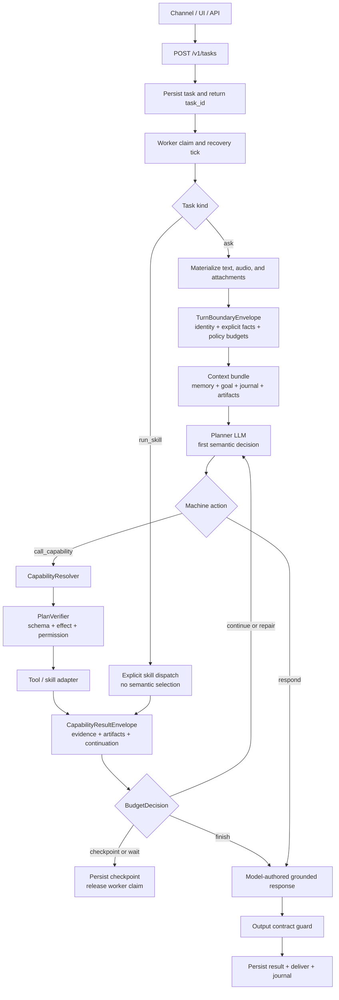

# Agent Loop And Planning

[Architecture index](README.md) | Next: [Security and execution](02-security-execution.md)

Ordinary natural-language tasks enter one planner-owned loop. The front door
only materializes inputs and builds a machine-owned boundary envelope. It does
not decide whether the request should answer, clarify, or execute.

`call_capability` is preferred because the planner chooses a stable capability,
while the resolver maps it to the current tool or skill implementation.
`PlanVerifier` validates machine contracts and policy; it is not another
semantic router. Recoverable errors return to the same loop as structured
`RepairEnvelope` observations.

`kind=run_skill` is intentionally separate. The caller supplies the exact skill
and arguments, so this path bypasses planner selection while retaining task
persistence, authentication, lifecycle, and the shared skill protocol.
