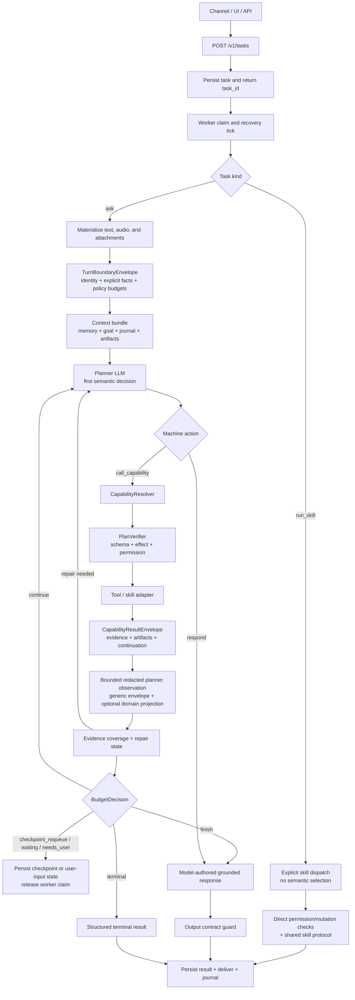

# Agent Loop and Planning

<!-- ai-learning-navigation:start -->
[Architecture index](README.md) | Next: [Security and execution](02-security-execution.md)

<!-- ai-learning-navigation:end -->

Every ordinary natural-language task enters one planner-owned loop. Before the
first model turn, the front door only materializes inputs and builds a
machine-owned `TurnBoundaryEnvelope`; it does not decide whether the request
should be answered, clarified, or executed.

`call_capability` is preferred because the planner chooses a stable capability,
and the resolver maps it to the current tool or skill implementation.
`PlanVerifier` validates machine contracts and policy; it is not a second
semantic router. Recoverable errors return to the same loop as structured
`RepairEnvelope` observations. `BudgetDecision` separately controls whether a
healthy loop continues, checkpoints, waits for the user, finishes, or stops.
Every successful `CapabilityResultEnvelope` is projected into one bounded,
redacted machine observation for the next planner turn. Domain-specific
projections may make common evidence more compact, but they are optional
optimizations and cannot be the only path that preserves provider, artifact,
async-job, or other structured result fields.
The terminal `respond` contract supports model-authored free text, exact lists,
and exact named-field objects whose JSON values are validated before the
runtime materializes the payload. Model-authored objects use `object`; each
`value_json` is one complete serialized JSON value, including JSON quotes
around string values. When exact values already exist in successful capability
results, `observed_object` names the source capability and dotted data path;
runtime copies the JSON values directly and rejects missing or failed
references instead of asking the model to re-serialize nested machine data.
Invalid authored JSON receives a bounded structured repair observation and is
not silently coerced.
Payloads unused by the selected shape may canonicalize only to empty/zero.
Redundant object content is accepted only when its parsed JSON exactly equals
the object materialized from the named fields.
This preserves strict machine delivery without introducing localized runtime
reply templates. It is a formatting boundary, not a capability simulator:
runtime-owned provider, domain parse/normalize/validate/preview, dry-run,
artifact/job, checkpoint, diff, verification, repair, and rewind fields require
a prior matching capability observation. Lower-level environment facts may
support that call but cannot replace the disclosed domain capability that owns
the result.

`kind=run_skill` is intentionally separate. The caller supplies the exact skill
and arguments, so the direct path bypasses planner selection and agent-loop
round decisions while retaining authentication, permission and mutation
checks, task persistence, lifecycle controls, and the shared skill protocol.
