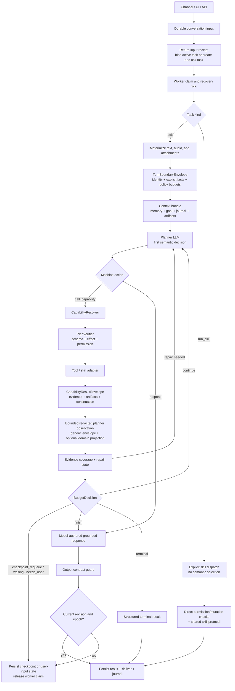

# Agent Loop and Planning

<!-- ai-learning-stage: agent-runtime -->
<!-- ai-learning-audience: operator,developer -->

<!-- ai-learning-navigation:start -->
[Architecture index](README.md) | Next: [Security and execution](02-security-execution.md)

<!-- ai-learning-navigation:end -->

Every ordinary natural-language task enters one planner-owned loop. Before the
first model turn, the front door only materializes inputs and builds a
machine-owned `TurnBoundaryEnvelope`; it does not decide whether the request
should be answered, clarified, or executed.

```mermaid
flowchart TD
    A[Channel / UI / API] --> B[Durable conversation input]
    B --> C[Return input receipt<br/>bind active task or create one ask task]
    C --> D[Worker claim and recovery tick]
    D --> E{Task kind}
    E -->|ask| F[Materialize text, audio, and attachments]
    F --> G[TurnBoundaryEnvelope<br/>identity + explicit facts + policy budgets]
    G --> H[Context bundle<br/>memory + goal + journal + artifacts]
    H --> I[Planner LLM<br/>first semantic decision]
    I --> J{Machine action}
    J -->|call_capability| K[CapabilityResolver]
    K --> L[PlanVerifier<br/>schema + effect + permission]
    L --> M[Tool / skill adapter]
    M --> N[CapabilityResultEnvelope<br/>evidence + artifacts + continuation]
    N --> NX[Bounded redacted planner observation<br/>generic envelope + optional domain projection]
    NX --> O[Evidence coverage + repair state]
    O -->|repair needed| I
    O --> P{BudgetDecision}
    P -->|continue| I
    P -->|checkpoint_requeue / waiting / needs_user| U[Persist checkpoint or user-input state<br/>release worker claim]
    P -->|finish| Q[Model-authored grounded response]
    P -->|terminal| V[Structured terminal result]
    J -->|respond| Q
    E -->|run_skill| R[Explicit skill dispatch<br/>no semantic selection]
    R --> W[Direct permission/mutation checks<br/>+ shared skill protocol]
    W --> T
    Q --> S[Output contract guard]
    S --> TT{Current revision and epoch?}
    TT -->|yes| T[Persist result + deliver + journal]
    TT -->|no| U
    V --> T
```

Ordinary interactive clients submit through
`POST /v1/conversation-inputs/client-task`. Acceptance, task binding, and
execution are separate durable facts: the server first records an owner-scoped
input receipt, then binds it to the active conversation task or atomically
creates one foreground task. Inputs that arrive during a model turn interrupt
that stale request; inputs that arrive during a tool call are consumed at the
next safe execution boundary. The runtime never infers stop or amendment from
user-language tokens.

Each planner decision records the covered input sequence, instruction revision,
and execution epoch. A tool or skill action must atomically claim that exact
version immediately before dispatch. Terminal presentation uses the same
version snapshot, so a late answer from a superseded model turn cannot replace
the current answer. Explicit current-task cancellation is a separate
authenticated control operation and remains available when the model provider
is unavailable.

There is one planner owner for a conversation task. The runtime does not launch
a second semantic "control-only" planner while a mutation owns the current loop
state. A model/read-only request may be interrupted and replanned immediately;
an already claimed mutation is observed through its cancellation class and the
next safe boundary. Operations that cannot finish within that boundary must use
the supervised async-job/checkpoint contract. This keeps steering responsive
without introducing two planners that can race to dispatch effects.

Cancellation is staged as accepted, stop requested, adapter acknowledged, and
settled. Child tasks and process groups receive the same machine request, but a
terminal cancelled presentation is fenced until registered runtime cleanup has
settled. A late or unknown mutation result is written to the reconciliation
ledger and cannot resume a superseded plan.

`call_capability` is preferred because the planner chooses a stable capability,
and the resolver maps it to the current tool or skill implementation.
`PlanVerifier` validates machine contracts and policy; it is not a second
semantic router. Recoverable errors return to the same loop as structured
`RepairEnvelope` observations. `BudgetDecision` separately controls whether a
healthy loop continues, checkpoints, waits for the user, finishes, or stops.
Every successful `CapabilityResultEnvelope` is projected into one bounded,
redacted machine observation for the next planner turn. Domain-specific
projections may make common evidence more compact, but they are optional
optimizations and cannot be the only path that preserves provider, artifact,
async-job, or other structured result fields.
The terminal `respond` contract supports model-authored free text, exact lists,
and exact named-field objects whose JSON values are validated before the
runtime materializes the payload. Model-authored objects use `object`; each
`value_json` is one complete serialized JSON value, including JSON quotes
around string values. When exact values already exist in successful capability
results, `observed_object` names the source capability and dotted data path;
runtime copies the JSON values directly and rejects missing or failed
references instead of asking the model to re-serialize nested machine data.
Invalid authored JSON receives a bounded structured repair observation and is
not silently coerced.
Payloads unused by the selected shape may canonicalize only to empty/zero.
Redundant object content is accepted only when its parsed JSON exactly equals
the object materialized from the named fields.
This preserves strict machine delivery without introducing localized runtime
reply templates. It is a formatting boundary, not a capability simulator:
runtime-owned provider, domain parse/normalize/validate/preview, dry-run,
artifact/job, checkpoint, diff, verification, repair, and rewind fields require
a prior matching capability observation. Lower-level environment facts may
support that call but cannot replace the disclosed domain capability that owns
the result.

`kind=run_skill` is intentionally separate. The caller supplies the exact skill
and arguments, so the direct path bypasses planner selection and agent-loop
round decisions while retaining authentication, permission and mutation
checks, task persistence, lifecycle controls, and the shared skill protocol.

Child-task capability checks use the effective runtime skill snapshot, including
admission and enable state, rather than release defaults. Read-only delegation
cannot gain write or network permissions. A capability-policy rejection before
enqueue returns structured evidence to the parent for bounded replanning;
scheduler failures and required-child execution failures are not blindly retried.
An unresolved failed machine result is finalized as a failed task with a
language-aware explanation, never promoted to success merely because it is JSON.

Durable local skill jobs use a process lifetime independent of the core process.
PID visibility, filesystem isolation, network policy, and explicit cancellation
remain separate controls. A core restart adopts the persisted checkpoint and
polls the existing job instead of repeating completed steps. A machine reboot
or a service manager that kills the entire process group/cgroup can still end
the job; the resulting process-loss observation goes through loop recovery.
