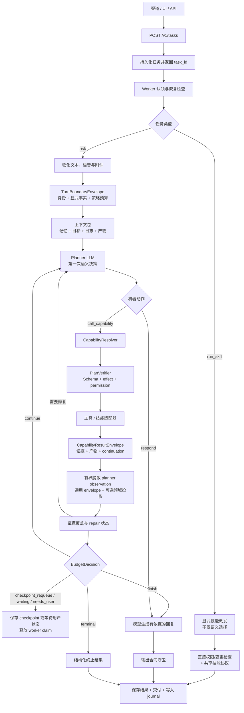

# Agent Loop 与规划

<!-- ai-learning-navigation:start -->
[架构索引](README.md) | 下一页：[安全与执行](02-security-execution.zh-CN.md)

<!-- ai-learning-navigation:end -->

所有普通自然语言任务都进入由 planner 掌握语义决策权的同一循环。第一次模型调用之前，前门只物化输入并构造由运行时持有的 `TurnBoundaryEnvelope`，不会提前判断请求应该直答、澄清还是执行。

优先使用 `call_capability`，让 planner 选择稳定能力，再由 resolver 映射到当前 tool 或 skill。`PlanVerifier` 只校验机器合同与策略，不承担第二层语义路由。每个成功的 `CapabilityResultEnvelope` 都会经过有界压缩与脱敏，作为一条通用机器 observation 返回下一轮 planner。领域专用投影可以压缩常用证据，但只是可选优化，不能成为保留 provider、artifact、异步任务或其他结构化结果字段的唯一通道。可恢复错误通过结构化 `RepairEnvelope` 作为 observation 返回同一循环；`BudgetDecision` 则独立决定健康循环应该继续、建立 checkpoint、等待用户、完成还是终止。

终止 `respond` 合同支持模型生成的自由文本、精确列表，以及由 runtime 在物化前
校验 JSON 值的精确命名字段对象。每个对象 `value_json` 都是一份完整序列化
JSON 值，字符串必须带 JSON 引号；无效 JSON 进入有界结构化 repair，不会被
静默强制转换。这样既保留严格机器交付，也不需要在 runtime 维护多语言固定回复
模板。它只是格式化边界，不是能力模拟器；runtime 拥有的
provider、领域解析/归一化/校验/预演、dry-run、artifact/job、checkpoint、diff、
verification、repair 和 rewind 字段必须先有对应 capability observation。低层
环境事实只能辅助该调用，不能替代拥有结果的已披露领域能力。

`kind=run_skill` 是明确分开的 API 路径。调用方已经给出技能与参数，因此该路径绕过 planner 选择和 agent loop 轮次决策，但继续使用鉴权、权限与变更检查、任务持久化、生命周期控制和共享技能协议。
