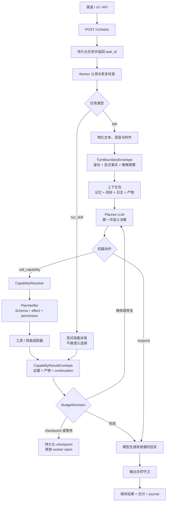

# Agent Loop 与规划

[架构索引](README.md) | 下一页：[安全与执行](02-security-execution.zh-CN.md)

普通自然语言任务统一进入由 planner 掌握语义决策权的循环。前门只负责物化输入并
构造机器边界信封，不提前判断请求应该直答、澄清还是执行。

优先使用 `call_capability`，让 planner 选择稳定能力，再由 resolver 映射到当前
tool 或 skill。`PlanVerifier` 只校验机器合同与策略，不承担第二层语义路由。
可恢复错误通过结构化 `RepairEnvelope` 作为 observation 返回同一循环。

`kind=run_skill` 是明确分开的 API 路径。调用方已经给出技能与参数，因此它绕过
planner 选择，但继续使用任务持久化、鉴权、生命周期和共享技能协议。
