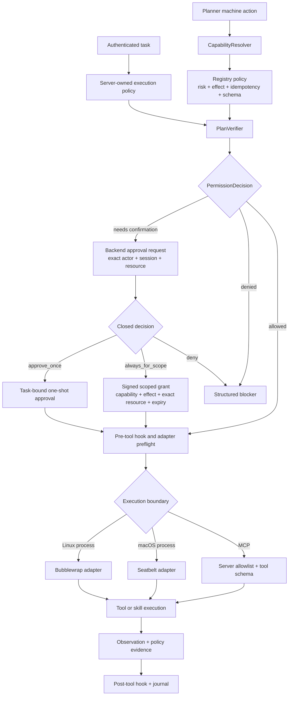
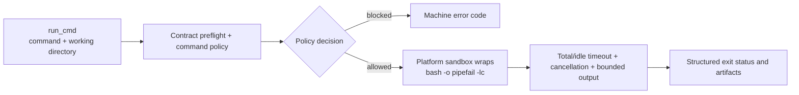

# Security and Execution

<!-- ai-learning-navigation:start -->
Previous: [Agent loop and planning](01-agent-loop.md) |
[Architecture index](README.md) |
Next: [Task state and context](03-task-state-context.md)

<!-- ai-learning-navigation:end -->

After authentication, the backend issues a server-owned execution policy.
Registry metadata, verification, approvals, command policy, and the platform
sandbox remain independent controls. YOLO requests
`approval_policy=never` and `sandbox_mode=danger_full`; it does not bypass
registry policy, schemas, cancellation, redaction, or audit evidence.

`run_cmd` intentionally supports shell syntax, but only after contract,
permission, and command-policy checks. Linux-only commands must not run
implicitly on macOS. Missing sandbox support fails closed with a structured
unsupported result rather than silently falling back to unrestricted
execution.
