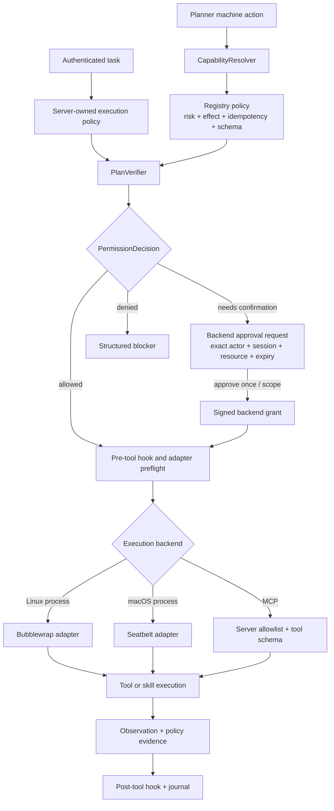
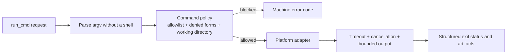

# Security And Execution

Previous: [Agent loop and planning](01-agent-loop.md) |
[Architecture index](README.md) |
Next: [Task state and context](03-task-state-context.md)

Authentication selects a server-owned execution policy. Registry metadata,
verification, approvals, command policy, and the platform sandbox remain
independent controls; YOLO changes approval and sandbox policy but does not
bypass the other boundaries.

Linux-only commands must not run implicitly on macOS. Missing sandbox support
fails closed with a structured unsupported result rather than silently falling
back to unrestricted execution.
