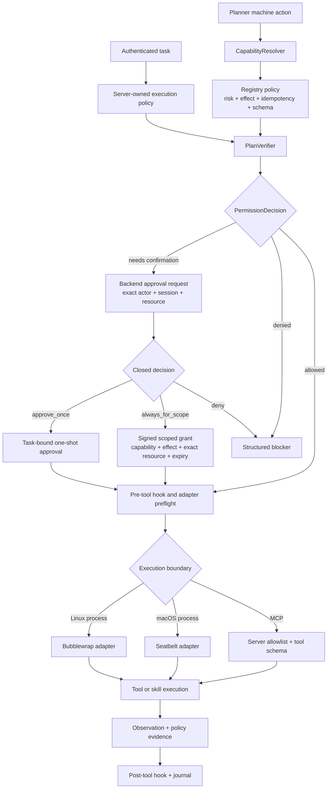
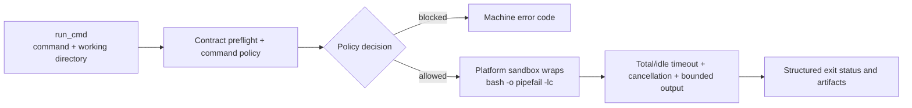

# Security and Execution

<!-- ai-learning-stage: safety-operations -->
<!-- ai-learning-audience: operator,developer -->

<!-- ai-learning-navigation:start -->
Previous: [Agent loop and planning](01-agent-loop.md) |
[Architecture index](README.md) |
Next: [Task state and context](03-task-state-context.md)

<!-- ai-learning-navigation:end -->

After authentication, the backend issues a server-owned execution policy.
Registry metadata, verification, approvals, command policy, and the platform
sandbox remain independent controls. YOLO requests
`approval_policy=never` and `sandbox_mode=danger_full`; it does not bypass
registry policy, schemas, cancellation, redaction, or audit evidence.

```mermaid
flowchart TD
    A[Authenticated task] --> B[Server-owned execution policy]
    C[Planner machine action] --> D[CapabilityResolver]
    D --> E[Registry policy<br/>risk + effect + idempotency + schema]
    B --> F[PlanVerifier]
    E --> F
    F --> G{PermissionDecision}
    G -->|needs confirmation| H[Backend approval request<br/>exact actor + session + resource]
    H --> I{Closed decision}
    I -->|approve_once| IA[Task-bound one-shot approval]
    I -->|always_for_scope| IB[Signed scoped grant<br/>capability + effect + exact resource + expiry]
    I -->|deny| J
    G -->|denied| J[Structured blocker]
    G -->|allowed| K[Pre-tool hook and adapter preflight]
    IA --> K
    IB --> K
    K --> L{Execution boundary}
    L -->|Linux process| M[Bubblewrap adapter]
    L -->|macOS process| N[Seatbelt adapter]
    L -->|MCP| O[Server allowlist + tool schema]
    M --> P[Tool or skill execution]
    N --> P
    O --> P
    P --> Q[Observation + policy evidence]
    Q --> R[Post-tool hook + journal]
```

```mermaid
flowchart LR
    A[run_cmd<br/>command + working directory] --> B[Contract preflight + command policy]
    B --> C{Policy decision}
    C -->|blocked| D[Machine error code]
    C -->|allowed| E[Platform sandbox wraps<br/>bash -o pipefail -lc]
    E --> F[Total/idle timeout + cancellation + bounded output]
    F --> G[Structured exit status and artifacts]
```

`run_cmd` intentionally supports shell syntax, but only after contract,
permission, and command-policy checks. Linux-only commands must not run
implicitly on macOS. Missing sandbox support fails closed with a structured
unsupported result rather than silently falling back to unrestricted
execution.

## Domain allowlist spike

Bubblewrap and Seatbelt can deny or inherit the complete network path, but they
cannot enforce a DNS-name allowlist by themselves. A one-time DNS-to-IP rule is
not safe because answers change and CDNs share addresses. The current spike
therefore validates 1–128 DNS names and then reports
`network=unavailable`, `available=false`, `fail_closed=true`, and
`sandbox_network_allowlist_unsupported`. Invalid entries return
`sandbox_network_allowlist_invalid`; a valid but unsupported policy never
becomes inherited networking.

A production Linux/macOS implementation requires an audited host-controlled
DNS/SNI or HTTP CONNECT proxy, task-lease-bound policy and DNS state, rejection
of literal IP/unapproved targets, bounded connections and I/O, and verified
helper packaging. Until that helper is admitted, domain allowlisting remains
explicitly unavailable and fail-closed while existing `deny` and `inherit`
behavior remains unchanged.
