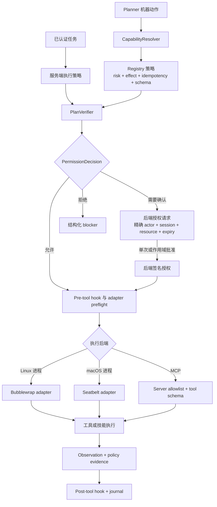
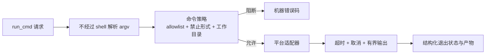

# 安全与执行

上一页：[Agent Loop 与规划](01-agent-loop.zh-CN.md) |
[架构索引](README.md) |
下一页：[任务状态与上下文](03-task-state-context.zh-CN.md)

认证结果选择由服务端持有的执行策略。Registry 元数据、验证、授权、命令策略和
平台沙箱是相互独立的控制层；YOLO 只改变授权与沙箱策略，不会绕过其他边界。

Linux 专用命令不得在 macOS 隐式执行。沙箱后端不可用时应 fail closed，并返回
结构化 unsupported 结果，不能静默退化为无沙箱执行。
