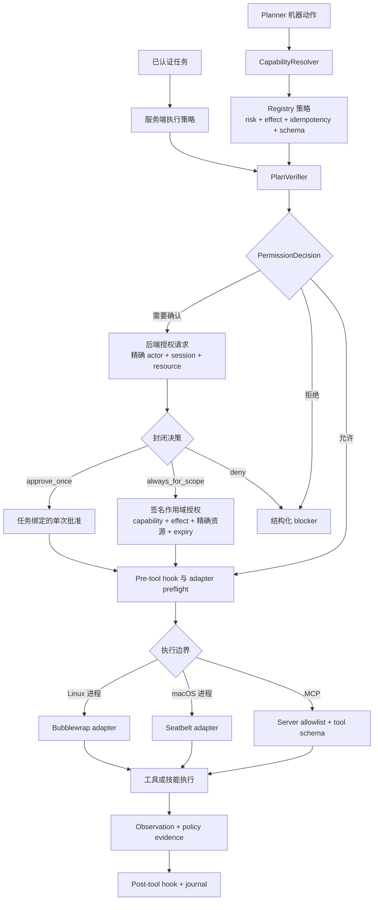
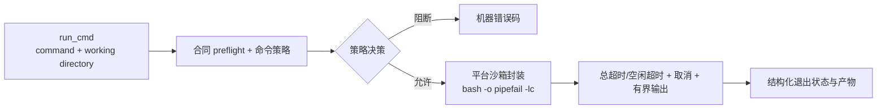

# 安全与执行

<!-- ai-learning-navigation:start -->
上一页：[Agent Loop 与规划](01-agent-loop.zh-CN.md) |
[架构索引](README.md) |
下一页：[任务状态与上下文](03-task-state-context.zh-CN.md)

<!-- ai-learning-navigation:end -->

认证完成后，后端会签发由服务端持有的执行策略。Registry 元数据、验证、授权、命令策略和平台沙箱仍是相互独立的控制层。YOLO 请求 `approval_policy=never` 与 `sandbox_mode=danger_full`，但不会绕过 registry 策略、schema、取消、脱敏或审计证据。

`run_cmd` 有意支持 shell 语法，但必须先通过合同、权限和命令策略检查。Linux 专用命令不得在 macOS 隐式执行；沙箱后端不可用时应 fail closed，并返回结构化 unsupported 结果，不能静默退化为无沙箱执行。
