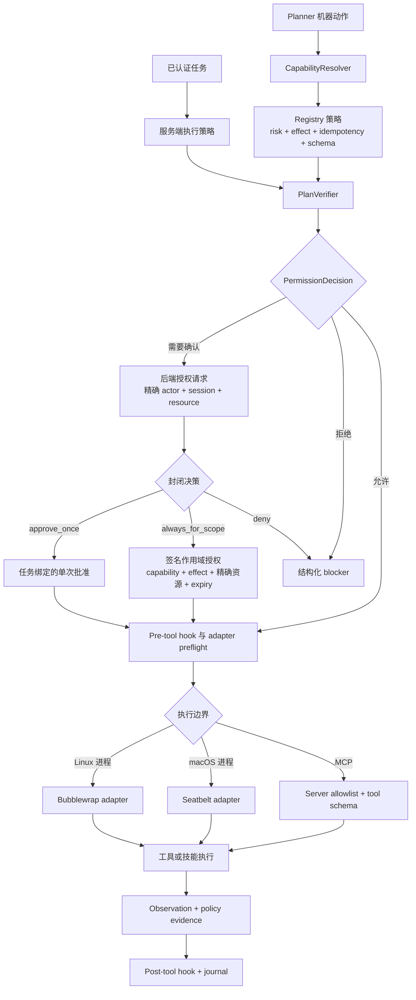
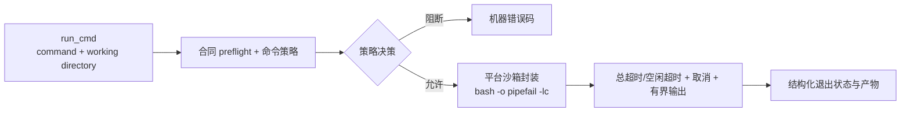

# 安全与执行

<!-- ai-learning-stage: safety-operations -->
<!-- ai-learning-audience: operator,developer -->

<!-- ai-learning-navigation:start -->
上一页：[Agent Loop 与规划](01-agent-loop.zh-CN.md) |
[架构索引](README.md) |
下一页：[任务状态与上下文](03-task-state-context.zh-CN.md)

<!-- ai-learning-navigation:end -->

认证完成后，后端会签发由服务端持有的执行策略。Registry 元数据、验证、授权、命令策略和平台沙箱仍是相互独立的控制层。YOLO 请求 `approval_policy=never` 与 `sandbox_mode=danger_full`，但不会绕过 registry 策略、schema、取消、脱敏或审计证据。

```mermaid
flowchart TD
    A[已认证任务] --> B[服务端执行策略]
    C[Planner 机器动作] --> D[CapabilityResolver]
    D --> E[Registry 策略<br/>risk + effect + idempotency + schema]
    B --> F[PlanVerifier]
    E --> F
    F --> G{PermissionDecision}
    G -->|需要确认| H[后端授权请求<br/>精确 actor + session + resource]
    H --> I{封闭决策}
    I -->|approve_once| IA[任务绑定的单次批准]
    I -->|always_for_scope| IB[签名作用域授权<br/>capability + effect + 精确资源 + expiry]
    I -->|deny| J
    G -->|拒绝| J[结构化 blocker]
    G -->|允许| K[Pre-tool hook 与 adapter preflight]
    IA --> K
    IB --> K
    K --> L{执行边界}
    L -->|Linux 进程| M[Bubblewrap adapter]
    L -->|macOS 进程| N[Seatbelt adapter]
    L -->|MCP| O[Server allowlist + tool schema]
    M --> P[工具或技能执行]
    N --> P
    O --> P
    P --> Q[Observation + policy evidence]
    Q --> R[Post-tool hook + journal]
```

```mermaid
flowchart LR
    A[run_cmd<br/>command + working directory] --> B[合同 preflight + 命令策略]
    B --> C{策略决策}
    C -->|阻断| D[机器错误码]
    C -->|允许| E[平台沙箱封装<br/>bash -o pipefail -lc]
    E --> F[总超时/空闲超时 + 取消 + 有界输出]
    F --> G[结构化退出状态与产物]
```

`run_cmd` 有意支持 shell 语法，但必须先通过合同、权限和命令策略检查。Linux 专用命令不得在 macOS 隐式执行；沙箱后端不可用时应 fail closed，并返回结构化 unsupported 结果，不能静默退化为无沙箱执行。

## 域名白名单 spike 结论

Bubblewrap 与 Seatbelt 可以拒绝或继承整条网络路径，但自身无法强制 DNS 域名白名单。
只做一次 DNS 到 IP 的规则并不安全，因为解析结果会变化，CDN 也会共享地址。因此当前
spike 会验证 1–128 个 DNS 名，然后明确返回 `network=unavailable`、
`available=false`、`fail_closed=true` 和
`sandbox_network_allowlist_unsupported`。非法域名返回
`sandbox_network_allowlist_invalid`；合法但后端不支持的策略绝不会退化为继承全部网络。

Linux/macOS 的正式实现需要经过审计的宿主 DNS/SNI 或 HTTP CONNECT 代理、与任务 lease
绑定的策略和 DNS 状态、拒绝字面 IP 与未批准目标、限制连接数和 I/O，并对 helper 包做
收据/hash 验证。在该 helper 通过准入前，域名白名单明确保持不可用且 fail-closed，既有
`deny` 与 `inherit` 行为不变。
