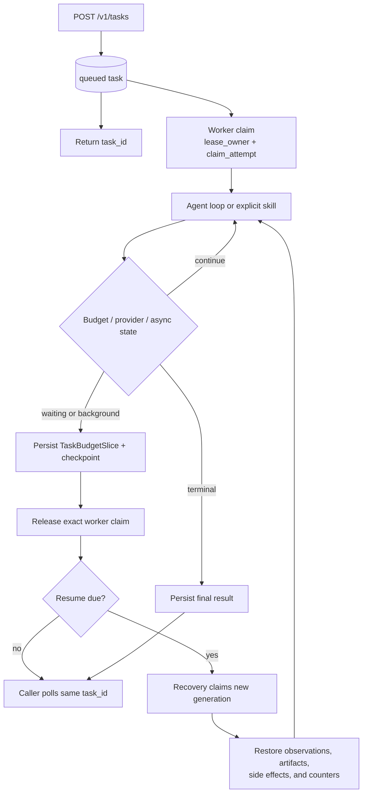
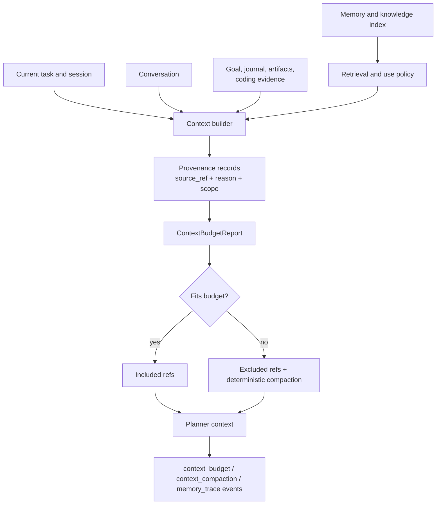

# Task State And Context

Previous: [Security and execution](02-security-execution.md) |
[Architecture index](README.md) |
Next: [Coding and observability](04-coding-observability.md)

Foreground request timeout does not terminate a persisted task. The worker uses
leases and heartbeats, while resumable work is represented by checkpoints and
machine lifecycle fields.

Context is assembled from explicit sources with provenance and a deterministic
budget. Memory and knowledge retrieval supply candidates; they do not select a
semantic route.

Memory writes happen after the visible answer and use a structured intent
schema. Users can inspect, expire, or delete stored preferences and facts.
