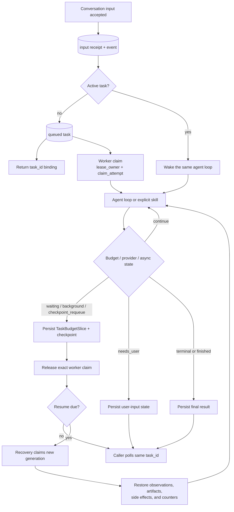
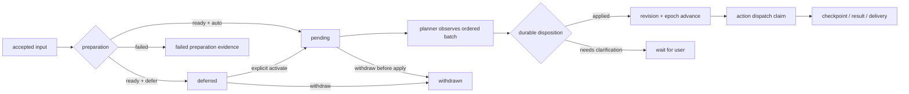
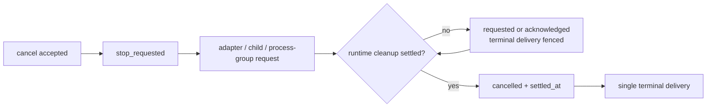
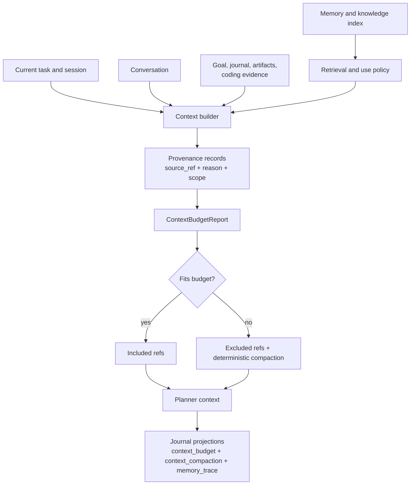

# Task State and Context

<!-- ai-learning-stage: context-memory -->
<!-- ai-learning-audience: operator,developer -->

<!-- ai-learning-navigation:start -->
Previous: [Security and execution](02-security-execution.md) |
[Architecture index](README.md) |
Next: [Coding and observability](04-coding-observability.md)

<!-- ai-learning-navigation:end -->

A client or HTTP timeout does not by itself terminate a persisted task. Workers
use fenced leases and heartbeats, while resumable work is represented by
checkpoints and machine lifecycle fields.

```mermaid
flowchart TD
    A[Conversation input accepted] --> A1[(input receipt + event)]
    A1 --> A2{Active task?}
    A2 -->|no| B[(queued task)]
    A2 -->|yes| A3[Wake the same agent loop]
    B --> C[Return task_id binding]
    B --> D[Worker claim<br/>lease_owner + claim_attempt]
    D --> E[Agent loop or explicit skill]
    A3 --> E
    E --> F{Budget / provider / async state}
    F -->|continue| E
    F -->|waiting / background / checkpoint_requeue| G[Persist TaskBudgetSlice + checkpoint]
    G --> H[Release exact worker claim]
    H --> I{Resume due?}
    I -->|no| J[Caller polls same task_id]
    I -->|yes| K[Recovery claims new generation]
    K --> L[Restore observations, artifacts,<br/>side effects, and counters]
    L --> E
    F -->|needs_user| N[Persist user-input state]
    N --> J
    F -->|terminal or finished| M[Persist final result]
    M --> J
```

Conversation input state is independent from task lifecycle state. A message
can be accepted before task creation, deferred without running, or withdrawn
before the planner applies it. Ready inputs are ordered by `input_seq` and
become effective only when a durable planner decision records their disposition
and advances the instruction revision. `execution_epoch` fences action dispatch
and terminal presentation; it is not a user-visible task status.

```mermaid
flowchart LR
    A[accepted input] --> B{preparation}
    B -->|ready + auto| C[pending]
    B -->|ready + defer| D[deferred]
    B -->|failed| E[failed preparation evidence]
    C --> F[planner observes ordered batch]
    F --> G{durable disposition}
    G -->|applied| H[revision + epoch advance]
    G -->|needs clarification| I[wait for user]
    C -->|withdraw before apply| J[withdrawn]
    D -->|explicit activate| C
    D -->|withdraw| J
    H --> K[action dispatch claim]
    K --> L[checkpoint / result / delivery]
```

Manual pause has no automatic wake time. Timed waiting and provider/async-job
waiting retain their explicit wake condition. Cancellation applies a stable
input cutoff: earlier pending inputs are preserved as deferred records rather
than silently creating replacement work after the canceled task ends.

Cancellation lifecycle is deliberately more precise than task status:

```mermaid
flowchart LR
    A[cancel accepted] --> B[stop_requested]
    B --> C[adapter / child / process-group request]
    C --> D{runtime cleanup settled?}
    D -->|no| E[requested or acknowledged<br/>terminal delivery fenced]
    E --> D
    D -->|yes| F[cancelled + settled_at]
    F --> G[single terminal delivery]
```

Parent termination projects this lifecycle onto active children. Queued
children with no registered runtime may settle immediately; active children
remain `cancel_requested` until runtime unregistration or reconciliation proves
cleanup. Internal children have no conversation reply owner, so they settle as
machine state without fabricating a user reply item.

Context is assembled from explicit sources with provenance and a deterministic
budget. Memory and knowledge retrieval supply candidates; they do not select a
semantic route.

```mermaid
flowchart TD
    A[Current task and session] --> B[Context builder]
    C[Conversation] --> B
    D[Memory and knowledge index] --> E[Retrieval and use policy]
    F[Goal, journal, artifacts,<br/>coding evidence] --> B
    E --> B
    B --> G[Provenance records<br/>source_ref + reason + scope]
    G --> H[ContextBudgetReport]
    H --> I{Fits budget?}
    I -->|yes| J[Included refs]
    I -->|no| K[Excluded refs + deterministic compaction]
    J --> L[Planner context]
    K --> L
    L --> M[Journal projections<br/>context_budget + context_compaction + memory_trace]
```

After a successful task result is persisted, Agent Runtime stores eligible short-term
turn records and starts preference/fact extraction asynchronously. Durable
preference and fact changes use a structured memory-intent schema. Users can
inspect, expire, or delete the stored records.
