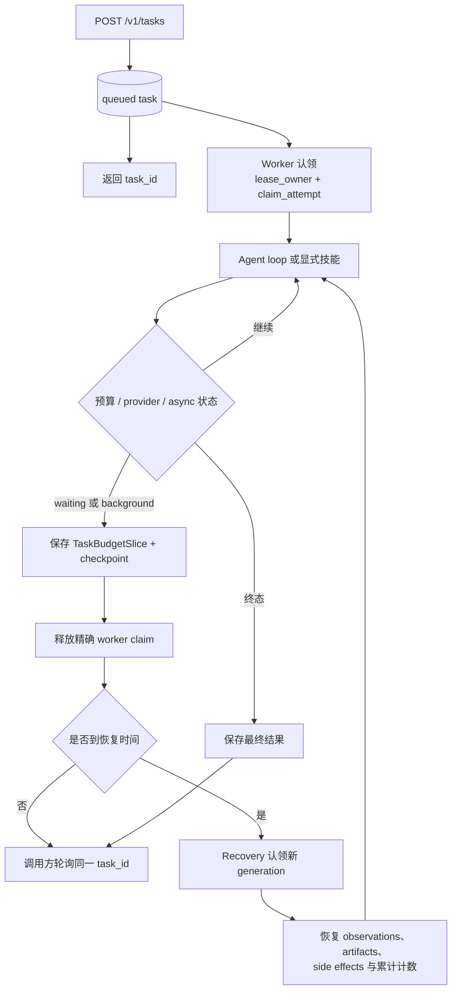
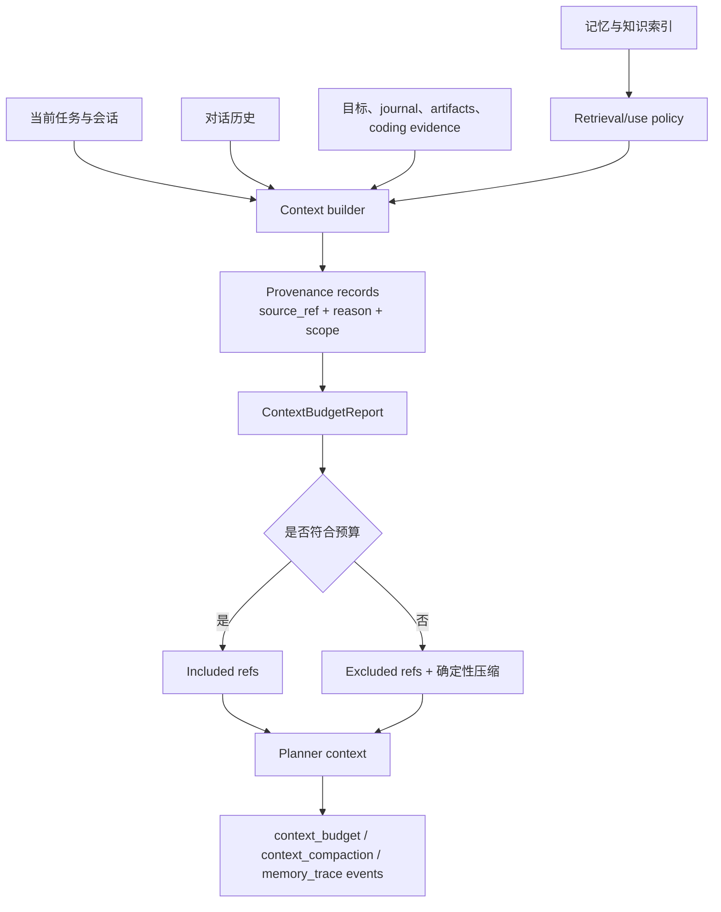

# 任务状态与上下文

上一页：[安全与执行](02-security-execution.zh-CN.md) |
[架构索引](README.md) |
下一页：[编码与可观测性](04-coding-observability.zh-CN.md)

前台请求超时不会终止已经持久化的任务。Worker 使用 lease 与 heartbeat；需要续跑
的工作通过 checkpoint 和机器生命周期字段表达。

上下文从带 provenance 的显式来源组装，并受确定性预算约束。记忆和知识库检索只
提供候选内容，不参与语义路由。

记忆写入发生在用户可见回复之后，并使用结构化 intent schema。用户可以查看、
过期或删除保存的偏好和事实。
