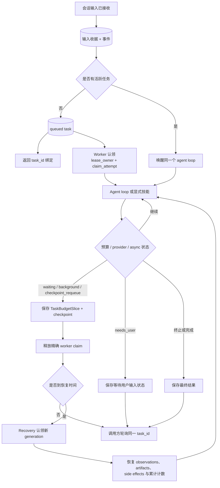
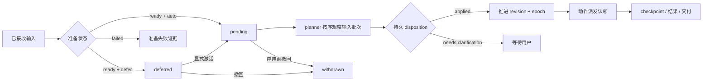
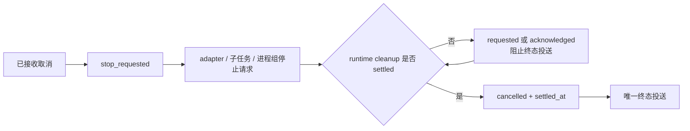
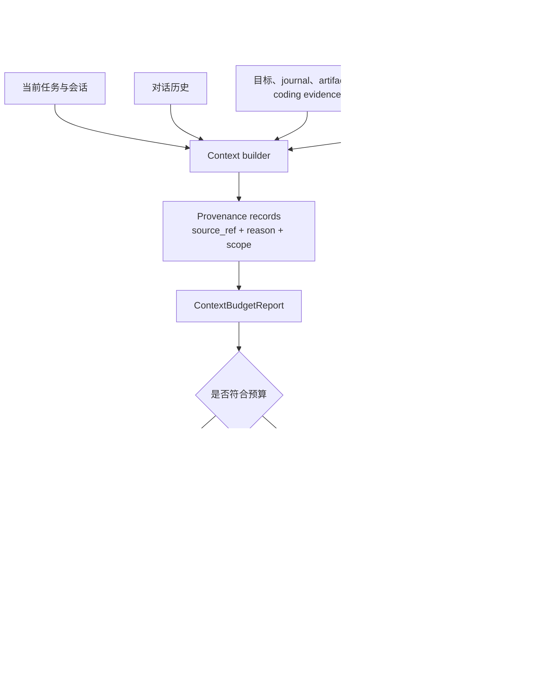

# 任务状态与上下文

<!-- ai-learning-stage: context-memory -->
<!-- ai-learning-audience: operator,developer -->

<!-- ai-learning-navigation:start -->
上一页：[安全与执行](02-security-execution.zh-CN.md) |
[架构索引](README.md) |
下一页：[编码与可观测性](04-coding-observability.zh-CN.md)

<!-- ai-learning-navigation:end -->

客户端或 HTTP 等待超时本身不会终止已经持久化的任务。Worker 使用带 fencing 语义的 lease 与 heartbeat；需要续跑的工作通过 checkpoint 和机器生命周期字段表达。

```mermaid
flowchart TD
    A[会话输入已接收] --> A1[(输入收据 + 事件)]
    A1 --> A2{是否有活跃任务}
    A2 -->|否| B[(queued task)]
    A2 -->|是| A3[唤醒同一个 agent loop]
    B --> C[返回 task_id 绑定]
    B --> D[Worker 认领<br/>lease_owner + claim_attempt]
    D --> E[Agent loop 或显式技能]
    A3 --> E
    E --> F{预算 / provider / async 状态}
    F -->|继续| E
    F -->|waiting / background / checkpoint_requeue| G[保存 TaskBudgetSlice + checkpoint]
    G --> H[释放精确 worker claim]
    H --> I{是否到恢复时间}
    I -->|否| J[调用方轮询同一 task_id]
    I -->|是| K[Recovery 认领新 generation]
    K --> L[恢复 observations、artifacts、<br/>side effects 与累计计数]
    L --> E
    F -->|needs_user| N[保存等待用户输入状态]
    N --> J
    F -->|终止或完成| M[保存最终结果]
    M --> J
```

会话输入状态与任务生命周期状态相互独立。消息可以在任务创建前被接收，可以延期而
不执行，也可以在 planner 应用前撤回。Ready 输入按 `input_seq` 排序；只有持久化的
planner 决策记录 disposition 并推进 instruction revision 后，它才成为有效约束。
`execution_epoch` 用于隔离动作派发和终态呈现，不是用户可见的任务状态。

```mermaid
flowchart LR
    A[已接收输入] --> B{准备状态}
    B -->|ready + auto| C[pending]
    B -->|ready + defer| D[deferred]
    B -->|failed| E[准备失败证据]
    C --> F[planner 按序观察输入批次]
    F --> G{持久 disposition}
    G -->|applied| H[推进 revision + epoch]
    G -->|needs clarification| I[等待用户]
    C -->|应用前撤回| J[withdrawn]
    D -->|显式激活| C
    D -->|撤回| J
    H --> K[动作派发认领]
    K --> L[checkpoint / 结果 / 交付]
```

人工暂停没有自动唤醒时间；定时等待、provider 等待和异步 job 等待保留各自明确的
唤醒条件。取消使用稳定的输入 cutoff：较早的 pending 输入会保存为 deferred 记录，
不会在已取消任务结束后静默创建替代工作。

取消生命周期比任务 status 更精确：

```mermaid
flowchart LR
    A[已接收取消] --> B[stop_requested]
    B --> C[adapter / 子任务 / 进程组停止请求]
    C --> D{runtime cleanup 是否 settled}
    D -->|否| E[requested 或 acknowledged<br/>阻止终态投送]
    E --> D
    D -->|是| F[cancelled + settled_at]
    F --> G[唯一终态投送]
```

父任务终止会把该生命周期投影到活跃子任务。没有注册 runtime 的 queued 子任务可以立即
settle；活跃子任务保持 `cancel_requested`，直到 runtime 注销或 reconciliation 证明清理
完成。内部子任务没有会话 reply owner，因此只结算机器状态，不伪造面向用户的 reply item。

上下文从带 provenance 的显式来源组装，并受确定性预算约束。记忆和知识库检索只
提供候选内容，不参与语义路由。

```mermaid
flowchart TD
    A[当前任务与会话] --> B[Context builder]
    C[对话历史] --> B
    D[记忆与知识索引] --> E[Retrieval/use policy]
    F[目标、journal、artifacts、<br/>coding evidence] --> B
    E --> B
    B --> G[Provenance records<br/>source_ref + reason + scope]
    G --> H[ContextBudgetReport]
    H --> I{是否符合预算}
    I -->|是| J[Included refs]
    I -->|否| K[Excluded refs + 确定性压缩]
    J --> L[Planner context]
    K --> L
    L --> M[Journal 投影<br/>context_budget + context_compaction + memory_trace]
```

任务成功结果持久化后，Agent Runtime 会保存符合策略的短期轮次记录，并异步启动偏好/事实提取。长期偏好和事实的变更使用结构化 memory-intent schema；用户可以查看、设为过期或删除这些记录。
