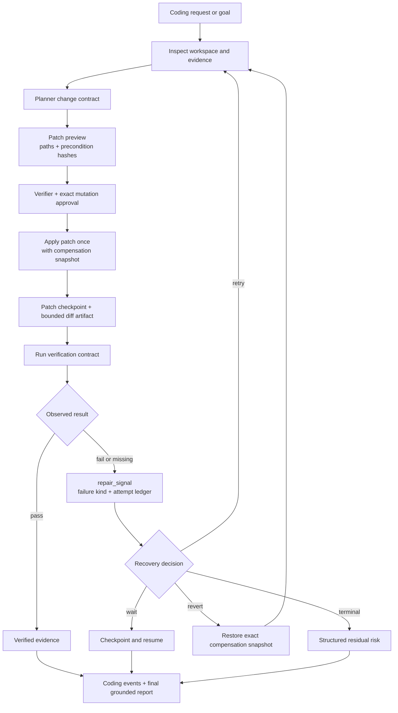
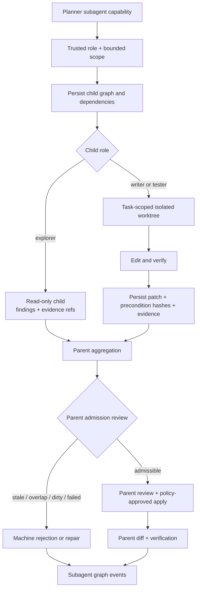
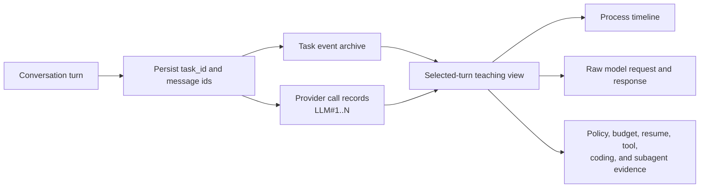

# Coding and Observability

<!-- ai-learning-navigation:start -->
Previous: [Task state and context](03-task-state-context.md) |
[Architecture index](README.md) |
Next: [Skills, media, and models](05-skills-media-models.md)

<!-- ai-learning-navigation:end -->

Coding changes use explicit path ownership, patch preconditions, compensation
snapshots, and observed verification. A failed check becomes a structured loop
observation, not a hardcoded user reply.

Persistent writer/tester subagents operate in task-scoped Git worktrees.
Read-only children return findings. Only the parent task can admit a child
patch into the main workspace after checking ownership, staleness, overlap, and
verification evidence.

Teaching mode projects persisted task and provider events. Selecting either
side of a conversation turn resolves the corresponding `task_id`, then shows
numbered LLM calls, raw request/response fields, runtime stages, code entry
points, policy decisions, checkpoints, tools, and child-task events.

