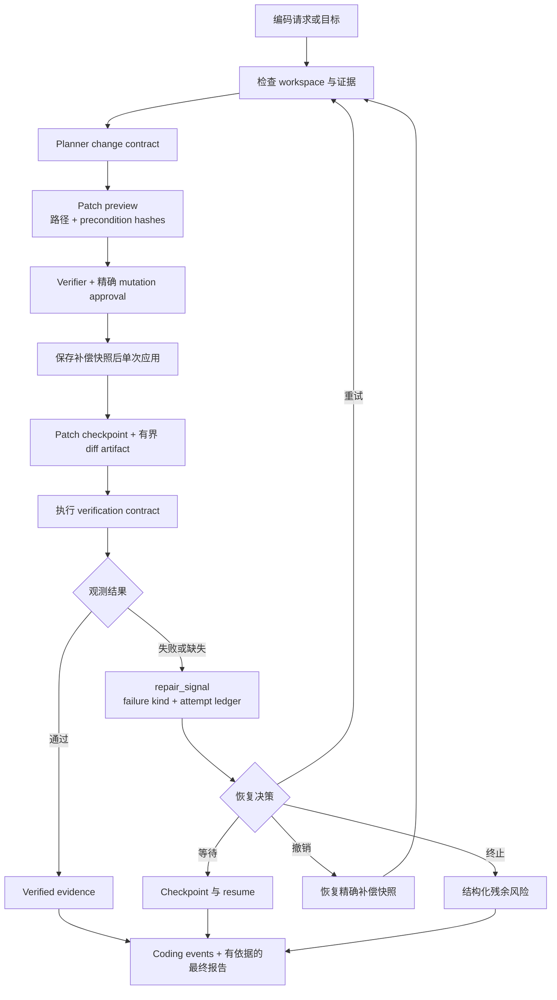
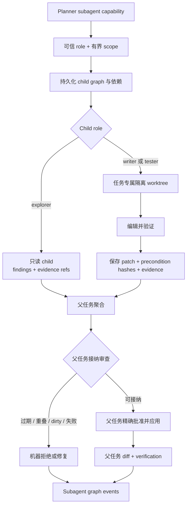
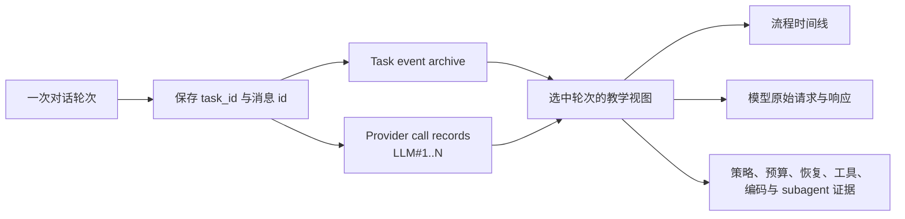

# 编码与可观测性

上一页：[任务状态与上下文](03-task-state-context.zh-CN.md) |
[架构索引](README.md) |
下一页：[技能、多媒体与模型](05-skills-media-models.zh-CN.md)

编码修改使用明确的路径所有权、patch 前置条件、补偿快照和真实观测到的验证结果。
检查失败会成为结构化 loop observation，而不是固定写死的用户回复。

可写的持久化 subagent 在任务专属 Git worktree 中工作；只读 child 返回 findings。
只有父任务检查路径所有权、过期、重叠和验证证据后，才能把 child patch 接纳进主
workspace。

教学模式是持久化任务事件和 provider 事件的投影。选择某条用户或助手消息后，
UI 根据对应 `task_id` 展示编号 LLM 调用、原始请求/响应字段、runtime stage、
代码入口、策略决策、checkpoint、工具和 child-task 事件。

