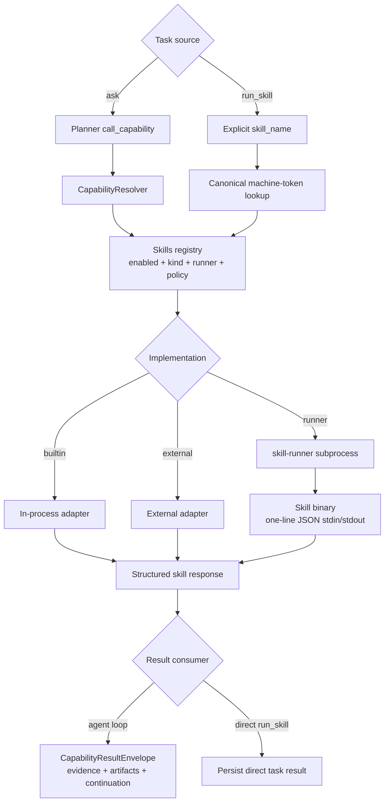
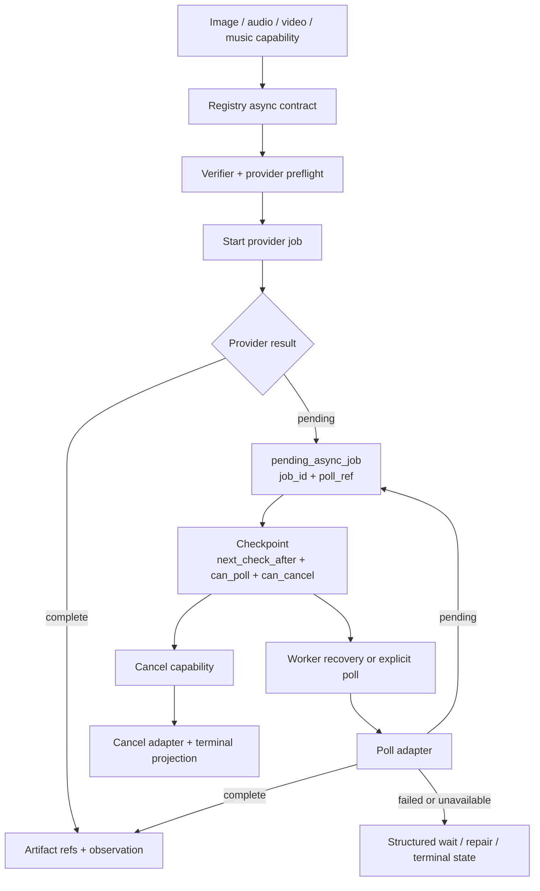
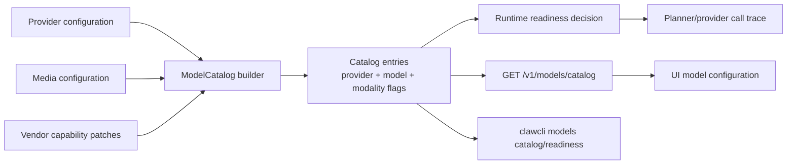

# Skills, Media, and Models

<!-- ai-learning-navigation:start -->
Previous: [Coding and observability](04-coding-observability.md) |
[Architecture index](README.md) |
Next: [Release validation](06-release-validation.md)

<!-- ai-learning-navigation:end -->

The registry is the machine source for skill availability, capabilities,
effects, risk, schema, install mode, and runner metadata. Natural-language
phrases do not belong in aliases or runtime dispatch branches.

Fixed/core skills are part of the normal build. Bundled optional skills live
under `optional_skills/` and are built or installed on demand; imported external
skills must pass validation and registration before they become available.

Long-tail media capabilities use start, poll, and cancel contracts. The
foreground task can return a checkpoint while provider work continues.

Model capabilities are projected through a catalog rather than inferred from
model-name phrases. The catalog exposes provider/model identity, API style,
configured model choices, input/output modalities, context window, timeout,
credential state, media understanding/generation flags, active text-provider
state, and async/dry-run metadata. UI, CLI, and runtime readiness checks consume
those fields directly.

