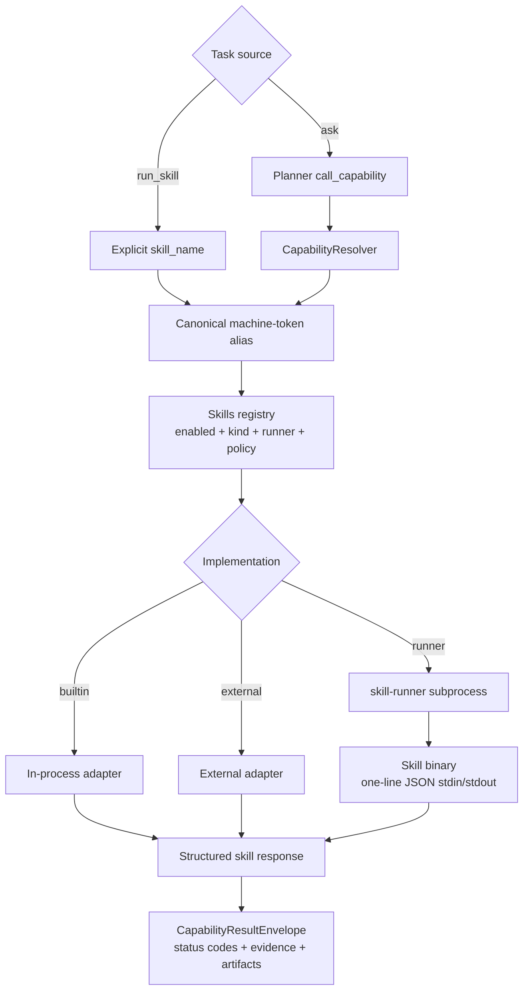
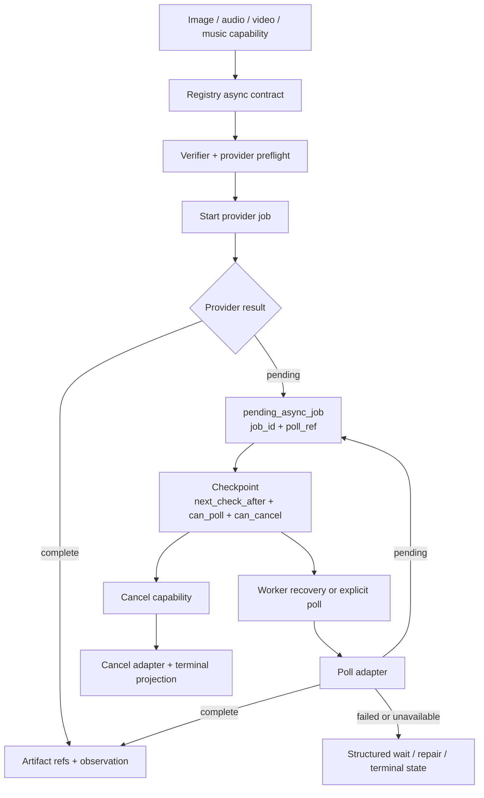
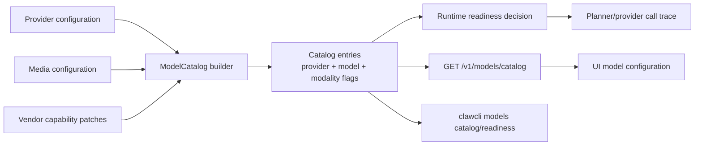

# Skills, Media, And Models

Previous: [Coding and observability](04-coding-observability.md) |
[Architecture index](README.md) |
Next: [Release validation](06-release-validation.md)

The registry is the machine source for skill availability, capabilities,
effects, risk, schema, install mode, and runner metadata. Natural-language
phrases do not belong in aliases or runtime dispatch branches.

Long-tail media capabilities use start, poll, and cancel contracts. The
foreground task can return a checkpoint while provider work continues.

Model capabilities are projected through a catalog rather than inferred from
model-name phrases. Text planning, image/video understanding, generation,
streaming, tool calling, context size, credentials, async support, and dry-run
support are explicit fields used by UI, CLI, and runtime readiness checks.

