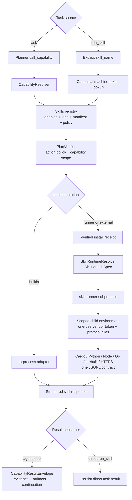
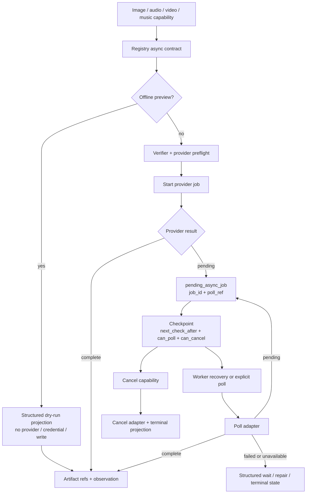
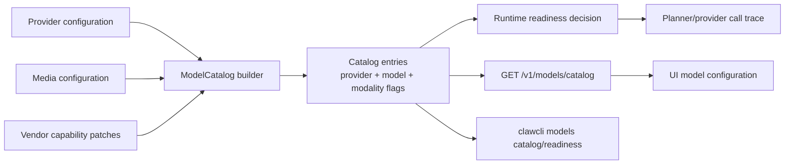

# Skills, Media, and Models

<!-- ai-learning-stage: capabilities-artifacts -->
<!-- ai-learning-audience: operator,developer -->

<!-- ai-learning-navigation:start -->
Previous: [Coding and observability](04-coding-observability.md) |
[Architecture index](README.md) |
Next: [Release validation](06-release-validation.md)

<!-- ai-learning-navigation:end -->

The registry is the machine source for skill availability, capabilities,
effects, risk, schema, install mode, and manifest reference. Natural-language
phrases do not belong in aliases or runtime dispatch branches.

```mermaid
flowchart TD
    A{Task source} -->|ask| B[Planner call_capability]
    A -->|run_skill| C[Explicit skill_name]
    B --> D[CapabilityResolver]
    C --> E[Canonical machine-token lookup]
    D --> F
    E --> F[Skills registry<br/>enabled + kind + manifest + policy]
    F --> P[PlanVerifier<br/>action policy + capability scope]
    P --> G{Implementation}
    G -->|builtin| H[In-process adapter]
    G -->|runner or external| R[Verified install receipt]
    R --> S[SkillRuntimeResolver<br/>SkillLaunchSpec]
    S --> I[skill-runner subprocess]
    I --> Q[Scoped child environment<br/>one-use vendor token + protocol alias]
    Q --> K[Cargo / Python / Node / Go / prebuilt / HTTPS<br/>one JSONL contract]
    H --> L[Structured skill response]
    K --> L
    L --> M{Result consumer}
    M -->|agent loop| N[CapabilityResultEnvelope<br/>evidence + artifacts + continuation]
    M -->|direct run_skill| O[Persist direct task result]
```

Every process implementation follows `skill.toml -> build adapter -> install
receipt -> SkillLaunchSpec -> JSONL capability result`. Fixed/core skills are
projected into receipts by the normal build. Bundled optional skills live under
`optional_skills/` and are installed on demand. Imported external skills require
`skill.toml` plus `INTERFACE.md` and pass the same adapter, protocol-smoke, and
receipt verification before registration. No runtime is inferred from a file
extension, skill name, or `target/release` convention.

Long-tail media capabilities use start, poll, and cancel contracts. The
foreground task can return a checkpoint while provider work continues.
Preview actions are separate machine capabilities: their registry policy
forbids network, credential access, external publish, and filesystem writes.

```mermaid
flowchart TD
    A[Image / audio / video / music capability] --> B[Registry async contract]
    B --> P{Offline preview?}
    P -->|yes| Q[Structured dry-run projection<br/>no provider / credential / write]
    Q --> F[Artifact refs + observation]
    P -->|no| C[Verifier + provider preflight]
    C --> D[Start provider job]
    D --> E{Provider result}
    E -->|complete| F[Artifact refs + observation]
    E -->|pending| G[pending_async_job<br/>job_id + poll_ref]
    G --> H[Checkpoint<br/>next_check_after + can_poll + can_cancel]
    H --> I[Worker recovery or explicit poll]
    I --> J[Poll adapter]
    J -->|pending| G
    J -->|complete| F
    J -->|failed or unavailable| K[Structured wait / repair / terminal state]
    H --> L[Cancel capability]
    L --> M[Cancel adapter + terminal projection]
```

Provider-backed runner actions receive credentials only after verifier policy
admits the action. `clawd` derives the active structured provider connection,
issues a distinct one-use token for each required child environment variable,
and logs variable names only. An OpenAI-compatible MiniMax adapter may receive
both `MINIMAX_API_KEY` and an `OPENAI_API_KEY` protocol alias, but never the
parent environment or a reused token.

Model capabilities are projected through a catalog rather than inferred from
model-name phrases. The catalog exposes provider/model identity, API style,
configured model choices, input/output modalities, context window, timeout,
credential state, media understanding/generation flags, active text-provider
state, and async/dry-run metadata. UI, CLI, and runtime readiness checks consume
those fields directly.

```mermaid
flowchart LR
    A[Provider configuration] --> D[ModelCatalog builder]
    B[Media configuration] --> D
    C[Vendor capability patches] --> D
    D --> E[Catalog entries<br/>provider + model + modality flags]
    E --> F[Runtime readiness decision]
    E --> G[GET /v1/models/catalog]
    E --> H[clawcli models catalog/readiness]
    G --> I[UI model configuration]
    F --> J[Planner/provider call trace]
```
