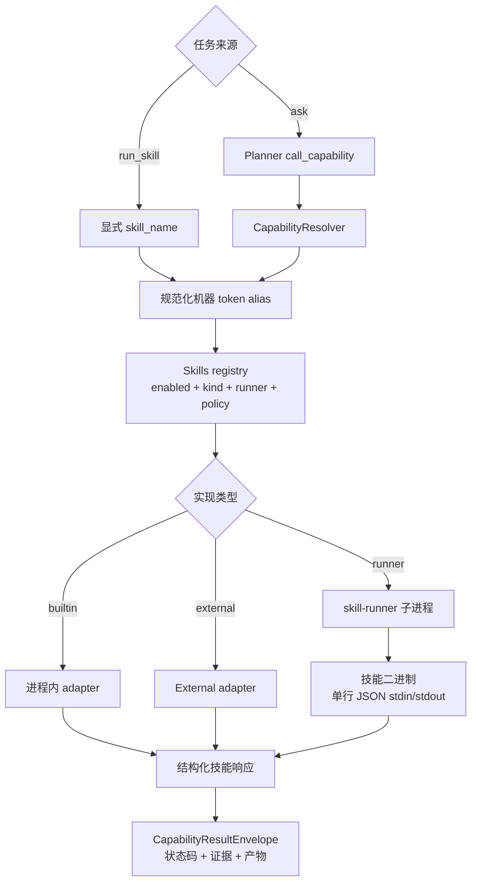
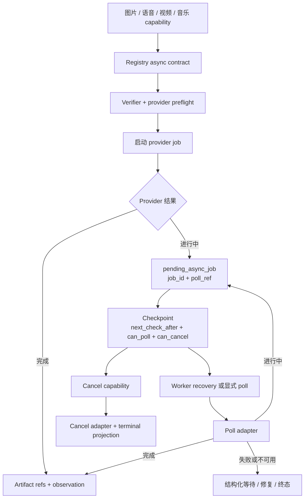
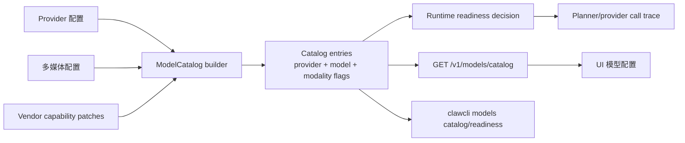

# 技能、多媒体与模型

上一页：[编码与可观测性](04-coding-observability.zh-CN.md) |
[架构索引](README.md) |
下一页：[发布验证](06-release-validation.zh-CN.md)

Registry 是技能可用状态、capability、effect、risk、schema、安装模式和 runner
元数据的机器事实源。自然语言短语不得进入 alias 或 runtime 派发分支。

长尾多媒体能力使用 start、poll、cancel 合同。Provider 工作继续运行时，前台任务
可以先返回 checkpoint。

模型能力通过 catalog 投影，不能根据模型名称短语猜测。文本规划、图片/视频理解、
生成、流式、工具调用、上下文长度、凭据、异步和 dry-run 都是明确机器字段，供
UI、CLI 和 runtime readiness 检查使用。

