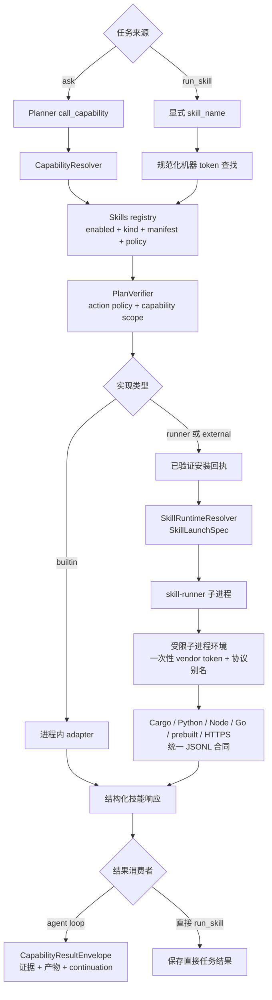
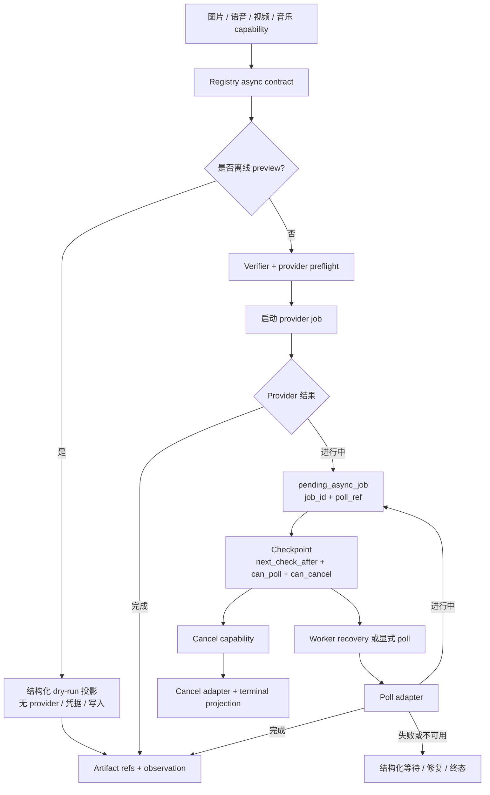
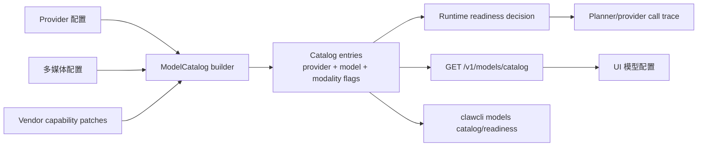

# 技能、多媒体与模型

<!-- ai-learning-stage: capabilities-artifacts -->
<!-- ai-learning-audience: operator,developer -->

<!-- ai-learning-navigation:start -->
上一页：[编码与可观测性](04-coding-observability.zh-CN.md) |
[架构索引](README.md) |
下一页：[发布验证](06-release-validation.zh-CN.md)

<!-- ai-learning-navigation:end -->

## 技能准入与执行

Registry 是技能可用状态、capability、effect、risk、schema、安装模式和 manifest 引用的机器事实源。自然语言短语不得进入 alias 或 runtime 派发分支。

```mermaid
flowchart TD
    A{任务来源} -->|ask| B[Planner call_capability]
    A -->|run_skill| C[显式 skill_name]
    B --> D[CapabilityResolver]
    C --> E[规范化机器 token 查找]
    D --> F
    E --> F[Skills registry<br/>enabled + kind + manifest + policy]
    F --> P[PlanVerifier<br/>action policy + capability scope]
    P --> G{实现类型}
    G -->|builtin| H[进程内 adapter]
    G -->|runner 或 external| R[已验证安装回执]
    R --> S[SkillRuntimeResolver<br/>SkillLaunchSpec]
    S --> I[skill-runner 子进程]
    I --> Q[受限子进程环境<br/>一次性 vendor token + 协议别名]
    Q --> K[Cargo / Python / Node / Go / prebuilt / HTTPS<br/>统一 JSONL 合同]
    H --> L[结构化技能响应]
    K --> L
    L --> M{结果消费者}
    M -->|agent loop| N[CapabilityResultEnvelope<br/>证据 + 产物 + continuation]
    M -->|直接 run_skill| O[保存直接任务结果]
```

所有进程实现都遵循 `skill.toml -> build adapter -> install receipt ->
SkillLaunchSpec -> JSONL capability result`。固定/核心技能在普通构建中投影回执；
随仓库提供的可选技能位于 `optional_skills/`，只在需要时安装。外部导入技能必须
提供 `skill.toml` 与 `INTERFACE.md`，通过同一 adapter、协议冒烟和回执验证后才
注册。运行时不得根据扩展名、技能名或 `target/release` 约定推断入口。

## 独立多模态模块

模型页把文字主模型与七个多模态模块分开：图片编辑、图片生成、图片理解、语音合成、
语音转写、视频生成和音乐生成。每个模块独立保存 provider、model、endpoint、凭据引用
和启用开关。关闭一个模块只阻止它的新调用，不会清空设置，也不会改变其他模块。
发行默认值为其中六个模块选择 MiniMax，语音转写默认使用 loopback 的
`local-whisper` custom provider；用户仍可逐个模块独立修改。

图片生成在调用 provider 前，会按所选 provider/model 声明的尺寸策略映射用户请求的
宽高比或尺寸，避免把模型不支持的 size token 直接发送出去，并尽量保持用户要求的画面形状。

## 多媒体任务与明确的转文字要求

长尾多媒体能力使用 start、poll、cancel 合同。Provider 工作继续运行时，前台任务可以先返回 checkpoint。
Preview 是独立的机器 capability；它的 registry policy 禁止网络、凭据访问、外部发布和文件写入。

```mermaid
flowchart TD
    A[图片 / 语音 / 视频 / 音乐 capability] --> B[Registry async contract]
    B --> P{是否离线 preview?}
    P -->|是| Q[结构化 dry-run 投影<br/>无 provider / 凭据 / 写入]
    Q --> F[Artifact refs + observation]
    P -->|否| C[Verifier + provider preflight]
    C --> D[启动 provider job]
    D --> E{Provider 结果}
    E -->|完成| F[Artifact refs + observation]
    E -->|进行中| G[pending_async_job<br/>job_id + poll_ref]
    G --> H[Checkpoint<br/>next_check_after + can_poll + can_cancel]
    H --> I[Worker recovery 或显式 poll]
    I --> J[Poll adapter]
    J -->|进行中| G
    J -->|完成| F
    J -->|失败或不可用| K[结构化等待 / 修复 / 终态]
    H --> L[Cancel capability]
    L --> M[Cancel adapter + terminal projection]
```

只有 verifier policy 准入的 provider-backed runner action 才能获得凭据。
`clawd` 根据当前结构化 provider connection，为每个必需的子进程环境变量分别
签发一次性 token，并且日志只记录变量名。OpenAI-compatible MiniMax adapter
可以同时获得 `MINIMAX_API_KEY` 和作为协议别名的 `OPENAI_API_KEY`，但不会
获得父进程完整环境，也不会复用同一个 token。

`media_download.download` 默认只交付原始媒体。抖音和小红书图文帖还会交付经过验证的
平台标题与正文；最多 9 张图片逐张发送，10 张及以上按来源顺序打成一个 ZIP，并包含
文章文本。只有同一条用户请求明确要求转文字时，才会进入图片识别或语音转写：图片文字
优先使用 `image_vision.extract_text`，本地 Tesseract 只是明确调用的离线兜底；视频或音频
使用语音转写，ZIP 和视频不会被误送给图片 OCR。

## 网页提取与任务级浏览器交互

`browser_web` 用于打开明确的公开 URL，返回有界的非可信正文、元数据、引用、截图和
结构化的部分成功/失败证据，不保持用户会话。`browser_session` 是另一项任务级交互工具，
用于导航、快照、点击、输入、选择、下载、截图和动作后条件验证。元素引用只在当前页面
和快照 generation 内有效；它不会回退到无沙箱浏览器，也不会使用持久化个人 profile。
只读观察可免确认，外部交互或写入动作仍必须通过 resolver/verifier policy。

## 模型能力目录与就绪状态

模型能力通过 catalog 投影，不能根据模型名称短语猜测。Catalog 明确提供 provider/model 身份、API style、可选模型、输入/输出模态、上下文长度、超时、凭据状态、多媒体理解/生成能力、当前文本 provider 状态，以及 async/dry-run 元数据；UI、CLI 和 runtime readiness 检查直接消费这些机器字段。

```mermaid
flowchart LR
    A[Provider 配置] --> D[ModelCatalog builder]
    B[多媒体配置] --> D
    C[Vendor capability patches] --> D
    D --> E[Catalog entries<br/>provider + model + modality flags]
    E --> F[Runtime readiness decision]
    E --> G[GET /v1/models/catalog]
    E --> H[clawcli models catalog/readiness]
    G --> I[UI 模型配置]
    F --> J[Planner/provider call trace]
```
