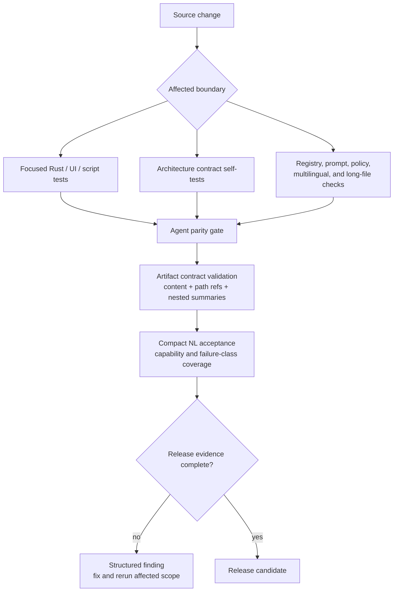

# Release Validation

<!-- ai-learning-navigation:start -->
Previous: [Skills, media, and models](05-skills-media-models.md) |
[Architecture index](README.md) |
Next: [Office artifact workspace](07-office-artifacts.md)

<!-- ai-learning-navigation:end -->

Release validation combines deterministic architecture contracts, focused
component tests, UI checks, and compact natural-language (NL) acceptance. The
release wrapper records machine-readable evidence for every gated check so a
passing summary cannot hide a skipped or malformed nested result.

Important contract families include:

- planner/runtime boundaries, removed pre-route compatibility, and loop-only repair;
- policy decisions, approvals, registry effects, idempotency, and side-effect reconciliation;
- task lifecycle, checkpoint/resume, event archive/replay, context, coding, and subagents;
- generated skill prompts, registry parity, aliases, async media contracts, and model readiness;
- no natural-language hard matching, no fixed multilingual runtime replies, secret scanning,
  cross-platform boundaries, and long-file limits;
- CLI exec/replay/session/goal/TUI/LLM trace artifacts and UI lint/build/tests.

Live-provider tests are acceptance evidence, not an excuse to encode one failed
sentence as a runtime branch. A failure should be repaired at the capability
contract, registry metadata, prompt, verifier, adapter, or provider boundary
that caused it.

`scripts/nl_tests/run_all_nl_with_server.sh` starts live NL acceptance in an
isolated local runtime by default: it allocates a loopback port, copies the
selected config, uses temporary task and audit databases, and submits through
the non-delivering `ui` channel. The temporary state is removed after the run.
Reusing a development server and its databases requires the explicit
`--reuse-server` option. Use `--suite` or `--category` to run the smallest
affected scope; numbered raw `LLM#1..N` request/return fields remain enabled
unless the caller explicitly disables them.
