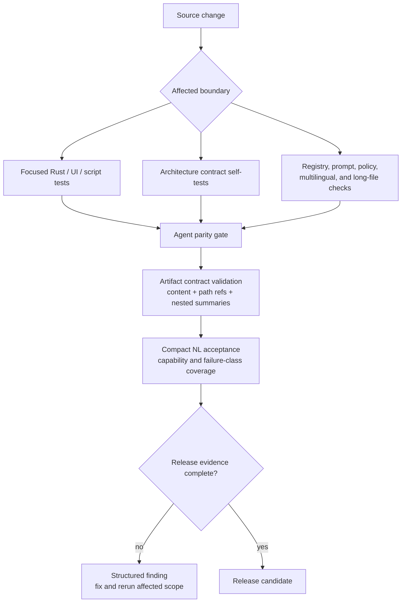

# Release Validation

Previous: [Skills, media, and models](05-skills-media-models.md) |
[Architecture index](README.md)

Release validation combines deterministic architecture contracts, focused
component tests, UI checks, and compact natural-language acceptance. Each gate
writes machine-readable evidence so a passing summary cannot hide a skipped or
malformed nested check.

Important contract families include:

- planner/runtime boundaries, removed pre-route compatibility, and loop-only repair;
- policy decisions, approvals, registry effects, idempotency, and side-effect reconciliation;
- task lifecycle, checkpoint/resume, event archive/replay, context, coding, and subagents;
- generated skill prompts, registry parity, aliases, async media contracts, and model readiness;
- no natural-language hard matching, no fixed multilingual runtime replies, secret scanning,
  cross-platform boundaries, and long-file limits;
- CLI exec/replay/session/goal/TUI/LLM trace artifacts and UI lint/build/tests.

Live provider tests are acceptance evidence, not an excuse to encode a failed
sentence as a runtime branch. Failures must be repaired at the capability
contract, registry metadata, prompt, verifier, adapter, or provider boundary.
