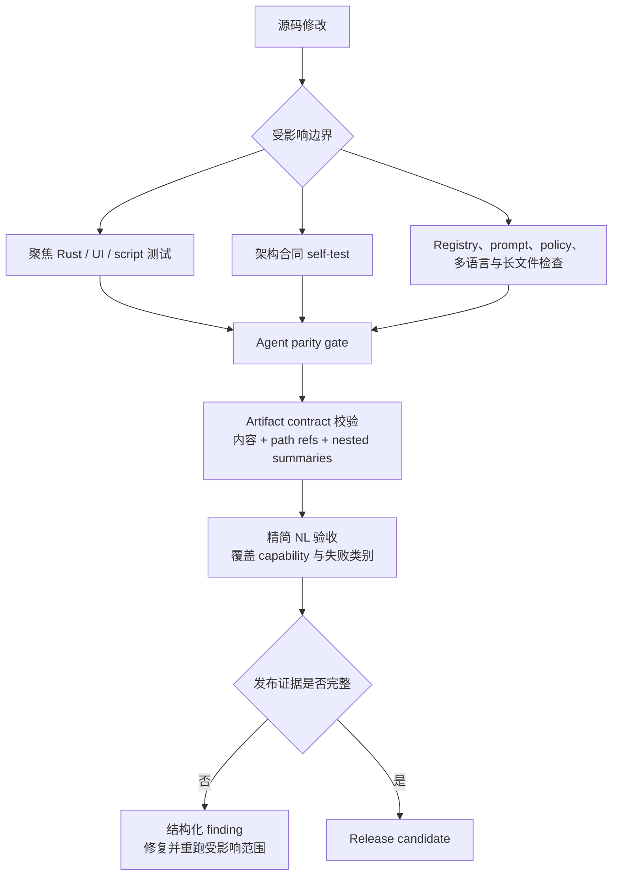

# 发布验证

上一页：[技能、多媒体与模型](05-skills-media-models.zh-CN.md) |
[架构索引](README.md)

发布验证由确定性架构合同、聚焦组件测试、UI 检查和精简 NL 验收组成。每个 gate
都写入机器可读证据，防止汇总显示通过但内部检查被跳过或产物格式损坏。

主要合同类别包括：

- planner/runtime 边界、已删除的 pre-route 兼容路径和仅限 loop 内的 repair；
- policy decision、授权、registry effect、幂等性和副作用 reconciliation；
- 任务生命周期、checkpoint/resume、事件归档回放、上下文、编码和 subagent；
- 生成式技能 prompt、registry parity、alias、异步多媒体合同和模型 readiness；
- 禁止自然语言硬匹配、禁止固定多语言 runtime 回复、密钥扫描、跨平台与长文件限制；
- CLI exec/replay/session/goal/TUI/LLM trace 产物及 UI lint/build/test。

Live provider 测试是验收证据，不能把失败句子编码成 runtime 分支。失败应在
capability contract、registry metadata、prompt、verifier、adapter 或 provider
边界修复。
