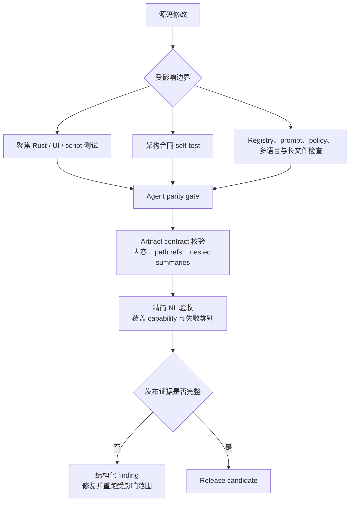

# 发布验证

<!-- ai-learning-navigation:start -->
上一页：[技能、多媒体与模型](05-skills-media-models.zh-CN.md) |
[架构索引](README.md) |
下一页：[Office 工件工作区](07-office-artifacts.zh-CN.md)

<!-- ai-learning-navigation:end -->

发布验证由确定性架构合同、聚焦组件测试、UI 检查和精简自然语言（NL）验收组成。发布 wrapper 会为每项门禁记录机器可读证据，防止汇总显示通过，但内部检查实际被跳过或嵌套产物已经损坏。

主要合同类别包括：

- planner/runtime 边界、已删除的 pre-route 兼容路径和仅限 loop 内的 repair；
- policy decision、授权、registry effect、幂等性和副作用 reconciliation；
- 任务生命周期、checkpoint/resume、事件归档回放、上下文、编码和 subagent；
- 生成式技能 prompt、registry parity、alias、异步多媒体合同和模型 readiness；
- 禁止自然语言硬匹配、禁止固定多语言 runtime 回复、密钥扫描、跨平台与长文件限制；
- CLI exec/replay/session/goal/TUI/LLM trace 产物及 UI lint/build/test。

Live provider 测试是验收证据，不能把某个失败句子直接编码成 runtime 分支。应在真正导致问题的 capability contract、registry metadata、prompt、verifier、adapter 或 provider 边界完成修复。

`scripts/nl_tests/run_all_nl_with_server.sh` 默认在隔离的本地 runtime 中运行
实际 NL 验收：自动分配 loopback 端口、复制选定配置、使用临时 task/audit
数据库，并通过不会向外发送消息的 `ui` channel 提交。运行结束后会删除临时
状态；只有显式传入 `--reuse-server` 才会复用开发服务器及其数据库。使用
`--suite` 或 `--category` 选择最小受影响范围；除非调用方明确关闭，测试仍会
打印带编号的原始 `LLM#1..N` 请求/返回字段。
