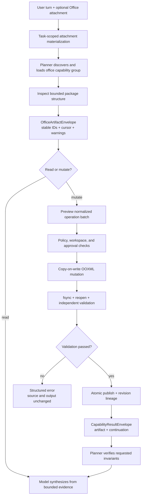

# Office Artifact Workspace

<!-- ai-learning-navigation:start -->
Previous: [Release validation](06-release-validation.md) |
[Architecture index](README.md)

<!-- ai-learning-navigation:end -->

RustClaw handles DOCX, XLSX, and PPTX as untrusted, structured artifacts. The
planner selects a deferred Office capability from registry metadata; runtime
code does not select a format or operation by matching user-language phrases.

The package safety layer rejects traversal members, encryption, macro-enabled
packages, malformed required parts, and configured ZIP expansion limits before
content parsing. Formulas, comments, hidden content, links, relationships, and
embedded objects are evidence only and are never executed. Large structures
are cursor-paged, while binary media remains artifact-referenced instead of
being inserted into model context.

Creation can start from an empty package or a read-only template. Editing
requires an exact source SHA-256 and is copy-on-write by default. Approved
in-place replacement creates a restorable backup. Every successful write
returns normalized operation IDs, changed object refs, preservation checks,
validation evidence, parent/template lineage, the verified output hash, and a
bounded continuation descriptor for the next user turn.

Pure OOXML parsing and writing are shared by Linux and macOS. Rendering or PDF
conversion is an optional capability-detected adapter; its absence never turns
a structurally valid Office result into a false failure, and XML validity alone
never claims visual fidelity.
