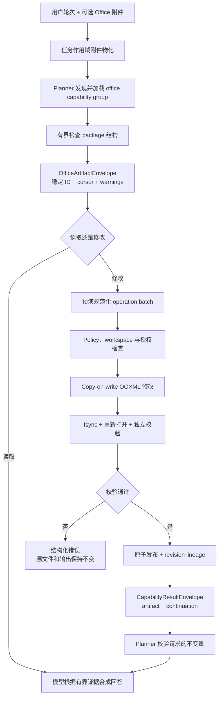

# Office 工件工作区

<!-- ai-learning-navigation:start -->
上一页：[发布验证](06-release-validation.zh-CN.md) |
[架构索引](README.md) |
下一页：[技能独立存储](08-skill-owned-storage.zh-CN.md)

<!-- ai-learning-navigation:end -->

RustClaw 把 DOCX、XLSX 和 PPTX 作为不可信的结构化工件处理。Planner 根据
registry metadata 选择延迟加载的 Office capability；runtime 不会通过匹配用户
语言中的固定短语来选择格式或操作。

Package 安全层会在解析内容前拒绝路径穿越成员、加密、带宏文件、必要部件损坏
以及超过配置的 ZIP 膨胀限制。公式、批注、隐藏内容、链接、relationship 和
嵌入对象只作为证据，绝不执行。大型结构使用 cursor 分页；二进制媒体仅以
artifact 引用进入证据，不会直接塞入模型上下文。

创建可以从空 package 或只读模板开始。编辑必须提供准确的源 SHA-256，默认
使用 copy-on-write。经批准的原地替换会建立可恢复备份。每次成功写入都会返回
规范化 operation ID、变更对象引用、保留性检查、校验证据、父版本/模板 lineage、
已验证输出 hash，以及供下一轮继续编辑的有界 continuation descriptor。

纯 OOXML 解析和写入由 Linux 与 macOS 共用。渲染或 PDF 转换是经过能力探测的
可选 adapter；缺失 adapter 不会把结构正确的 Office 结果误判为失败，而仅有
XML 合法也不会声称视觉保真。
