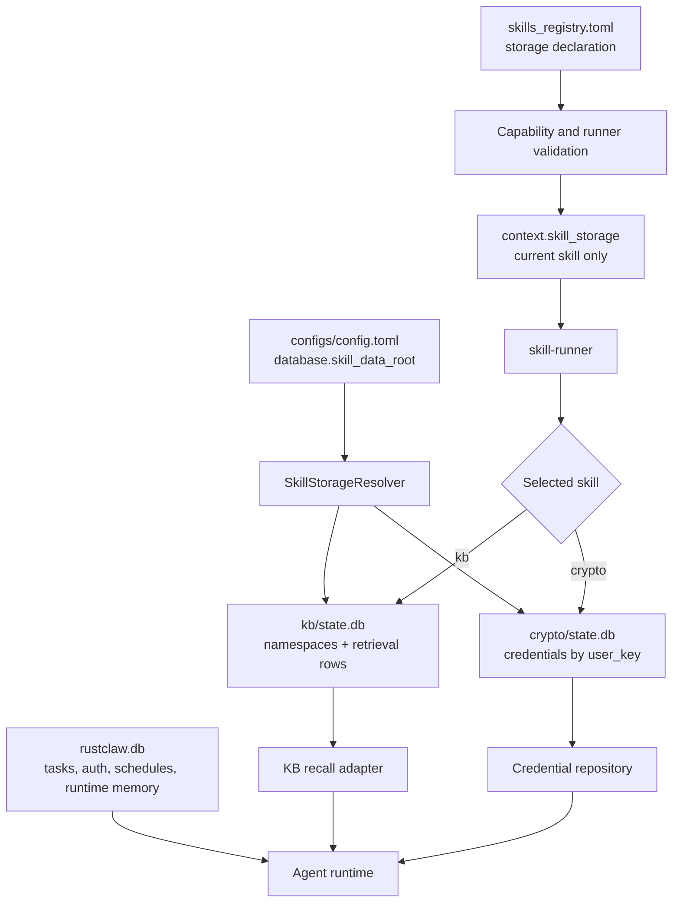

# Skill-Owned Storage

<!-- ai-learning-navigation:start -->
Previous: [Office artifact workspace](07-office-artifacts.md) |
[Architecture index](README.md)

<!-- ai-learning-navigation:end -->

Persistent skill state is isolated from the runtime database. The main database
owns tasks, auth identities, schedules, conversation state, and runtime memory.
Each persisted skill declares its storage contract in the registry and receives
only its own resolved descriptor. Crypto credentials and KB documents therefore
cannot become accidental shared tables or implicit planner inputs.

The resolver accepts only canonical machine-token skill names, creates private
per-skill directories, and provides a schema version plus bounded SQLite
settings. The runner validates the registry declaration before spawning a
skill and never exposes the generic runtime database path.

Upgrades use one-shot idempotent migrations. Legacy crypto credentials are
copied to the crypto database, counted and digest-verified, then the old main
table is dropped. Legacy KB rows and JSON snapshots are likewise verified in
the KB database before their old copies are removed. Migration checkpoints
contain counts and hashes, never secrets.

Authentication lifecycle operations coordinate the stores explicitly: key
rotation rebinds Crypto and KB ownership, user deletion removes only that
user's rows, and factory reset clears skill-owned data. Failure before the main
transaction commits restores the skill snapshots. The repository gate
`scripts/check_skill_storage_ownership.py` prevents direct main-database access,
generic runner database fields, and registry ownership drift from returning.
