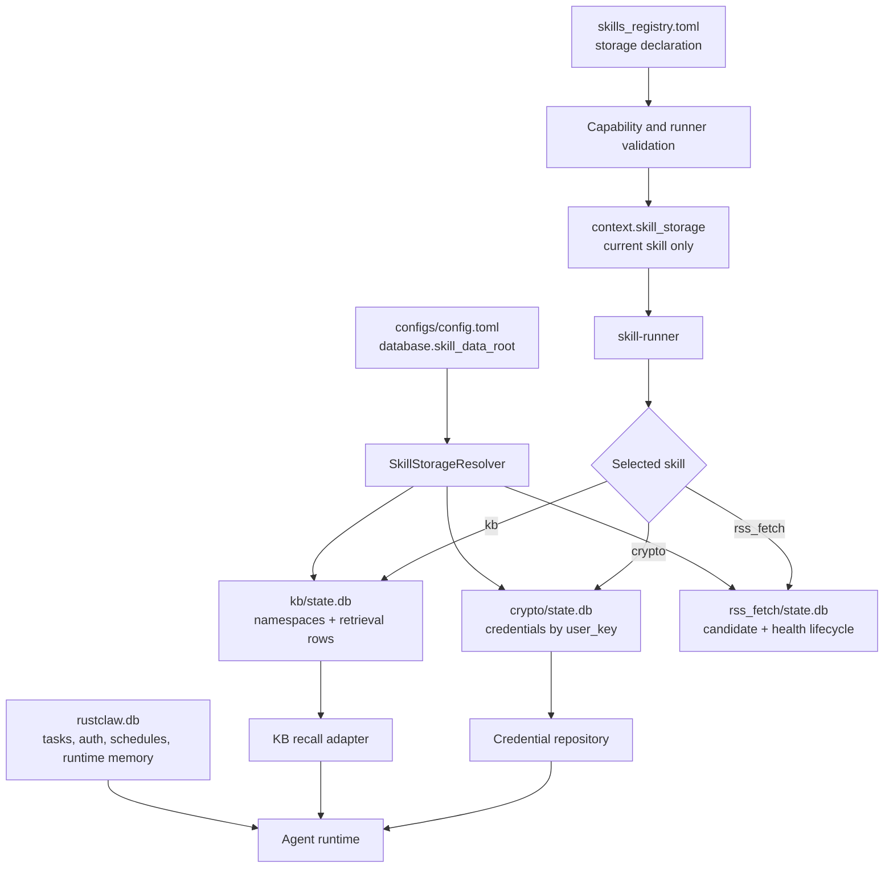

# Skill-Owned Storage

<!-- ai-learning-navigation:start -->
Previous: [Office artifact workspace](07-office-artifacts.md) |
[Architecture index](README.md) |
Next: [Interactive coding and presentation](09-interactive-coding.md)

<!-- ai-learning-navigation:end -->

Persistent skill state is isolated from the runtime database. The main database
owns tasks, auth identities, schedules, conversation state, and runtime memory.
Each persisted skill declares its storage contract in the registry and receives
only its own resolved descriptor. Crypto credentials, KB documents, and RSS
source-health/discovery state therefore cannot become accidental shared tables
or implicit planner inputs.

```mermaid
flowchart TD
    A[configs/config.toml<br/>database.skill_data_root] --> B[SkillStorageResolver]
    C[skills_registry.toml<br/>storage declaration] --> D[Capability and runner validation]
    B --> E[crypto/state.db<br/>credentials by user_key]
    B --> F[kb/state.db<br/>namespaces + retrieval rows]
    B --> N[rss_fetch/state.db<br/>candidate + health lifecycle]
    D --> G[context.skill_storage<br/>current skill only]
    G --> H[skill-runner]
    H --> I{Selected skill}
    I -->|crypto| E
    I -->|kb| F
    I -->|rss_fetch| N
    J[rustclaw.db<br/>tasks, auth, schedules, runtime memory] --> K[Agent runtime]
    F --> L[KB recall adapter]
    L --> K
    E --> M[Credential repository]
    M --> K
```

The resolver accepts only canonical machine-token skill names, creates private
per-skill directories, and provides a schema version plus bounded SQLite
settings. The runner validates the registry declaration before spawning a
skill and exposes only the selected skill's storage descriptor.

Crypto credentials live in `crypto/state.db`, KB documents and retrieval rows
live in `kb/state.db`, and RSS candidate/health lifecycle records live in
`rss_fetch/state.db`. Active RSS source URLs and discovery policy remain in
`configs/rss.toml`. Storage checkpoints contain counts and hashes, never
secrets. Any schema transition is one-shot, idempotent, count/digest verified,
and scoped to the owning skill.

Authentication lifecycle operations coordinate the stores explicitly: key
rotation rebinds Crypto and KB ownership, user deletion removes only that
user's rows, and factory reset clears skill-owned data. Failure before the main
transaction commits restores the skill snapshots. The repository gate
`scripts/check_skill_storage_ownership.py` verifies that skills use their
private stores, runner context stays skill-scoped, and registry ownership
remains consistent.
