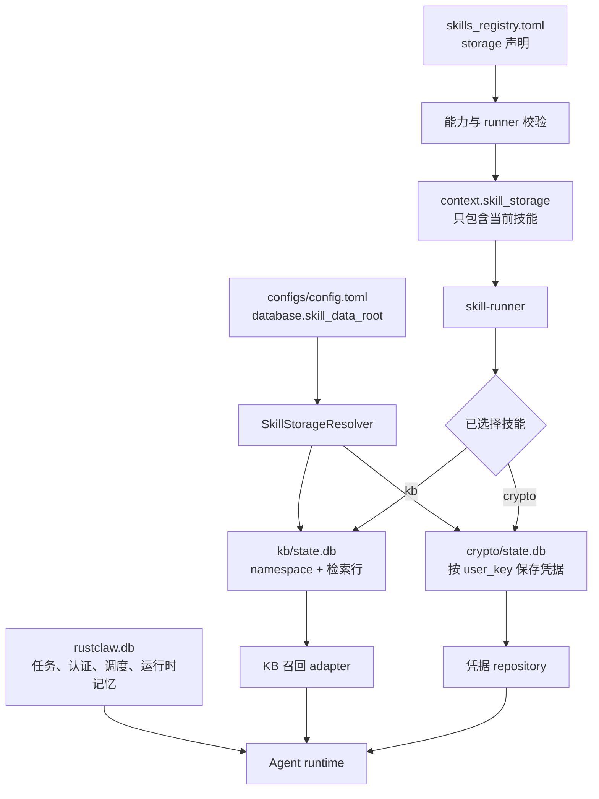

# 技能独立存储

<!-- ai-learning-navigation:start -->
上一页：[Office 工件工作区](07-office-artifacts.zh-CN.md) |
[架构索引](README.md)

<!-- ai-learning-navigation:end -->

技能持久化状态与运行时主数据库相互隔离。主库只负责任务、认证身份、调度、
会话状态和运行时记忆。每个需要持久化的技能都在 registry 声明自己的存储合同，
运行时只向当前技能下发其专属描述符。因此，Crypto 凭据和 KB 文档不会再成为
共享表，也不会隐式进入 planner 输入。

Resolver 只接受规范的机器 token 技能名，建立私有的技能目录，并提供 schema
版本与有界 SQLite 参数。Runner 会在启动技能前校验 registry 声明，绝不再下发
通用主数据库路径。

升级使用一次性、幂等迁移。旧 Crypto 凭据复制到私有库后会核对行数与摘要，
验证成功才删除主库旧表；旧 KB 行和 JSON 快照也会在 KB 私有库验证完成后再
物理删除。迁移 checkpoint 只记录计数和 hash，不保存密钥。

认证生命周期会显式协调各存储：key 轮换同步重绑定 Crypto/KB owner，删除用户
只删除该用户的数据，恢复出厂清空技能私有数据。如果主事务提交前失败，技能
快照会恢复。仓库门禁 `scripts/check_skill_storage_ownership.py` 会阻止技能重新
直连主库、runner 恢复通用数据库字段或 registry 存储 owner 漂移。
