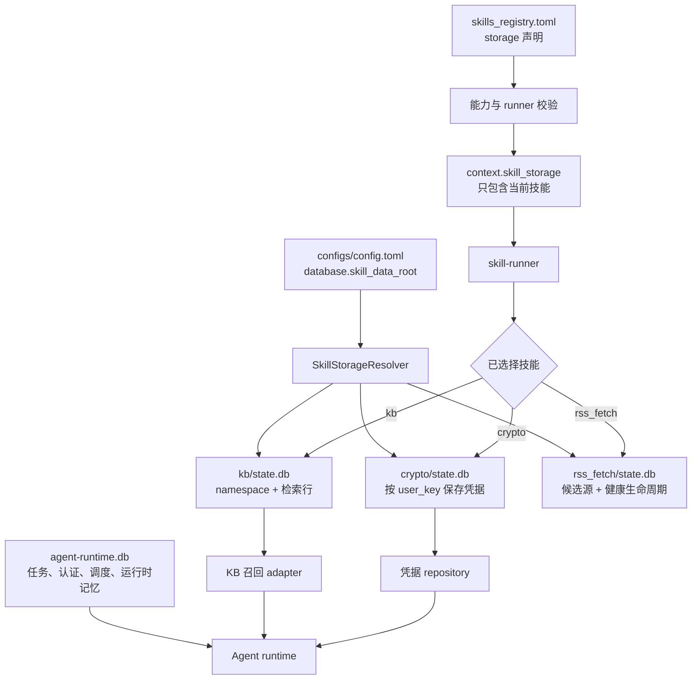

# 技能独立存储

<!-- ai-learning-stage: capabilities-artifacts -->
<!-- ai-learning-audience: developer -->

<!-- ai-learning-navigation:start -->
上一页：[Office 工件工作区](07-office-artifacts.zh-CN.md) |
[架构索引](README.md) |
下一页：[交互式编码与输出呈现](09-interactive-coding.zh-CN.md)

<!-- ai-learning-navigation:end -->

技能持久化状态与运行时主数据库相互隔离。主库只负责任务、认证身份、调度、
会话状态和运行时记忆。每个需要持久化的技能都在 registry 声明自己的存储合同，
运行时只向当前技能下发其专属描述符。因此，Crypto 凭据、KB 文档以及 RSS
源健康与发现状态保持独立，不会成为共享表，也不会隐式进入 planner 输入。

```mermaid
flowchart TD
    A[configs/config.toml<br/>database.skill_data_root] --> B[SkillStorageResolver]
    C[skills_registry.toml<br/>storage 声明] --> D[能力与 runner 校验]
    B --> E[crypto/state.db<br/>按 user_key 保存凭据]
    B --> F[kb/state.db<br/>namespace + 检索行]
    B --> N[rss_fetch/state.db<br/>候选源 + 健康生命周期]
    D --> G[context.skill_storage<br/>只包含当前技能]
    G --> H[skill-runner]
    H --> I{已选择技能}
    I -->|crypto| E
    I -->|kb| F
    I -->|rss_fetch| N
    J[agent-runtime.db<br/>任务、认证、调度、运行时记忆] --> K[Agent runtime]
    F --> L[KB 召回 adapter]
    L --> K
    E --> M[凭据 repository]
    M --> K
```

Resolver 只接受规范的机器 token 技能名，建立私有的技能目录，并提供 schema
版本与有界 SQLite 参数。Runner 会在启动技能前校验 registry 声明，只下发
当前技能自己的存储描述符。

Crypto 凭据存放在 `crypto/state.db`，KB 文档与检索行存放在 `kb/state.db`，
RSS 候选源与健康生命周期存放在 `rss_fetch/state.db`；激活源 URL 和发现策略
保留在 `configs/rss.toml`。存储 checkpoint 只记录计数和 hash，不保存密钥。
任何 schema 转换都必须一次性、幂等、核对数量与摘要，并且只能修改所属技能
的数据。

认证生命周期会显式协调各存储：key 轮换同步重绑定 Crypto/KB owner，删除用户
只删除该用户的数据，恢复出厂清空技能私有数据。如果主事务提交前失败，技能
快照会恢复。仓库门禁 `scripts/check_skill_storage_ownership.py` 验证技能只使用
私有存储、runner context 保持技能范围，并且 registry 存储 owner 一致。
