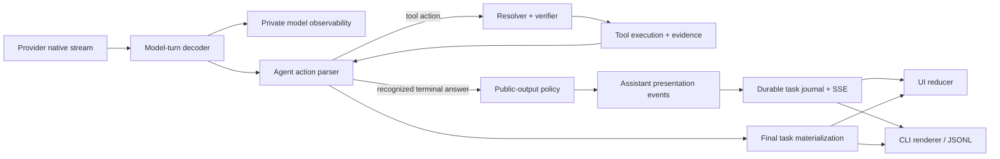
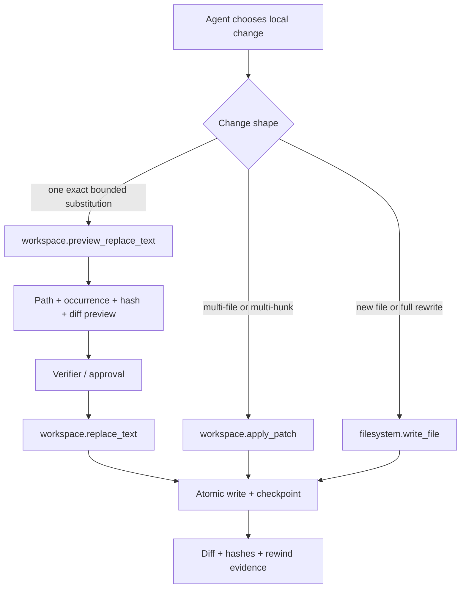
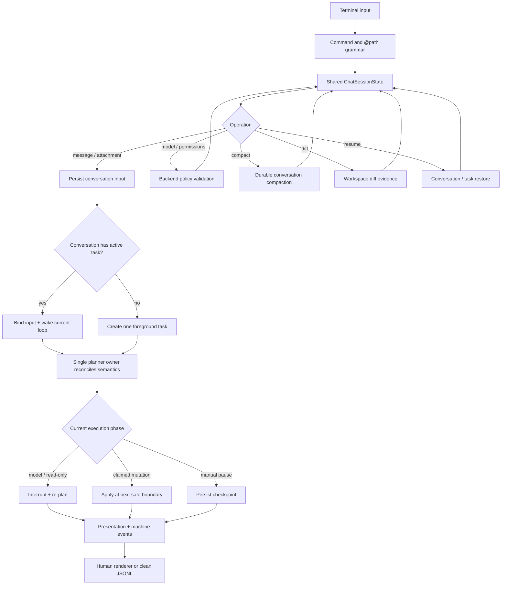

# Interactive Coding And Presentation

<!-- ai-learning-stage: development-release -->
<!-- ai-learning-audience: developer -->

<!-- ai-learning-navigation:start -->
Previous: [Skill-owned storage](08-skill-owned-storage.md) |
[Architecture index](README.md) |
Next: [Web entry and core isolation](10-web-entry-security.md)

<!-- ai-learning-navigation:end -->

Agent Runtime keeps semantic decisions in one agent loop while deterministic runtime
layers enforce schemas, permissions, confinement, side effects, and evidence.
Interactive coding adds a public presentation stream and safer local edit
surface.

## Private And Public Event Planes

Provider `TextDelta` content never enters SSE directly. The current
incremental parser publishes only after proving that bytes belong to a native
terminal `respond` action with `shape=free_text`. Complete UTF-8 fragments then
pass the user-visible output policy. Other response shapes and structured-plan
formats remain terminal-only.

Each public answer attempt has a stable stream and attempt ID. A later verifier
retry emits abort and replacement events rather than appending a second answer.
Completion records the byte count and SHA-256 digest. UI and CLI reconcile that
digest with the final task result, which remains authoritative.

## Exact Local Editing

Exact replacement requires one non-overlapping occurrence. Zero or multiple
matches never mutate the file. Optional precondition hashes detect stale
previews. The mutation preserves UTF-8 and line endings, writes atomically,
and reuses the workspace checkpoint/diff/rewind layer.

Replay is decided before execution by the runtime idempotency ledger. Reusing
the same idempotency key returns the recorded result; a fresh invocation runs
against current filesystem state and may return `replacement_target_not_found`.

## Durable CLI Conversation

The CLI stores safe identifiers and preferences, not authoritative task or
policy state. Model and permission changes are session-scoped and validated by
the backend. Compaction preserves goals, constraints, approvals, completed
side effects, changed files, artifact references, pending work, and resume
cursors.

`@path`, slash commands, and attachment commands are explicit grammar. They do
not use natural-language phrase matching. Path materialization reuses workspace
confinement, ignore/secret policy, symlink checks, size limits, and content
hashing.

The CLI accepts at most 10 pending attachments, 20 MiB per file, and 60 MiB in
total. It persists only safe attachment metadata and content hashes; bytes are
read again and hash-checked when the task is submitted. A successful submission
clears the pending set. Model selection and `safe|ask|yolo` preferences are
session-scoped requests, while the authenticated server remains the authority
that validates the model and issues the execution policy.

Browser conversation recovery is also server-authoritative.
`GET /v1/tasks/conversation-history` returns authenticated, owner-filtered,
cursor-paginated ask turns with bounded display text, task status, attachment
kind/count, persisted custom conversation titles, and a SHA-256 page digest.
`PUT /v1/tasks/conversations/{conversation_id}/title` stores a title in the
authenticated owner's conversation namespace. It excludes provider prompts,
attachment bytes, tool arguments, secrets, and full journals. Browser storage
holds only drafts and preferences; teaching detail is reloaded through the
protected task-debug endpoint.

The browser composer remains available while a task is executing. Text, voice,
image, and file snapshots are persisted immediately as owner-scoped
conversation inputs. A stable client message ID recovers a lost HTTP response without
submitting duplicate work. The active agent loop observes the ordered input;
if its task has already reached a terminal boundary, the same input receipt is
bound to one follow-up task instead. Teaching history records the input ID,
task ID, and instruction revision, while the task event stream remains the
source for model and tool progress.

The composer exposes the transport choice directly. **Run now** is the default
and updates an active task or creates one idle foreground task. **Run later**
stores a `deferred` input without task creation. Deferred inputs are restored
from the server and can be explicitly activated or withdrawn; neither action
depends on browser-local queue state or natural-language phrase matching.

The CLI uses the same input contract and keeps stdin reading independent from
its event follower, so a user can add instructions while output is streaming.
Explicit `/cancel` is parsed only as command grammar and calls the authenticated
current-conversation control endpoint; ordinary natural-language wording stays
opaque to the transport and is interpreted by the agent loop. Locally queued
entries are limited to transient network delivery and are never presented as
server-accepted work.

One planner owner remains authoritative for a task. A new input interrupts a
model or interruptible read-only turn and causes re-planning; an already claimed
mutation reaches its next safe boundary before the new revision is applied.
Manual pause writes a durable checkpoint and never resumes from a timer alone.
Cancellation publishes separate accepted, requested, and settled machine
states, so the interface does not claim that an external effect was undone.

The dashboard and active-task list use the same identity scope. An admin sees
all queued/running tasks; a normal key sees that owner's tasks across
conversations. This keeps queue counts and oldest-running age aligned with
the tasks that the current operator can inspect.

## Failure And Privacy Rules

- Runtime decisions consume machine error tokens, not `text` or `error_text`.
- Hidden reasoning, planner JSON, tool arguments, secrets, and raw provider
  frames never become presentation content.
- Stream gaps, offset mismatches, digest mismatches, and replacement errors are
  structured protocol failures.
- Human terminal animation is disabled for non-TTY, `NO_COLOR`, and JSONL.
- Linux and macOS share portable paths and terminal adapters; unavailable
  platform functions return structured unsupported results.
