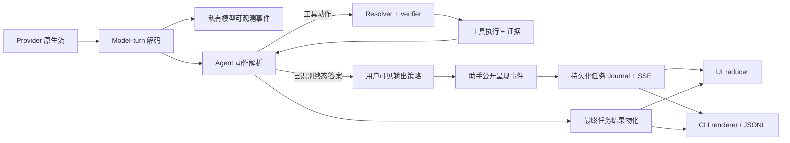
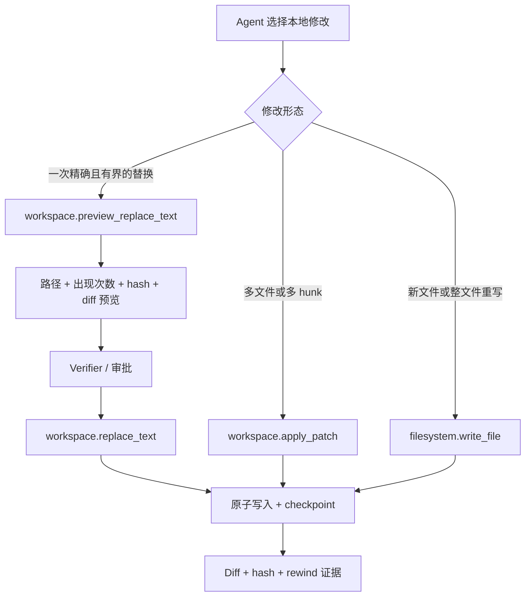
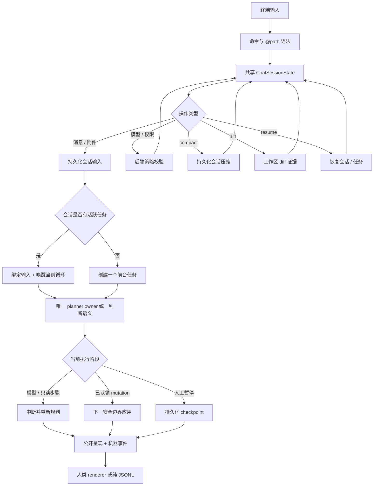

# 交互式编码与输出呈现

<!-- ai-learning-stage: development-release -->
<!-- ai-learning-audience: developer -->

<!-- ai-learning-navigation:start -->
上一页：[技能独立存储](08-skill-owned-storage.zh-CN.md) |
[架构索引](README.md) |
下一页：[Web 入口与核心隔离](10-web-entry-security.zh-CN.md)

<!-- ai-learning-navigation:end -->

Agent Runtime 继续由单一 agent loop 负责语义决策，确定性 runtime 只负责 schema、
权限、路径边界、副作用与证据。交互式编码增加公开输出流和更安全的本地编辑
能力。

## 私有事件面与公开事件面

Provider 的 `TextDelta` 内容不能直接进入 SSE。当前增量解析器只在证明字节属于
原生终态 `respond` 且 `shape=free_text` 后才允许公开；完整 UTF-8 片段还要通过
用户可见输出策略。其他回复形状和结构化 plan 格式只发送终态结果。

每次公开答案尝试都有稳定的 stream ID 和 attempt ID。如果后续 verifier 要求
重试，就发送 abort 与 replacement 事件，不能把第二个答案追加到第一个答案。
完成事件记录总字节数和 SHA-256。UI 与 CLI 用它和最终任务结果对账，最终任务
结果始终是权威结果。

## 精确本地编辑

精确替换要求目标只出现一次。找不到或出现多次都不得修改文件。可选的前置
hash 用于发现预览后文件已经变化。修改必须保留 UTF-8 与换行风格，使用原子
写入，并复用工作区 checkpoint、diff 与 rewind 层。

重放由 runtime 幂等账本在执行前判断。同一个 idempotency key 返回已经记录的
结果；新的 key 会按当前文件状态重新执行，因此可能返回
`replacement_target_not_found`。

## 持久化 CLI 会话

CLI 只保存安全的 ID 和偏好，不把本地缓存当作任务或策略权威来源。模型与权限
修改只影响当前会话，并由后端校验。上下文压缩必须保留目标、约束、审批、已完成
副作用、修改文件、工件引用、待办工作和 resume cursor。

`@path`、斜杠命令和附件命令都是显式语法，不使用自然语言短语匹配。路径物化
复用工作区边界、ignore/secret 策略、符号链接检查、大小限制和内容 hash。

CLI 最多保留 10 个待发送附件，单文件上限 20 MiB，总上限 60 MiB。会话只保存
安全的附件 metadata 与内容 hash；提交任务时重新读取并核对 hash，成功提交后
清空待发送集合。模型选择与 `safe|ask|yolo` 是会话范围的请求，最终仍由已认证
服务端校验模型并签发执行策略。

浏览器对话恢复同样以服务端为权威。`GET /v1/tasks/conversation-history` 返回
经过认证、按 owner 过滤、使用 cursor 分页的 ask 轮次，其中只包含有界展示文本、
task 状态、附件种类/数量、持久化的自定义会话名称和页面 SHA-256。
`PUT /v1/tasks/conversations/{conversation_id}/title` 在当前认证 owner 的会话
命名空间内保存名称。接口不会返回 provider prompt、附件字节、工具参数、密钥
或完整 journal。浏览器存储只保存草稿与偏好，教学详情通过受保护的 task-debug
endpoint 重新加载。

浏览器在任务执行时仍允许输入和发送。文字、语音、图片和文件快照会立即作为
owner-scoped 会话输入持久化。稳定的 client message ID 可以在 HTTP 响应丢失后找回
原收据，不会重复创建工作。活跃 agent
loop 按序观察输入；如果原任务已经越过终态边界，同一输入收据只会绑定到一个 follow-up
任务。教学历史记录 input ID、task ID 与 instruction revision；模型和工具进度继续以
task event stream 为权威来源。

输入框直接展示传输选择。“立即处理”是默认行为，会补充活跃任务，或在空闲时创建唯一的
前台任务；“稍后处理”只保存 `deferred` 输入，不创建任务。延后输入从服务器恢复，并可由
用户明确“立即处理”或“撤回”；这些操作不依赖浏览器本地队列，也不使用自然语言短语匹配。

CLI 使用同一输入合同，并把 stdin 读取与事件 follower 解耦，因此输出流仍在运行时也能
继续补充指令。显式 `/cancel` 只按命令语法解析，并调用当前会话的鉴权控制端点；普通
自然语言对 transport 保持 opaque，由 agent loop 理解。客户端本地队列只承担短暂网络
发送，不会被展示成服务端已经接收的工作。

同一任务始终只有一个 planner owner。新输入到达模型或可中断只读步骤时会中断并重新
规划；mutation 已经认领后，要到下一个安全边界才应用新 revision。人工暂停写入持久化
checkpoint，不会仅因计时器到期自动恢复。取消过程分别发布 accepted、requested 与
settled 机器状态，因此界面不会把“已经请求停止”误报成“外部效果已经撤销”。

首页和活动任务列表使用同一身份范围：管理员看到系统内全部排队/运行任务，
普通 key 看到本人跨会话的任务。因此，排队数量和最老运行时长始终对应当前
操作者可以查看的任务列表。

## 失败与隐私规则

- Runtime 决策消费机器错误 token，不解析 `text` 或 `error_text`。
- 隐藏推理、planner JSON、工具参数、密钥和原始 provider frame 不得成为公开
  呈现内容。
- Stream 缺口、offset 不匹配、摘要不匹配和 replacement 错误都返回结构化协议
  失败。
- 非 TTY、`NO_COLOR` 和 JSONL 模式禁用人类终端动画。
- Linux 与 macOS 共用可移植路径和终端 adapter；平台能力不可用时返回结构化
  unsupported 结果。
