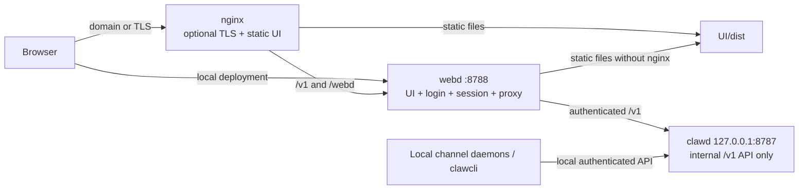

# Web Entry And Core Isolation

<!-- ai-learning-stage: safety-operations -->
<!-- ai-learning-audience: operator -->

<!-- ai-learning-navigation:start -->
Previous: [Interactive coding and presentation](09-interactive-coding.md) |
[Architecture index](README.md) |
Next: [Task artifact delivery](11-task-artifact-delivery.md)

<!-- ai-learning-navigation:end -->

RustClaw keeps browser-facing security in `webd` and keeps `clawd` as an
internal core API. This prevents a second public UI/API entry from bypassing
the browser session gateway.

## Current Access Topology



`clawd` does not serve `UI/dist` and cannot bind a non-loopback address. Its
address is not a user configuration field. The internal test override accepts
only loopback socket addresses, so parallel local test servers cannot reopen
the public interface.

## Ownership

- `webd` owns browser login, persisted sessions, credential injection,
  login-failure lockout, body limits, forwarded-client handling, and API proxying.
- `clawd` owns authenticated task and administration APIs, agent execution,
  tools, skills, and persistence.
- nginx is optional. It owns TLS/domain termination and static asset delivery,
  then forwards `/v1` and `/webd` to `webd`, never to `clawd`.

## webd listener scope

The dashboard's left entry card controls whether `webd` accepts direct device-IP
connections. The switch changes only `[webd].listen`, preserves its port and
other settings, writes the TOML atomically, and schedules a delayed restart so
the current API response can finish:

- direct access: `0.0.0.0:<port>`
- local/nginx-only access: `127.0.0.1:<port>`

On a native deployment, nginx and `webd` share the host network namespace, so
closing direct access does not affect the nginx route. A browser connected to
`IP:<port>` does disconnect. Container and sidecar deployments must keep the
listener reachable from their proxy network instead of assuming host loopback.
- Local channel daemons and `clawcli` may call the loopback core API directly;
  this is machine-local component communication, not a browser entry.

## Dashboard Operations

The dashboard reports whether nginx is installed, running, configured for
RustClaw, and serving a deployed UI. Admin-only actions use the existing
background workspace-operation state:

- **Enable/Repair nginx** checks the system package version, installs or updates
  nginx when needed, writes the RustClaw site, deploys existing `UI/dist`,
  validates configuration, and starts or reloads it. Linux package managers and
  Homebrew on macOS are handled explicitly.
- **Disable nginx** stops and disables the service, removes the RustClaw site and
  its dedicated UI deployment, and warns that a cloud/domain entry will become
  unreachable. nginx itself is not uninstalled.

Operations return machine status and error keys. Human-facing Chinese or
English guidance is rendered by the UI rather than parsed by runtime logic.

## Deployment Rules

- Native Linux/macOS: `clawd` is loopback-only; `webd` is the browser entry.
- Docker: publish `8788`, not `8787`; `webd` and `clawd` communicate through
  loopback inside the same container.
- Local use does not require nginx. Open `webd` directly.
- Server/domain use should place nginx in front of `webd` and use trusted TLS.
- Never expose or port-forward `8787`.

## Verification

```bash
cargo test -p webd
cargo test -p clawd internal_listener_tests::
cargo test -p clawd workspace_nginx_tests::
cargo test -p clawd workspace_webd_tests::
python3 scripts/check_long_files.py
```

The webd tests prove that UI assets are served locally while `/v1` remains a
proxy path. The clawd listener test rejects wildcard and LAN addresses.
