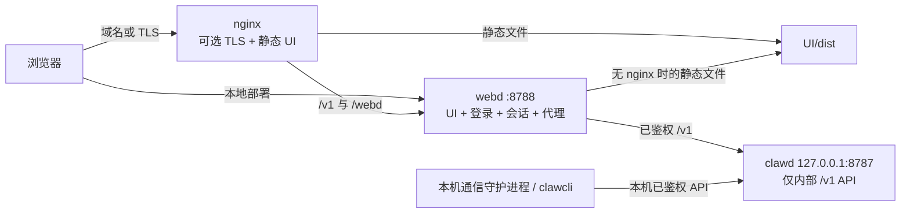

# Web 入口与核心隔离

<!-- ai-learning-stage: safety-operations -->
<!-- ai-learning-audience: operator -->

<!-- ai-learning-navigation:start -->
上一页：[交互式编码与输出呈现](09-interactive-coding.zh-CN.md) |
[架构索引](README.md) |
下一页：[任务产物交付](11-task-artifact-delivery.zh-CN.md)

<!-- ai-learning-navigation:end -->

Agent Runtime 把面向浏览器的安全边界集中在 `webd`，把 `clawd` 保留为内部核心
API。这样不会出现绕过浏览器会话网关的第二套公开 UI/API 入口。

## 当前访问拓扑



`clawd` 不再托管 `UI/dist`，也不能绑定非 loopback 地址。它的地址不是用户配置项。
内部测试 override 也只接受 loopback socket，因此并行本地测试不会重新打开对外端口。

## 责任归属

- `webd` 负责浏览器登录、持久会话、凭据注入、登录失败锁定、请求体限制、
  代理来源处理和 API 转发。
- `clawd` 负责已鉴权的任务/管理 API、agent 执行、工具、技能和持久化。
- nginx 是可选外层，负责 TLS/域名终止和静态资源，再把 `/v1` 与 `/webd` 转给
  `webd`，不直接连 `clawd`。

## webd 监听范围

首页左侧入口卡片控制 `webd` 是否接受设备 IP 直连。开关只修改
`[webd].listen`，保留原端口和其他设置，使用原子写入，并延迟重启以确保当前 API
响应先完整返回：

- 对外直连：`0.0.0.0:<端口>`
- 仅本机/nginx：`127.0.0.1:<端口>`

原生部署时 nginx 与 `webd` 位于同一主机网络命名空间，因此关闭直连不影响 nginx
入口；正在通过 `IP:<端口>` 访问的浏览器则会断开。容器或 sidecar 部署不能默认使用
主机 loopback，必须按代理所在网络保持上游可达。
- 本机通信守护进程和 `clawcli` 可以直连 loopback 核心 API；这是机器内部组件通信，
  不是浏览器入口。

## 首页操作

首页会显示 nginx 是否已安装、正在运行、已配置 Agent Runtime 站点，以及 UI 是否已部署。
仅管理员可执行下列后台操作：

- **启用/修复 nginx**：检查系统软件源版本，按需安装或更新 nginx，写入 Agent Runtime
  站点，部署已有 `UI/dist`，验证配置后启动或重载。Linux 使用对应包管理器，macOS
  使用 Homebrew。
- **关闭 nginx**：停止并禁用服务，删除 Agent Runtime 站点和专用 UI 部署，但不卸载 nginx；
  操作前会明确提示云服务器或域名入口将无法继续访问。

操作返回机器状态和错误键。面向用户的中英文说明由 UI 渲染，运行时不解析固定自然语言。

## 部署规则

- Linux/macOS 原生部署：`clawd` 只绑定 loopback，`webd` 是浏览器入口。
- Docker：发布 `8788`，不发布 `8787`；`webd` 和 `clawd` 在容器内通过 loopback 通信。
- 本地使用不需要 nginx，直接打开 `webd`。
- 服务器/域名部署应在 `webd` 外层使用 nginx 和可信 TLS。
- 不要对外暴露或端口转发 `8787`。

## 验证

```bash
cargo test -p webd
cargo test -p clawd internal_listener_tests::
cargo test -p clawd workspace_nginx_tests::
cargo test -p clawd workspace_webd_tests::
python3 scripts/check_long_files.py
```

`webd` 测试证明 UI 资源由它自己提供，而 `/v1` 仍然是代理路径。`clawd` 监听测试会拒绝
wildcard 和局域网地址。
