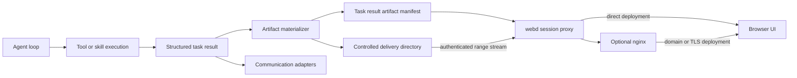

# Task Artifact Delivery

<!-- ai-learning-stage: architecture-guide -->
<!-- ai-learning-audience: operator -->

<!-- ai-learning-navigation:start -->
Previous: [Web entry and core isolation](10-web-entry-security.md) |
[Architecture index](README.md)

<!-- ai-learning-navigation:end -->

RustClaw turns successful task output files into authenticated, durable task
artifacts. The browser receives a machine-readable manifest and renders the
right preview or download control without interpreting assistant prose.

## Delivery Flow



When a task succeeds, `clawd` collects structured local output references,
verifies that every source remains inside the workspace, copies accepted files
into `.rustclaw/artifacts/delivery/<task_id>/<artifact_id>/`, and adds an
`artifacts` array to the stored task result. Each manifest entry contains a
stable identifier, filename, media kind, MIME type, byte size, SHA-256 digest,
and same-origin download and preview paths.

Dry-run output, paths outside the workspace, directories, missing files, and
files above the configured delivery limit are not exposed. Materialization
failure does not turn an otherwise successful tool or skill execution into a
failed task; it is logged as a structured delivery warning.

## Browser Access

The UI uses these authenticated core routes through `webd`:

- `GET /v1/tasks/:task_id/artifacts` returns the controlled manifest.
- `GET /v1/tasks/:task_id/artifacts/:artifact_id/content` streams content.
- `HEAD` returns metadata without transferring the file.
- A single byte range is supported for audio, video, PDF, and resumable download.

The content endpoint verifies task ownership and resolves only files under the
controlled delivery directory. Responses include a safe content disposition,
content type, ETag, `nosniff`, and range headers. Raster images, audio, video,
and PDF may be previewed inline. Active content such as SVG and HTML is always
downloaded instead of rendered inline.

The browser always calls same-origin `/v1` paths. With standalone `webd`, the
request is proxied directly to loopback `clawd`. With nginx, static UI files are
served by nginx while `/v1` still travels through `webd`, preserving the same
session and authorization boundary. Artifact streams use the long-running
proxy client so a normal API request timeout does not interrupt a large file.

## Communication Adapter Compatibility

Telegram, Wechat, Feishu, Lark, WhatsApp, and other channel daemons retain their
existing native text and media delivery paths. The top-level artifact manifest
is additive: it does not replace `text`, channel message arrays, skill `extra`,
or existing media references. A channel may adopt the manifest deliberately,
but the browser endpoint does not become a hidden dependency of channel
delivery.

This separation lets each channel respect its own upload limits, formatting,
and retry model while the browser keeps authenticated preview and download
semantics. Task history restores only artifact metadata and URLs; binary data is
never persisted in browser local storage.

## Lifecycle And Verification

Deleting a task removes its controlled delivery directory. A background cleanup
pass also removes orphan task directories. Original workspace files remain
owned by the tool or skill that created them.

```bash
cargo test -p clawd task_artifact
cargo test -p clawd conversation_history_projects_downloadable_task_artifacts
cargo test -p webd
cargo test -p telegramd
cd UI && node --import tsx --test src/lib/task-artifacts.test.ts src/lib/chat-history.test.ts
```

The checks cover containment, authentication, byte ranges, history restoration,
safe preview policy, the long-running proxy path, and unchanged channel delivery.
