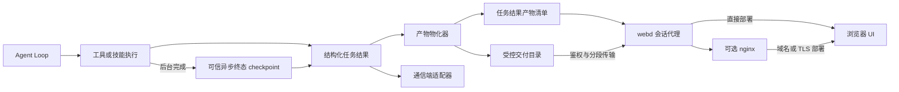
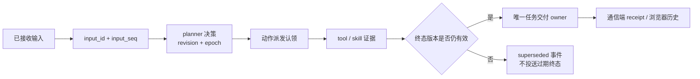

# 任务产物交付

<!-- ai-learning-stage: capabilities-artifacts -->
<!-- ai-learning-audience: operator,developer -->

<!-- ai-learning-navigation:start -->
上一页：[Web 入口与核心隔离](10-web-entry-security.zh-CN.md) |
[架构索引](README.md) |
下一页：[浏览器媒体发现](12-media-discovery.zh-CN.md)

<!-- ai-learning-navigation:end -->

Agent Runtime 会把成功任务输出的文件转换为经过鉴权、可持久恢复的任务产物。浏览器读取
机器可解析的产物清单，根据类型展示预览或下载控件，不解析助手回复中的自然语言。

## 交付流程



任务成功时，`clawd` 收集结构化的本地输出引用，确认来源位于工作区内，将允许交付的
文件复制到 `.agent-runtime/artifacts/delivery/<task_id>/<artifact_id>/`，并在持久化任务
结果中增加 `artifacts` 数组。每条清单包含稳定 ID、文件名、媒体类别、MIME 类型、
字节数、SHA-256 摘要，以及同源下载和预览路径。

dry-run 输出、工作区外路径、目录、缺失文件和超过交付上限的文件都不会暴露。产物
物化失败不会把原本成功的工具或技能执行改成失败任务，而是记录结构化交付警告。

异步 capability 可能在前台 turn 保存 checkpoint 以后才完成。此时终态 worker 结果保留在
可信的 `async_job_completion_checkpoint` observation 下，不会复制进已经过期的恢复前
capability result。产物物化与原生通信端交付共用同一个解码器，只接受有版本且成功的
observation，再读取其中的结构化 final result 与 `deliver_to_user` 偏好。这样恢复后的媒体
任务仍可下载，同时通信端不需要解析自然语言，也不用猜测 checkpoint 的嵌套位置。

## 浏览器访问

UI 通过 `webd` 使用以下已鉴权核心接口：

- `GET /v1/tasks/:task_id/artifacts`：返回受控产物清单。
- `GET /v1/tasks/:task_id/artifacts/:artifact_id/content`：流式传输内容。
- `HEAD`：只读取元数据，不传输文件正文。
- 支持单段字节范围，供音频、视频、PDF 和断点下载使用。

内容接口验证任务归属，并且只解析受控交付目录内的文件。响应包含安全的内容处置、
内容类型、ETag、`nosniff` 和分段请求头。位图、音频、视频和 PDF 可以安全内嵌预览；
SVG、HTML 等主动内容始终作为文件下载，不在页面内执行。

浏览器始终请求同源 `/v1` 路径。只使用 `webd` 时，请求直接代理到 loopback `clawd`；
使用 nginx 时，静态 UI 由 nginx 提供，`/v1` 仍经过 `webd`，因此会话和鉴权边界保持
一致。产物流使用长任务代理客户端，大文件不会被普通 API 请求超时提前中断。

## 通信端兼容

Telegram、微信、飞书、Lark、WhatsApp 等通信守护进程继续使用各自现有的文字和原生
媒体交付链路。任务顶层的产物清单只是新增字段，不替换 `text`、通信端消息数组、技能
`extra` 或现有媒体引用。通信端可以按自身需求显式接入清单，但浏览器下载接口不会成为
通信端交付的隐藏依赖。

这种隔离使每个通信端继续遵守自己的上传限制、格式和重试机制，浏览器则保持统一的鉴权
预览与下载语义。历史记录只恢复产物元数据和 URL，不把二进制或 base64 内容写入浏览器
本地存储。

通信守护进程是传输适配器，不是另一套 Agent Runtime。新增通信端只负责平台验签、重放
保护、绑定、附件物化、locale 采集、任务提交、低噪音活动提示和交付回执。已绑定用户的
普通消息统一经过：

`平台事件 -> 验签/去重/绑定 -> ChannelIngressEnvelope -> 持久会话输入 -> Agent Runtime`

Envelope 保留原文与附件事实；MIME 和扩展名只描述附件，不负责选择技能或 capability。
共享命令只保留 `/help`（`/start` 别名）、`/key`、`/cancel`，以及中央偏好已完整接管时的
`/voicemode`。已绑定用户发送的 `/run`、`/status` 和未知斜杠文本保持原样进入普通
`ask`。技能安装、升级、启停和卸载不得改变命令 catalog digest。

通信端普通消息与 UI、CLI 使用同一套 owner-scoped 会话输入收据。第一条被接收的输入
创建前台任务；后续输入绑定该任务，不再创建第二个终态交付 owner。只有 durable
handoff 完成后，通信端才确认 provider event。显式 `/cancel` 调用中央当前会话控制
合同，并可携带精确 UUID guard；非法命令参数会作为普通 agent 输入处理，不能扩大成
批量取消。



输入接收、取消请求和终态收尾是不同的机器事件。面向用户的确定性控制确认使用带 key
的 i18n 文案；runtime 路由不会解析这些文案。二进制产物继续使用既有统一 delivery
service 与鉴权 artifact broker。

Adapter 保持同一 peer 的普通消息顺序，同时允许 catalog 中精确的 `/cancel` 命令越过
缓慢附件物化。该旁路只属于基于命令语法的机器控制，普通自然语言不会获得 transport
捷径。投送认领由 receipt 驱动：dispatch lease 过期且没有平台确认时转为
`query_required`；多段消息只部分被平台接收时记录已接收前缀，不会重放整条消息。微信
在实际发送时解析最新有效 inbound context token，因此 token 过期不能被当作“内容肯定
没有投送”的证据。

确定性失败使用 `ChannelNotice` 和 public-safe i18n 参数，原始 provider body 与诊断只
作为运维证据。通信端优先使用平台原生 typing，同一任务最多发送一条慢任务提示，按序列
去重进度，并在终态后停止进度。Locale 依次取中央偏好、平台 locale、固定会话/请求
locale、通信端默认和产品安全默认；通信端默认语言只是识别失败时的兜底，不会强制所有
用户使用同一种语言。

## 生命周期与验证

删除任务时会删除对应的受控交付目录；后台清理也会移除找不到任务的孤立目录。原始工作区
文件仍由创建它的工具或技能管理。

```bash
cargo test -p clawd task_artifact
cargo test -p clawd conversation_history_projects_downloadable_task_artifacts
cargo test -p webd
cargo test -p telegramd
cd UI && node --import tsx --test src/lib/task-artifacts.test.ts src/lib/chat-history.test.ts
```

这些检查覆盖路径约束、鉴权、字节范围、历史恢复、可信异步终态结果、安全预览策略、
长任务代理路径，以及通信端交付不受影响。
