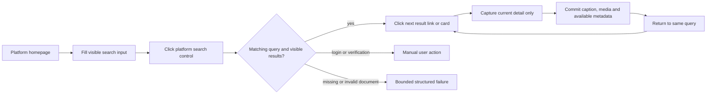
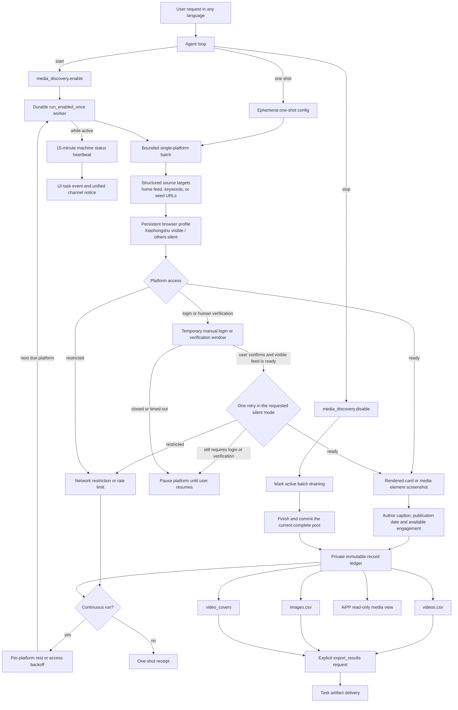

# Browser Media Discovery

<!-- ai-learning-stage: capabilities-artifacts -->
<!-- ai-learning-audience: operator,developer -->

<!-- ai-learning-navigation:start -->
Previous: [Task artifact delivery](11-task-artifact-delivery.md) |
[Architecture index](README.md) |
Next: [NNI capability and heartbeat control](13-nni-capability.md)
<!-- ai-learning-navigation:end -->

`media_discovery` is an optional Skill Store capability for bounded discovery on
Douyin, Xiaohongshu, and Kuaishou. Xiaohongshu defaults to a visible browser;
Douyin and Kuaishou default to silent mode. Explicit mode preferences take precedence.
Silent runs may open a window when the private profile needs manual login or human verification.
It captures only content that the browser has
already rendered and exports ordered CSV records; it does not run OCR or model text review,
and it downloads neither video binaries nor original image files.

Douyin recommendation collection reads a visible card's machine content ID and
opens its HTTPS detail page in the same browser. This also works when the home
page redirects to `/jingxuan` and its cards invoke a desktop client. Collection
uses the detail player's next-item control, or scrolls an embedded feed, and
waits for the active content ID to change before recording the next post.

Kuaishou recommendation collection reads the rendered public feed card itself:
the stable work URL, author caption, visible poster, and structurally identified
like counter. It rejects keyword-shaped hot-list pseudo-links at the URL-contract
boundary and does not enter a challenged detail page merely to enrich a card.

For keyword discovery, the agent emits `source_mode=topics` with `topics[]`.
The skill opens the platform homepage, fills its visible search input, clicks
the site's search control, and verifies the keyword and rendered result page.
It handles a new result tab and current/older search layouts without treating
homepage recommendations as search results. Visible result links are opened
in DOM order; each detail is captured before returning to the same query.
Kuaishou's newer cards use an in-page player rather than links. The adapter
uniquely associates rendered covers with public post IDs in already-loaded page
state, captures the active slide, and closes the player before the next card.
It does not read the system clipboard or fetch a private platform API.
Xiaohongshu capture is scoped to the note container, excluding background cards.
Its publication timestamp comes from the current note's detail state, not the
search overlay's generated JSON-LD date, comment time, or browsing telemetry.
Engagement labels use rendered text so hidden tooltips do not pollute counters.
The exact keyword and actual search-page URL accompany every committed record.
The runtime and skill never match localized user phrases to select search behavior.

`run.searches` proves a search reached visible results, whereas `run.counts` and
`run.capture_summary` prove saved content. Missing controls, incorrect query
navigation, timeouts, JSON instead of a document, and failed return navigation
produce separate machine errors. Platform login or verification remains manual;
the collector does not disguise automation or bypass access restrictions.

## User Workflow

A user controls the workflow through ordinary conversation. The model maps the
request to machine arguments; runtime code does not match fixed phrases in any
language.

- Starting collection calls `media_discovery.enable`, then launches the returned
  no-argument `media_discovery.run_enabled_once` companion as one runtime-owned
  durable background job. No schedule job is created.
- A one-shot request calls `media_discovery.run_once` with explicit platform
  and source settings. Its ephemeral config is not persisted and does not start
  background collection.
- Pausing or resuming changes only the selected platform state.
- Stopping calls `media_discovery.disable`. The background worker observes the
  persisted disabled state, and if a matching batch is active, marks it
  `draining`, finishes and commits the current complete post, then exits normally.
- `media_discovery.export_results` rebuilds and delivers exactly `videos.csv`
  and `images.csv` from the private immutable record ledger, copies the
  persisted `video_covers/` directory, and exposes each cover as an image
  artifact.
- The administrator AiPP presents the same private ledger through a bounded,
  read-only host renderer. Collection lifecycle changes still go through Agent.
- Image identity combines the platform post with its image resource, not the
  caption or carousel position. Reviewed Xiaohongshu CDN object IDs survive
  signature/resize URL changes; other sources retain their full URL identity.
  Repeated capture does not append matching records. Distinct images and posts
  remain separate in the CSV, and screenshots use stable resource-based paths.
- AiAPP groups retained and new images by platform and `post_sequence` into one
  card, with ordered image navigation, enlargement and per-image download.
  Original records and files remain unchanged by presentation grouping.

## Current Execution Flow

Each batch is bounded by item, scroll, and elapsed-time limits. A private worker
lease admits only one continuous coordinator, and a per-platform batch lease
admits only one live browser batch for that platform. Different platforms may
run concurrently within the resource cap. An already enabled continuous configuration also rejects another
`enable`, covering requests that were queued while the prior batch was active.
These rejections are structured pre-dispatch outcomes with no side effect. The
run checkpoints after committed records, maintains a periodic heartbeat,
and honors graceful stop only between complete posts. A multi-image post is
therefore committed in full before the browser closes. The collector remains
separate from the manual `media_download` queue. The durable runtime job starts
later batches after bounded randomized rests and remains observable and cancellable.
Each platform has its own batch quota, cooldown, failure count and saved-item
count in `platform_outcomes`. Due platforms run concurrently within the resource
cap; excess batches wait for capacity. A full or blocked batch does not consume
another platform's quota. Feed-card capture only proves
the card's visible fields, not unseen detail text or an entire gallery.

Status queries distinguish live heartbeat leases from expired records. Expired
records are returned in `expired_leases`, not as an active batch or worker;
`latest_run` reports the most recently completed batch without starting another
collection. The query preserves stored history. A completed one-shot receipt is
the completion boundary: verification uses status/history reads, and CSV export
does not require another browser run.
`run.capture_summary` reports saved captions/covers and only the metric names
actually observed. Missing counters are unavailable, not zero. CSV is persistent
local storage; saving it and delivering an exported artifact are separate actions.

While continuous collection remains active, the skill
emits a structured status heartbeat every 15 minutes. It contains only machine
fields for elapsed time and current counts. `clawd` persists it in the task
event stream for the UI and, for non-UI origins, sends a localized proactive
notice through the same receipt-backed channel delivery service used by other
background work. Host-side rate limiting and task/sequence idempotency prevent
duplicate delivery. One-shot collection does not opt into this reporting path.

## Screenshot and Capture Boundary

When the user omits a mode preference, the model omits `browser_mode`: Xiaohongshu
uses `visible`, while Douyin/Kuaishou use `silent`. Explicit mode overrides apply
to all selected platforms; resume keeps saved settings. Manual login/verification
may temporarily open a window for silent runs. Runtime never matches localized
words to choose a mode. The skill screenshots a rendered
content card or media element already present in the page. It does not fetch the
element's CDN URL to obtain a higher-resolution copy. For video items, the first
stable frame observed in the rendered video, poster, or card is copied to
`video_covers/`; if autoplay already started, this is not claimed to be the
encoded timeline's exact frame zero. Other successful temporary screenshots are
deleted after their record is committed; failed evidence may be retained only
in the private diagnostic area until its configured expiry.

Interactions use bounded randomized delays and scroll distances to avoid
bursty traffic while preserving deterministic item order and hard run limits.
This cooperative pacing, like screenshot reuse, is not an
anti-automation bypass. The skill does not solve challenges, hide automation,
bypass access controls, or continue through rate-limit and login barriers.
Missing desktop sessions and platform barriers produce structured machine
states for the agent and UI.

A visible run waits in its current browser; a silent run may open one
manual window per batch. A separate local control tab waits for the user's
explicit confirmation and visible feed readiness before the window closes.
The skill then retries the original silent mode once. If still challenged,
`manual_verification_not_restored` pauses that platform without reopening a
window or stopping other platforms. Closing or timing out the window also pauses the platform
rather than claiming success or reopening it. Feed-readiness and manual waits
honor a stop request. A network restriction is not a login/slider request:
Xiaohongshu code `300012` maps to `network_access_restricted` and a platform-only
30-minute to 6-hour backoff, without a popup. This describes the rejected access
attempt, not proof of an IP-wide block or a specific cause. Failure diagnostics retain the machine stage, page
origin/path, readiness, and element counts under `diagnostics/<run_id>/` and in
the run result; only bounded numeric platform error codes may be retained from
a query. Full query strings, page text, credentials, and cookies are excluded.

Login/verification and sampled element-occlusion checks run before and after
capture. Rejected temporary screenshots are removed rather than published as
previews. These checks reduce false captures but do not prove every transient
overlay or future layout is supported.
Browser-loaded images get a bounded readiness wait before capture; broken or
unloaded images are rejected instead of saving placeholders. Manual verification
must remain clear across two consecutive observations before browsing resumes.

Screenshots are preview artifacts only. The skill never sends video covers or
image screenshots to OCR or model review. Text comes only from the platform's
rendered title and author-caption fields. No provider API key is given to the
skill, and page content remains untrusted data that can never become runtime
instructions.

## Data and Recovery

The skill receives a private directory from `SkillStorageResolver`. State,
browser profile, immutable JSON records, diagnostic evidence, and CSV files stay
inside that directory; the skill never reads or writes the main runtime
database.

`videos.csv` records stable page links, actual browser mode, source mode,
search keyword and search-page URL, author caption, and a portable relative
`cover_screenshot_path` such as
`video_covers/douyin_123.png`. `images.csv` records the same search provenance,
author caption, browser mode, post and image order plus the
observed image URL and stable source-page link. Both files use UTF-8 BOM, RFC
4180 quoting, stable sequence numbers, and spreadsheet formula-injection
protection. CSV files are derived views and can be regenerated atomically from
the ledger after a crash.

Installation, update, enablement, policy grants, and removal use the normal
Skill Store admission path with an immutable receipt and registry generation.
Uninstall preserves private data by default.

The collection view shows three columns on wide desktops, two on tablets and
one on phones. Publication and collection times are distinct: `published_at`
comes from the current post's date DOM or ID-matched structured page data. A
relative label is retained as `publication_text`, explicitly shown as it was
at capture time. Missing dates and older records are not assigned invented dates.
Views, likes, comments, favorites and shares are captured when the platform
exposes them. Missing metrics are omitted, explicit zero is retained, and
abbreviated displays preserve platform precision. These are capture-time
snapshots, not live counters, and are also retained in CSV exports.
