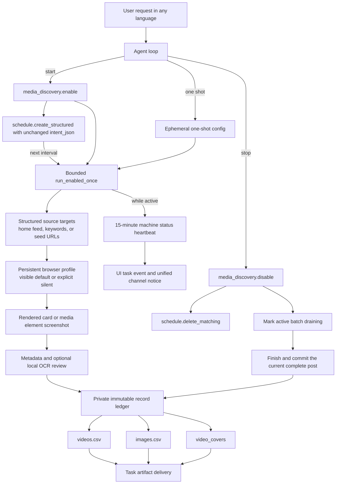

# Browser Media Discovery

<!-- ai-learning-stage: capabilities-artifacts -->
<!-- ai-learning-audience: operator,developer -->

<!-- ai-learning-navigation:start -->
Previous: [Task artifact delivery](11-task-artifact-delivery.md) |
[Architecture index](README.md)
<!-- ai-learning-navigation:end -->

`media_discovery` is an optional Skill Store capability for bounded discovery on
Douyin and Xiaohongshu. It opens a visible browser by default and uses silent
mode only when the user explicitly requests it. Both modes recognize only
content that the browser has already rendered and export ordered CSV records;
neither downloads video binaries or original image files.

For keyword discovery, the agent emits `source_mode=topics` with `topics[]`.
The skill visits each platform search result in that order and writes the exact
keyword and search-page URL into every committed record. The runtime and skill
never match localized user phrases to select search behavior.

## User Workflow

A user controls the workflow through ordinary conversation. The model maps the
request to machine arguments; runtime code does not match fixed phrases in any
language.

- Starting collection calls `media_discovery.enable`, copies the returned
  `schedule_spec.args.intent_json` unchanged into `schedule.create_structured`,
  and calls the no-argument `media_discovery.run_enabled_once` for the initial
  bounded batch unless the user requested a later start.
- A one-shot request calls `media_discovery.run_once` with explicit platform
  and source settings. Its ephemeral config is not persisted or scheduled.
  Scheduler payloads carry the machine-only `scheduled_run=true` marker and
  run only platforms that remain enabled and unpaused.
- Pausing or resuming changes only the selected platform state.
- Stopping calls `media_discovery.disable`; its required companion
  `schedule.delete_matching` consumes the returned structured cleanup args.
  Runtime rejects a terminal reply until that cleanup succeeds. Shared
  multi-platform schedules remain while they still serve an enabled platform.
  If a matching batch is active, the skill marks it `draining`, finishes and
  commits the current complete post, then exits normally.
- `media_discovery.export_results` rebuilds and delivers exactly `videos.csv`
  and `images.csv` from the private immutable record ledger, copies the
  persisted `video_covers/` directory, and exposes each cover as an image
  artifact.

## Current Execution Flow

Each run is bounded by item, scroll, and elapsed-time limits. A private lease
admits only one live batch, including across scheduled and conversational
starts. An already enabled continuous configuration also rejects another
`enable`, covering requests that were queued while the prior batch was active.
These rejections are structured pre-dispatch outcomes with no side effect. The
run checkpoints after committed records, maintains a periodic heartbeat,
and honors graceful stop only between complete posts. A multi-image post is
therefore committed in full before the browser closes. The collector remains
separate from the manual `media_download` queue. The
scheduler starts later batches; the skill does not leave an unmanaged detached
process behind.

While a continuous initial or scheduler-started batch remains active, the skill
emits a structured status heartbeat every 15 minutes. It contains only machine
fields for elapsed time and current counts. `clawd` persists it in the task
event stream for the UI and, for non-UI origins, sends a localized proactive
notice through the same receipt-backed channel delivery service used by other
background work. Host-side rate limiting and task/sequence idempotency prevent
duplicate delivery. One-shot collection does not opt into this reporting path.

## Screenshot and Recognition Boundary

`browser_mode=visible` is the default and opens a window. The model may pass
`browser_mode=silent` only for an explicit no-window request; runtime never
matches localized words to choose the mode. The skill screenshots a rendered
content card or media element already present in the page. It does not fetch the
element's CDN URL to obtain a higher-resolution copy. For video items, the first
stable frame observed in the rendered video, poster, or card is copied to
`video_covers/`; if autoplay already started, this is not claimed to be the
encoded timeline's exact frame zero. Other successful temporary screenshots are
deleted after their record is committed; failed evidence may be retained only
in the private diagnostic area until its configured expiry.

Interactions use bounded randomized delays and scroll distances to avoid
bursty traffic while preserving deterministic item order and hard run limits.
This cooperative pacing, like screenshot reuse, is not an
anti-automation bypass. The skill does not solve challenges, hide automation,
bypass access controls, or continue through rate-limit and login barriers.
Missing desktop sessions and platform barriers produce structured machine
states for the agent and UI.

Recognition modes are:

- `metadata_only`: keep page metadata and links without OCR.
- `local_ocr`: run Tesseract over the temporary browser screenshot.
- `ocr_reviewed`: preserve raw OCR and ask the host-scoped internal LLM gateway
  only to restore layout, punctuation, and highly certain recognition errors.

No provider API key is given to the skill. Page content and recognized text are
untrusted data and can never become runtime instructions.

## Data and Recovery

The skill receives a private directory from `SkillStorageResolver`. State,
browser profile, immutable JSON records, diagnostic evidence, and CSV files stay
inside that directory; the skill never reads or writes the main runtime
database.

`videos.csv` records stable page links, actual browser mode, source mode,
search keyword and search-page URL, separate platform and recognized text,
and a portable relative `cover_screenshot_path` such as
`video_covers/douyin_123.png`. `images.csv` records the same search provenance,
browser mode, post and image order plus the
observed image URL and stable source-page link. Both files use UTF-8 BOM, RFC
4180 quoting, stable sequence numbers, and spreadsheet formula-injection
protection. CSV files are derived views and can be regenerated atomically from
the ledger after a crash.

Installation, update, enablement, policy grants, and removal use the normal
Skill Store admission path with an immutable receipt and registry generation.
Uninstall preserves private data by default.
