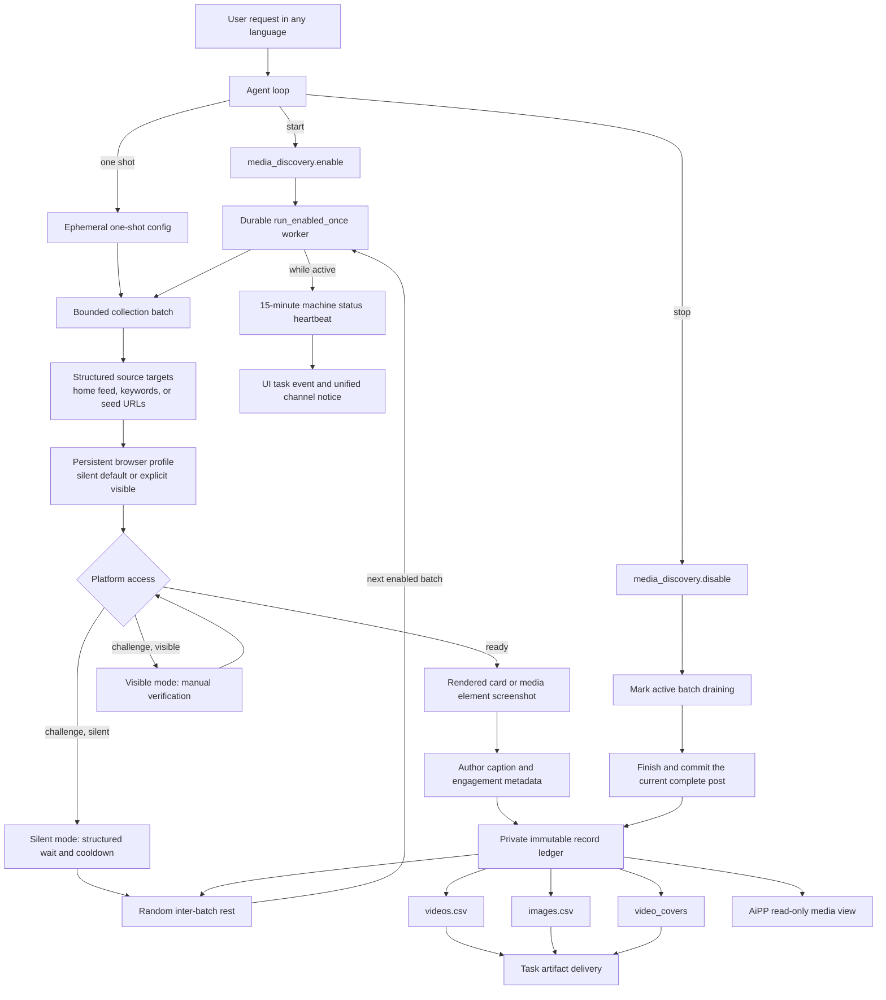

# Browser Media Discovery

<!-- ai-learning-stage: capabilities-artifacts -->
<!-- ai-learning-audience: operator,developer -->

<!-- ai-learning-navigation:start -->
Previous: [Task artifact delivery](11-task-artifact-delivery.md) |
[Architecture index](README.md) |
Next: [NNI capability and heartbeat control](13-nni-capability.md)
<!-- ai-learning-navigation:end -->

`media_discovery` is an optional Skill Store capability for bounded discovery on
Douyin, Xiaohongshu, and Kuaishou. It runs silently by default and opens a visible browser
only when the user explicitly requests visible or non-silent operation, or when a persisted
private profile needs an interactive login. It captures only content that the browser has
already rendered and exports ordered CSV records; it does not run OCR or model text review,
and it downloads neither video binaries nor original image files.

Douyin recommendation collection reads a visible card's machine content ID and
opens its HTTPS detail page in the same browser. This also works when the home
page redirects to `/jingxuan` and its cards invoke a desktop client. Collection
uses the detail player's next-item control, or scrolls an embedded feed, and
waits for the active content ID to change before recording the next post.

Kuaishou recommendation collection reads the rendered public feed card itself:
the stable work URL, author caption, visible poster, and structurally identified
like counter. It rejects keyword-shaped hot-list pseudo-links at the URL-contract
boundary and does not enter a challenged detail page merely to enrich a card.

For keyword discovery, the agent emits `source_mode=topics` with `topics[]`.
The skill visits each platform search result in that order and writes the exact
keyword and search-page URL into every committed record. The runtime and skill
never match localized user phrases to select search behavior.

## User Workflow

A user controls the workflow through ordinary conversation. The model maps the
request to machine arguments; runtime code does not match fixed phrases in any
language.

- Starting collection calls `media_discovery.enable`, then launches the returned
  no-argument `media_discovery.run_enabled_once` companion as one runtime-owned
  durable background job. No schedule job is created.
- A one-shot request calls `media_discovery.run_once` with explicit platform
  and source settings. Its ephemeral config is not persisted and does not start
  background collection.
- Pausing or resuming changes only the selected platform state.
- Stopping calls `media_discovery.disable`. The background worker observes the
  persisted disabled state, and if a matching batch is active, marks it
  `draining`, finishes and commits the current complete post, then exits normally.
- `media_discovery.export_results` rebuilds and delivers exactly `videos.csv`
  and `images.csv` from the private immutable record ledger, copies the
  persisted `video_covers/` directory, and exposes each cover as an image
  artifact.
- The administrator AiPP presents the same private ledger through a bounded,
  read-only host renderer. Collection lifecycle changes still go through Agent.

## Current Execution Flow

Each batch is bounded by item, scroll, and elapsed-time limits. A private worker
lease admits only one continuous job, and a separate batch lease admits only one
live browser batch. An already enabled continuous configuration also rejects another
`enable`, covering requests that were queued while the prior batch was active.
These rejections are structured pre-dispatch outcomes with no side effect. The
run checkpoints after committed records, maintains a periodic heartbeat,
and honors graceful stop only between complete posts. A multi-image post is
therefore committed in full before the browser closes. The collector remains
separate from the manual `media_download` queue. The durable runtime job starts
later batches after bounded randomized rests and remains observable and cancellable.

Status queries distinguish live heartbeat leases from expired records. Expired
records are returned in `expired_leases`, not as an active batch or worker;
`latest_run` reports the most recently completed batch without starting another
collection. The query preserves stored history. A completed one-shot receipt is
the completion boundary: verification uses status/history reads, and CSV export
does not require another browser run.

While continuous collection remains active, the skill
emits a structured status heartbeat every 15 minutes. It contains only machine
fields for elapsed time and current counts. `clawd` persists it in the task
event stream for the UI and, for non-UI origins, sends a localized proactive
notice through the same receipt-backed channel delivery service used by other
background work. Host-side rate limiting and task/sequence idempotency prevent
duplicate delivery. One-shot collection does not opt into this reporting path.

## Screenshot and Capture Boundary

`browser_mode=silent` is the default and opens no window. The model may pass
`browser_mode=visible` only for an explicit visible or non-silent request; runtime never
matches localized words to choose the mode. The skill screenshots a rendered
content card or media element already present in the page. It does not fetch the
element's CDN URL to obtain a higher-resolution copy. For video items, the first
stable frame observed in the rendered video, poster, or card is copied to
`video_covers/`; if autoplay already started, this is not claimed to be the
encoded timeline's exact frame zero. Other successful temporary screenshots are
deleted after their record is committed; failed evidence may be retained only
in the private diagnostic area until its configured expiry.

Interactions use bounded randomized delays and scroll distances to avoid
bursty traffic while preserving deterministic item order and hard run limits.
This cooperative pacing, like screenshot reuse, is not an
anti-automation bypass. The skill does not solve challenges, hide automation,
bypass access controls, or continue through rate-limit and login barriers.
Missing desktop sessions and platform barriers produce structured machine
states for the agent and UI.

An explicit visible run waits for the user to complete a challenge and then
continues in the same browser. Feed-readiness and manual-verification waits
honor a stop request. Failure diagnostics retain the machine stage, page
origin/path, readiness, and element counts under `diagnostics/<run_id>/` and in
the run result; they exclude URL queries, page text, credentials, and cookies.

Screenshots are preview artifacts only. The skill never sends video covers or
image screenshots to OCR or model review. Text comes only from the platform's
rendered title and author-caption fields. No provider API key is given to the
skill, and page content remains untrusted data that can never become runtime
instructions.

## Data and Recovery

The skill receives a private directory from `SkillStorageResolver`. State,
browser profile, immutable JSON records, diagnostic evidence, and CSV files stay
inside that directory; the skill never reads or writes the main runtime
database.

`videos.csv` records stable page links, actual browser mode, source mode,
search keyword and search-page URL, author caption, and a portable relative
`cover_screenshot_path` such as
`video_covers/douyin_123.png`. `images.csv` records the same search provenance,
author caption, browser mode, post and image order plus the
observed image URL and stable source-page link. Both files use UTF-8 BOM, RFC
4180 quoting, stable sequence numbers, and spreadsheet formula-injection
protection. CSV files are derived views and can be regenerated atomically from
the ledger after a crash.

Installation, update, enablement, policy grants, and removal use the normal
Skill Store admission path with an immutable receipt and registry generation.
Uninstall preserves private data by default.
