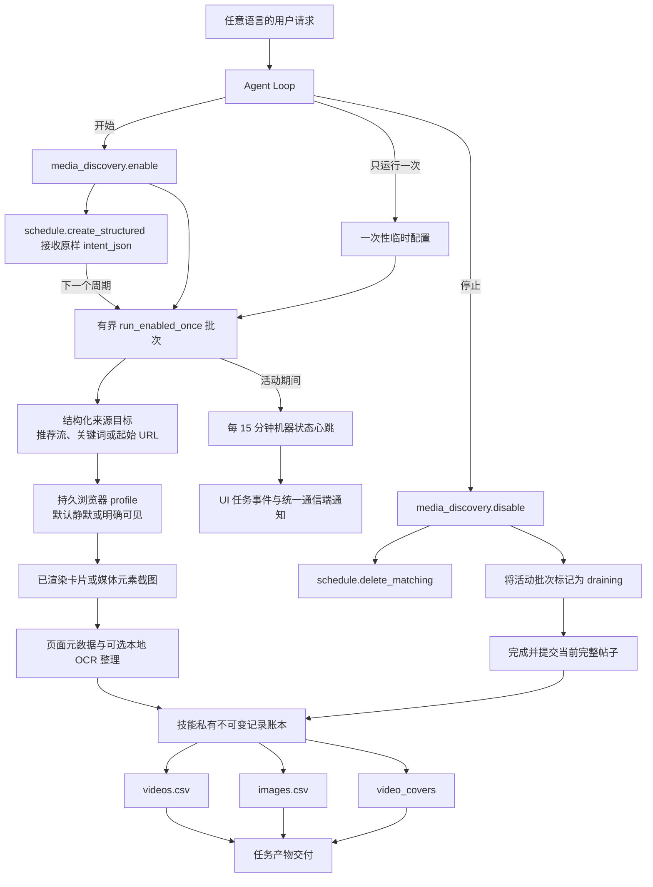

# 浏览器媒体发现

<!-- ai-learning-stage: capabilities-artifacts -->
<!-- ai-learning-audience: operator,developer -->

<!-- ai-learning-navigation:start -->
上一页：[任务产物交付](11-task-artifact-delivery.zh-CN.md) |
[架构索引](README.md) |
下一页：[NNI 能力与心跳控制](13-nni-capability.zh-CN.md)
<!-- ai-learning-navigation:end -->

`media_discovery` 是通过 Skill Store 按需安装的抖音与小红书有界素材发现能力。默认以
无窗口静默模式运行，只有用户明确要求打开浏览器或非静默运行时才弹出窗口。两种模式都只识别浏览器已经
渲染的内容，并按发现顺序导出 CSV；不会下载视频文件或图片原文件。

关键词采集由 Agent 输出 `source_mode=topics` 与 `topics[]`。技能按输入顺序打开对应平台
搜索结果，并把准确关键词和搜索页 URL 写入每条已提交记录；runtime 与技能都不匹配用户
所用语言的固定短语来选择搜索行为。

## 用户操作流程

用户通过普通对话控制采集。模型把任意语言的请求转换为机器参数，运行时代码不匹配
中文、英文或其他语言的固定短语。

- 开始采集时，Agent 先调用 `media_discovery.enable`，再把返回的
  `schedule_spec.args.intent_json` 原样交给 `schedule.create_structured`，并立即调用一次
  无参数的 `media_discovery.run_enabled_once` 有界首批任务；用户要求稍后开始时除外。
- 只采集一次时，Agent 直接用明确的平台与来源参数调用 `media_discovery.run_once`；该临时
  配置不持久化也不创建调度。调度 payload 使用仅供机器内部使用的
  `scheduled_run=true` 标记，并且只运行仍处于启用且未暂停状态的平台。
- 暂停和恢复只改变所选平台的状态。
- 停止采集时，Agent 调用 `media_discovery.disable`，再由必做 companion
  `schedule.delete_matching` 使用返回的结构化清理参数。该清理成功前 runtime 不允许
  最终回复；仍服务于其他启用平台的共享调度会保留。
  如果匹配平台的批次仍在运行，技能会将其标记为 `draining`，完整保存当前帖子后正常退出。
- `media_discovery.export_results` 从技能私有不可变账本重建并交付
  `videos.csv`、`images.csv`，同时复制 `video_covers/` 并把其中封面作为图片产物交付。

## 当前执行流程

每个批次都有条数、滚动次数和运行时间上限。技能私有 lease 在定时任务和对话启动之间
也只允许一个活动批次；第二个启动会收到结构化 `run_already_active`。只要持续采集仍为
enabled，新的 `enable` 也会返回 `collection_already_enabled`，因此在批次运行时排队、稍后
才到达技能的启动请求也不能新建采集；这两种拒绝均为无副作用的 pre-dispatch 结果。已提交记录形成
checkpoint，运行期间持续更新 heartbeat，并且只在完整帖子边界响应优雅停止，因此多图
帖子会保存全部图片后再关闭浏览器。自动采集使用独立队列，不占用
`media_download` 的手动下载队列。后续批次由统一 scheduler 启动，技能不会留下无人
管理的 detached 进程。

持续采集的首批任务或 scheduler 启动的后续批次只要仍在运行，技能就会每 15 分钟发出一次
结构化状态心跳，其中只包含已运行时间和本轮条目、视频、图片、重复、失败数量等机器字段。
`clawd` 会把它持久化到任务事件流供 UI 展示；如果任务来自通信端，则通过统一、带 receipt
和幂等键的渠道交付服务发送本地化通知。宿主按至少 900 秒限频，并按任务与帧序号去重。
一次性采集不会启用这条周期通知链路。

## 截图与识别边界

`browser_mode=silent` 是默认值且不弹出窗口。只有用户明确要求打开浏览器或非静默运行时，模型才传入
`browser_mode=visible`；运行时不匹配任何语言中的固定字样。技能只截取页面中已经
渲染的内容卡片或媒体元素，不会为了
取得高清版本再次请求该元素的 CDN 地址。视频条目会把浏览器 video、poster 或卡片中
首次观察到的稳定可见画面复制到 `video_covers/`；如果页面已经自动播放，不会把它表述为
编码时间轴上的绝对第 0 帧。其他成功临时截图在记录提交后删除；失败证据只能在技能私有
诊断区按配置的过期时间短期保留。

浏览交互采用有界随机等待和滚动距离，在保持条目顺序与硬上限不变的前提下避免突发请求。
这种友好节奏和复用已渲染内容都不是反自动化绕过方案。技能不会破解
挑战、隐藏自动化、绕过访问控制，也不会强行越过限流或登录边界。缺少桌面会话、需要
登录或平台阻止访问时，技能返回结构化机器状态，供 Agent 和 UI 展示。

识别模式包括：

- `metadata_only`：只保留页面元数据和链接，不执行 OCR。
- `local_ocr`：用 Tesseract 识别临时浏览器截图。
- `ocr_reviewed`：保留原始 OCR，并且只通过宿主内部 LLM 网关恢复段落、标点和高置信
  识别错误。

技能不会获得 provider API key。页面内容与识别文字始终属于不可信数据，不能成为运行时
指令。

## 数据与恢复

技能通过 `SkillStorageResolver` 获得独立目录。状态、浏览器 profile、不可变 JSON 记录、
诊断证据和 CSV 都位于该目录中；技能不会读写主运行时数据库。

`videos.csv` 保存稳定页面链接、实际浏览模式、来源模式、搜索关键词和搜索页 URL，把平台文字
和识别文字分列，并记录 `video_covers/douyin_123.png` 形式的可迁移相对封面路径；
`images.csv` 保存同样的搜索来源、浏览模式、帖子顺序、图内
顺序、页面中观察到的图片 URL 和稳定来源页面链接。两份文件均使用 UTF-8 BOM、RFC 4180
引号规则、稳定递增编号和公式注入防护。CSV 是派生视图，崩溃后可以从账本原子重建。

安装、升级、启用、policy grant 和卸载都经过统一 Skill Store admission，绑定不可变
receipt 和 registry generation。卸载默认保留技能私有数据。
