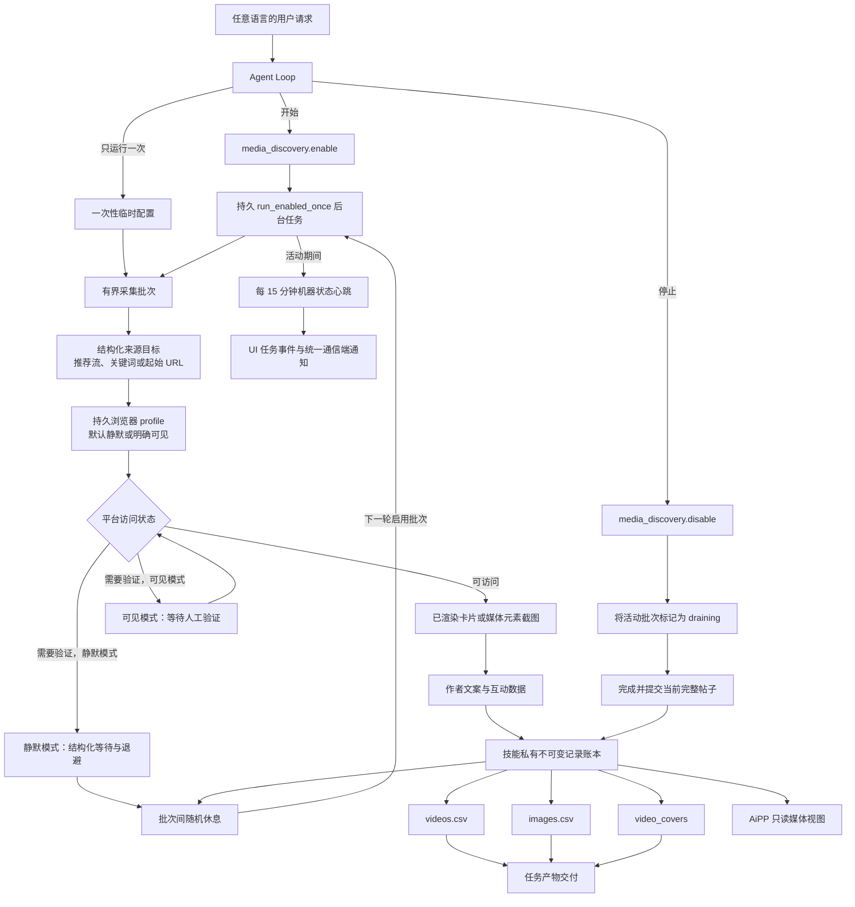

# 浏览器媒体发现

<!-- ai-learning-stage: capabilities-artifacts -->
<!-- ai-learning-audience: operator,developer -->

<!-- ai-learning-navigation:start -->
上一页：[任务产物交付](11-task-artifact-delivery.zh-CN.md) |
[架构索引](README.md) |
下一页：[NNI 能力与心跳控制](13-nni-capability.zh-CN.md)
<!-- ai-learning-navigation:end -->

`media_discovery` 是通过 Skill Store 按需安装的抖音、小红书与快手有界素材发现能力。默认以
无窗口静默模式运行，只有用户明确要求打开浏览器、非静默运行，或技能私有 profile 需要交互登录时
才弹出窗口。技能只采集浏览器已经渲染的内容，并按发现顺序导出 CSV；不执行 OCR 或模型文字整理，
也不会下载视频文件或图片原文件。

抖音推荐采集读取可见卡片的机器内容 ID，在同一浏览器中打开对应 HTTPS 详情页。
首页跳转到 `/jingxuan`、卡片点击会唤起桌面客户端时，也通过网页详情入口访问。
进入详情后使用播放器的下一条控件，或滚动内嵌内容流，等待当前内容 ID 改变再记录下一条。

快手推荐采集直接读取公开推荐流中已经渲染的作品卡片，包括稳定作品链接、作者文案、可见封面和
通过结构控件识别的点赞量。URL 合同会排除形似作品链接的热搜词入口，也不会仅为补充卡片数据而
进入已经触发平台挑战的详情页。

关键词采集由 Agent 输出 `source_mode=topics` 与 `topics[]`。技能按输入顺序打开对应平台
搜索结果，并把准确关键词和搜索页 URL 写入每条已提交记录；runtime 与技能都不匹配用户
所用语言的固定短语来选择搜索行为。

## 用户操作流程

用户通过普通对话控制采集。模型把任意语言的请求转换为机器参数，运行时代码不匹配
中文、英文或其他语言的固定短语。

- 开始采集时，Agent 先调用 `media_discovery.enable`，再把返回的无参数
  `media_discovery.run_enabled_once` companion 启动为一个由 runtime 管理的持久后台任务；
  不创建定时任务。
- 只采集一次时，Agent 直接用明确的平台与来源参数调用 `media_discovery.run_once`；该临时
  配置不持久化，也不启动后台采集。
- 暂停和恢复只改变所选平台的状态。
- 停止采集时，Agent 调用 `media_discovery.disable`。后台任务读取持久化的关闭状态；如果
  匹配平台的批次仍在运行，技能会将其标记为 `draining`，完整保存当前帖子后正常退出。
- `media_discovery.export_results` 从技能私有不可变账本重建并交付
  `videos.csv`、`images.csv`，同时复制 `video_covers/` 并把其中封面作为图片产物交付。
- 管理员 AiPP 通过有界、只读的宿主 renderer 展示同一份私有账本；采集生命周期变更仍由
  Agent 执行。

## 当前执行流程

每个批次都有条数、滚动次数和运行时间上限。技能私有 worker lease 只允许一个持续后台任务，
batch lease 只允许一个活动浏览批次；第二个启动会收到结构化 `run_already_active`。只要持续采集仍为
enabled，新的 `enable` 也会返回 `collection_already_enabled`，因此在批次运行时排队、稍后
才到达技能的启动请求也不能新建采集；这两种拒绝均为无副作用的 pre-dispatch 结果。已提交记录形成
checkpoint，运行期间持续更新 heartbeat，并且只在完整帖子边界响应优雅停止，因此多图
帖子会保存全部图片后再关闭浏览器。自动采集使用独立队列，不占用
`media_download` 的手动下载队列。后续批次由持久后台任务在有界随机休息后启动，整个任务
可观察、可取消，不会留下无人管理的 detached 进程。

状态查询会区分有效心跳与已过期记录。过期记录只放在 `expired_leases`，不会当作活动批次或
后台 worker；`latest_run` 返回最近完成的批次，无需再次启动采集。查询不会改写保存的历史。
单批完成收据就是该批次的完成依据；验收使用状态或历史查询，导出 CSV 也不需要重新打开浏览器。

持续采集只要仍在运行，技能就会每 15 分钟发出一次
结构化状态心跳，其中只包含已运行时间和本轮条目、视频、图片、重复、失败数量等机器字段。
`clawd` 会把它持久化到任务事件流供 UI 展示；如果任务来自通信端，则通过统一、带 receipt
和幂等键的渠道交付服务发送本地化通知。宿主按至少 900 秒限频，并按任务与帧序号去重。
一次性采集不会启用这条周期通知链路。

## 截图与采集边界

`browser_mode=silent` 是默认值且不弹出窗口。只有用户明确要求打开浏览器或非静默运行时，模型才传入
`browser_mode=visible`；运行时不匹配任何语言中的固定字样。技能只截取页面中已经
渲染的内容卡片或媒体元素，不会为了
取得高清版本再次请求该元素的 CDN 地址。视频条目会把浏览器 video、poster 或卡片中
首次观察到的稳定可见画面复制到 `video_covers/`；如果页面已经自动播放，不会把它表述为
编码时间轴上的绝对第 0 帧。其他成功临时截图在记录提交后删除；失败证据只能在技能私有
诊断区按配置的过期时间短期保留。

浏览交互采用有界随机等待和滚动距离，在保持条目顺序与硬上限不变的前提下避免突发请求。
这种友好节奏和复用已渲染内容都不是反自动化绕过方案。技能不会破解
挑战、隐藏自动化、绕过访问控制，也不会强行越过限流或登录边界。缺少桌面会话、需要
登录或平台阻止访问时，技能返回结构化机器状态，供 Agent 和 UI 展示。

明确选择可见模式时，浏览器等待用户手动完成验证，再继续当前采集；等待页面就绪或人工验证时，
也会响应停止请求。失败诊断保存机器阶段、页面域名与路径、加载状态和元素数量，写入
`diagnostics/<run_id>/` 并随运行结果返回；不保存 URL 查询参数、页面正文、凭据或 Cookie。

截图只作为预览产物。视频封面和图片截图都不会送入 OCR 或模型整理；文字只来自平台页面
已经渲染的标题和作者文案。技能不会获得 provider API key，页面内容始终属于不可信数据，
不能成为运行时指令。

## 数据与恢复

技能通过 `SkillStorageResolver` 获得独立目录。状态、浏览器 profile、不可变 JSON 记录、
诊断证据和 CSV 都位于该目录中；技能不会读写主运行时数据库。

`videos.csv` 保存稳定页面链接、实际浏览模式、来源模式、搜索关键词、搜索页 URL、作者文案，
并记录 `video_covers/douyin_123.png` 形式的可迁移相对封面路径；
`images.csv` 保存同样的搜索来源、作者文案、浏览模式、帖子顺序、图内
顺序、页面中观察到的图片 URL 和稳定来源页面链接。两份文件均使用 UTF-8 BOM、RFC 4180
引号规则、稳定递增编号和公式注入防护。CSV 是派生视图，崩溃后可以从账本原子重建。

安装、升级、启用、policy grant 和卸载都经过统一 Skill Store admission，绑定不可变
receipt 和 registry generation。卸载默认保留技能私有数据。
